---
## Front matter
title: "Отчёт по лабораторной работе №1"
subtitle: "Установка и конфигурация операционной системы на виртуальную машину"
author: "Акунаева Антонина Эрдниевна"

## Generic otions
lang: ru-RU
toc-title: "Содержание"

## Bibliography
bibliography: bib/cite.bib
csl: pandoc/csl/gost-r-7-0-5-2008-numeric.csl

## Pdf output format
toc: true # Table of contents
toc-depth: 2
lof: true # List of figures
lot: true # List of tables
fontsize: 12pt
linestretch: 1.5
papersize: a4
documentclass: scrreprt
## I18n polyglossia
polyglossia-lang:
  name: russian
  options:
	- spelling=modern
	- babelshorthands=true
polyglossia-otherlangs:
  name: english
## I18n babel
babel-lang: russian
babel-otherlangs: english
## Fonts
mainfont: IBM Plex Serif
romanfont: IBM Plex Serif
sansfont: IBM Plex Sans
monofont: IBM Plex Mono
mathfont: STIX Two Math
mainfontoptions: Ligatures=Common,Ligatures=TeX,Scale=0.94
romanfontoptions: Ligatures=Common,Ligatures=TeX,Scale=0.94
sansfontoptions: Ligatures=Common,Ligatures=TeX,Scale=MatchLowercase,Scale=0.94
monofontoptions: Scale=MatchLowercase,Scale=0.94,FakeStretch=0.9
mathfontoptions:
## Biblatex
biblatex: true
biblio-style: "gost-numeric"
biblatexoptions:
  - parentracker=true
  - backend=biber
  - hyperref=auto
  - language=auto
  - autolang=other*
  - citestyle=gost-numeric
## Pandoc-crossref LaTeX customization
figureTitle: "Рис."
tableTitle: "Таблица"
listingTitle: "Листинг"
lofTitle: "Список иллюстраций"
lotTitle: "Список таблиц"
lolTitle: "Листинги"
## Misc options
indent: true
header-includes:
  - \usepackage{indentfirst}
  - \usepackage{float} # keep figures where there are in the text
  - \floatplacement{figure}{H} # keep figures where there are in the text
---


# Цель работы

Целью данной работы является приобретение практических навыков установки операционной системы на виртуальную машину, настройки минимально необходимых для дальнейшей работы сервисов. [@TUIS-lab1]

# Выполнение лабораторной работы

Запускаем Oracle VirtualBox и создаём операционную систему виртуальной машины - Rocky (дистрибутив Linux). Задаём имя и остальные параметры, указываем образ диска ОС ([рис. @fig:001]).

{#fig:001 width=70%}

Задаём значения для выделяемой основной памяти и ЦПУ как 4096 МБ и 2 ядра ([рис. @fig:002]).

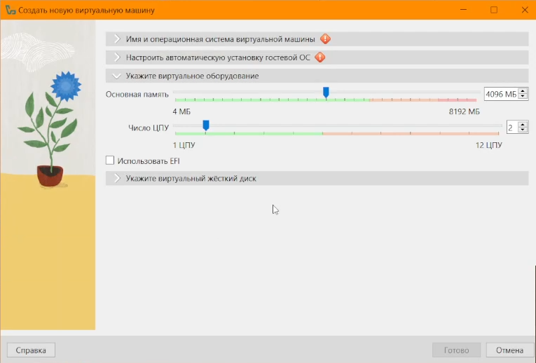{#fig:002 width=70%}

Выделяем для жёсткого диска 40 ГБ памяти ([рис. @fig:003]). Затем запускаем виртуальную машину.

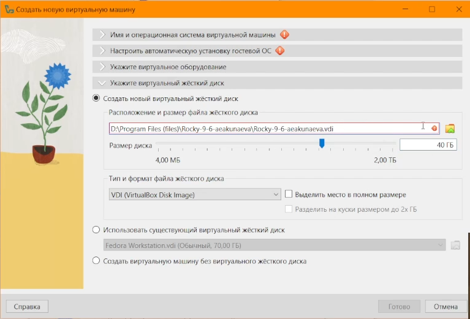{#fig:003 width=70%}

В окне запущенной ВМ выбираем *Install Rocky Linux 9.6* ([рис. @fig:004]).

{#fig:004 width=70%}

Выбираем основным языком ОС - английский (США) ([рис. @fig:005]).

{#fig:005 width=70%}

Во вкладке *Software selection* выбираем *Server with GUI*, а справа находим и отмечаем *Development Tools*, как указано в требованиях лабораторной работы ([рис. @fig:006]).

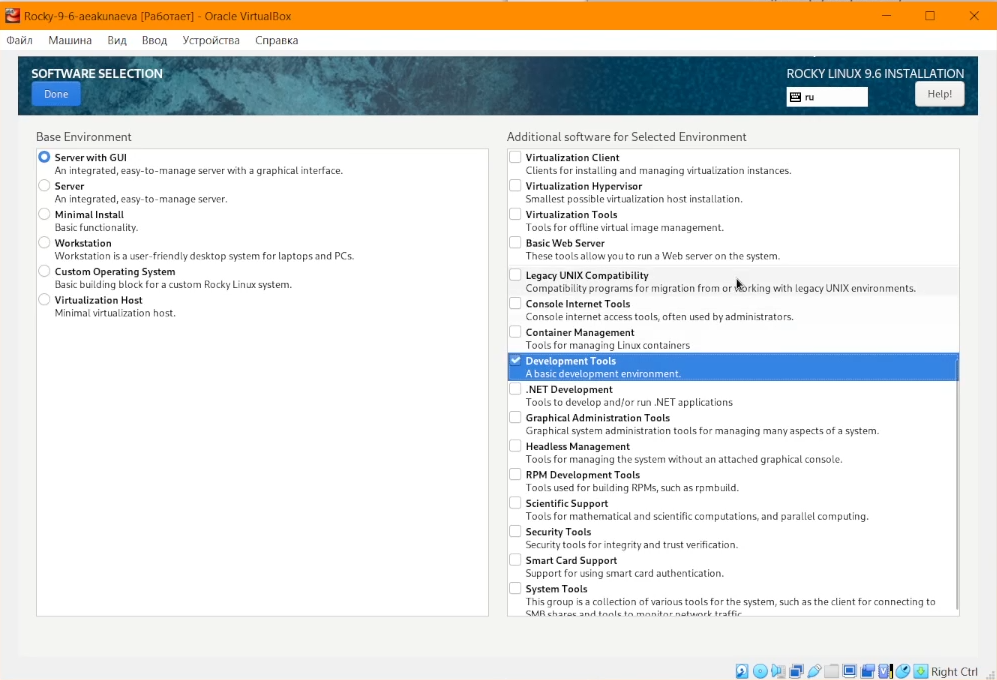{#fig:006 width=70%}

Добавляем во вкладке раскладки клавиатуры русский язык (Россия) и настраиваем удобный шорткат для смены языков (в нашем случае *Alt+Shift*) ([рис. @fig:007]).

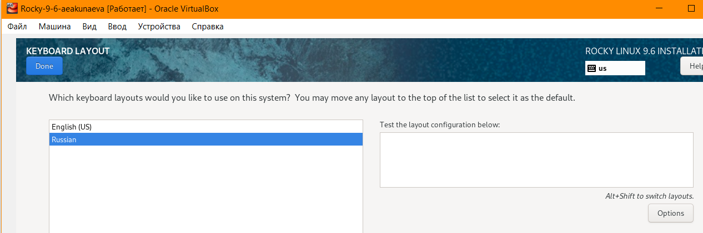{#fig:007 width=70%}

Добавляем поддержку русского языка ([рис. @fig:008]).

{#fig:008 width=70%}

Отключаем KDUMP ([рис. @fig:009]).

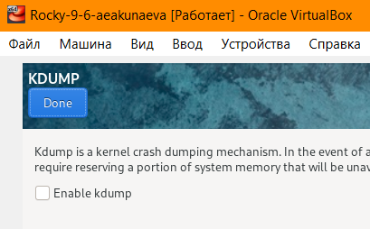{#fig:009 width=70%}

Во вкладке настройки сети подключаем её и изменяем имя хоста на собственное (*aeakunaeva.localmain*) ([рис. @fig:010]).

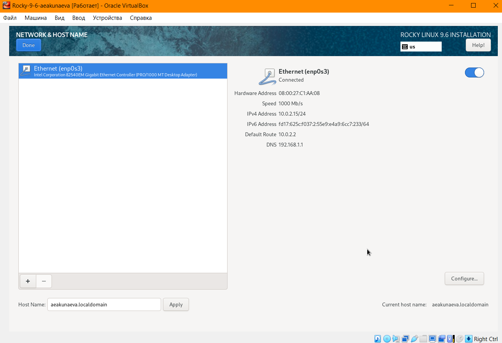{#fig:010 width=70%}

Устанавливаем пароль для администрирования и добавляем возможность логина SSH с этим паролем ([рис. @fig:011]). Также добавляем аккаунт администратора с паролем ([рис. @fig:012]).

{#fig:011 width=70%}

{#fig:012 width=70%}

После завершения настройки устанавливаем ОС ([рис. @fig:013]-[рис. @fig:014]).

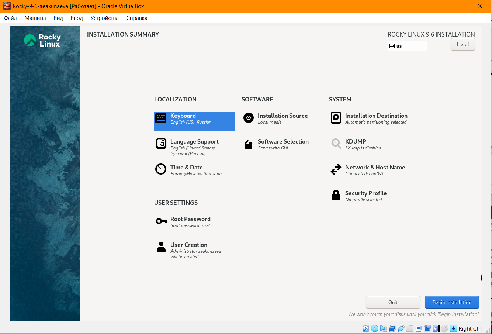{#fig:013 width=70%}

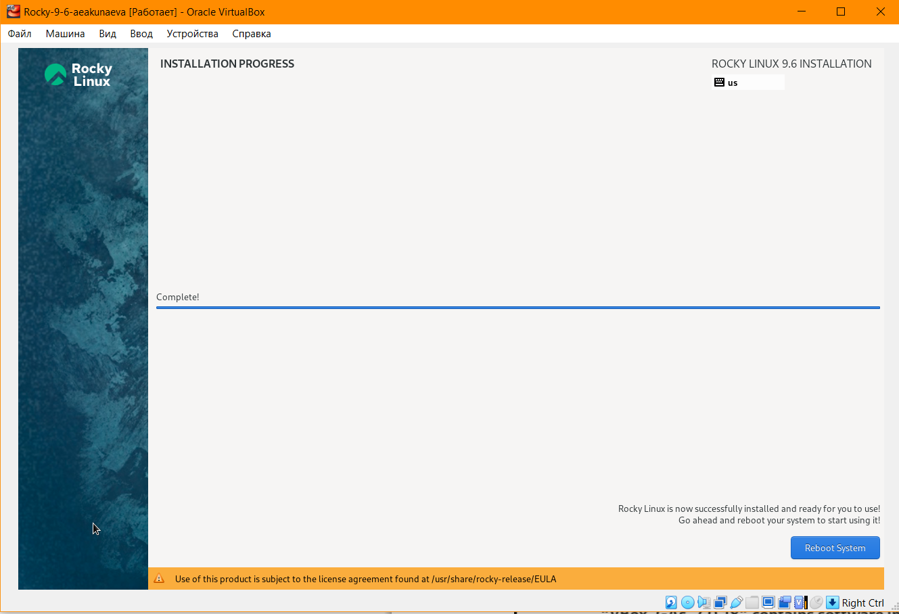{#fig:014 width=70%}

Войдя под своим аккаунтом администратора, выбираем у ВМ *Устройства -> Подключить образ диска дополнений гостевой ОС*, дожидаемся установки и перезапускаем виртуальную машину ([рис. @fig:015]).

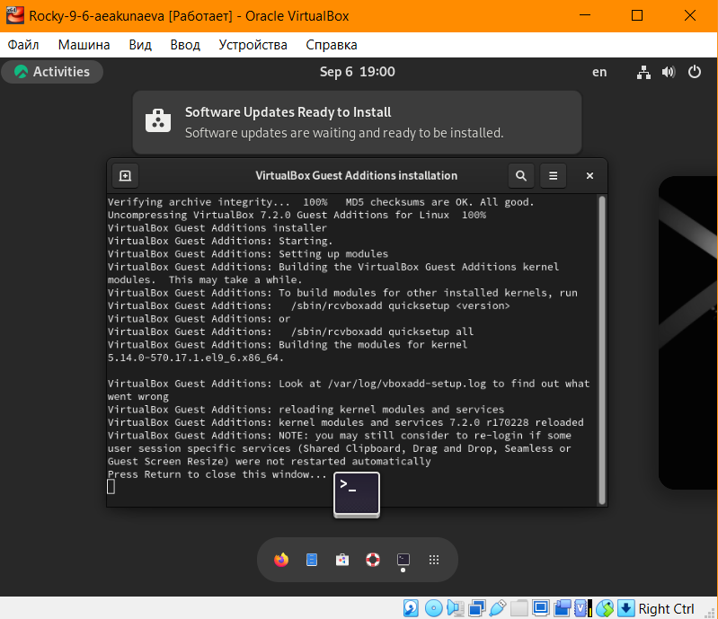{#fig:015 width=70%}

# Домашнее задание

Войдём в систему под своим аккаунтом, в терминале пропишем команду и ознакомимся с её выводом ([рис. @fig:16]):

```
dmesg | less
```

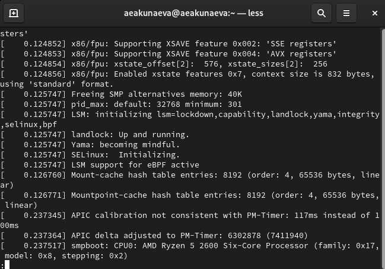{#fig:16 width=70%}

Далее используем команду *dmesg*, чтобы определить некоторые данные:

1. Версия ядра Linux - 5.14.0-570.17.1.el9_6.x86_64 ([рис. @fig:017]):

```
dmesg | grep -i "version"
```

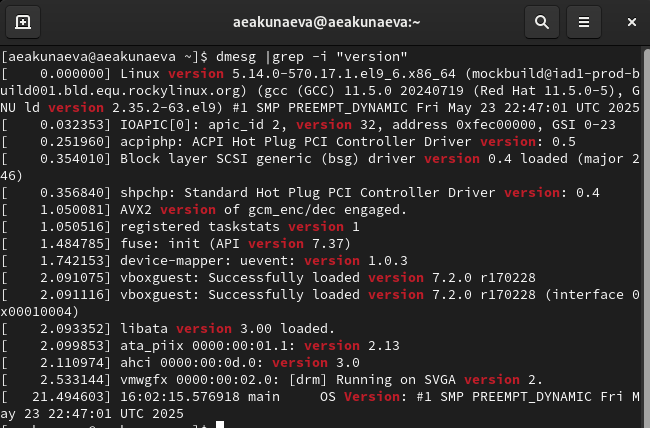{#fig:017 width=70%}

2. Частота процессора - 3393.628 MHz ([рис. @fig:018]):

```
dmesg | grep -i "processor"
```

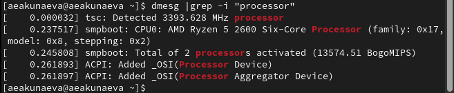{#fig:018 width=70%}

3. Модель процессора - AMD Ryzen 5 2600 Six-Core Processor ([рис. @fig:019]):

```
dmesg | grep -i "CPU0"
```

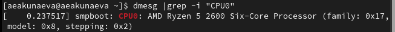{#fig:019 width=70%}

4. Объём доступной оперативной памяти - 3675284K/4193848K ([рис. @fig:020]):

```
dmesg | grep -i "memory"
```

{#fig:020 width=70%}

5. Тип обнаруженного гипервизора - KVM ([рис. @fig:021]):

```
dmesg | grep -i "hypervisor"
```

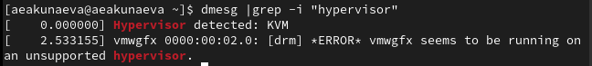{#fig:021 width=70%}

6-7. Тип файловой системы корневого раздела - XFS (dm-0). Здесь же видна последовательность монтирования файловых систем ([рис. @fig:022]):

```
dmesg | grep -i "filesystem"
```

{#fig:022 width=70%}

# Выводы

Я приобрела практические навыки установки операционной системы на виртуальную машину и настройки минимально необходимых для дальнейшей работы сервисов.

# Список литературы{.unnumbered}

::: {#refs}
:::
