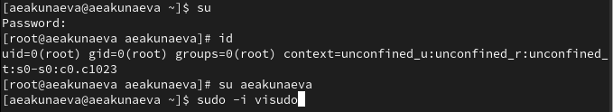
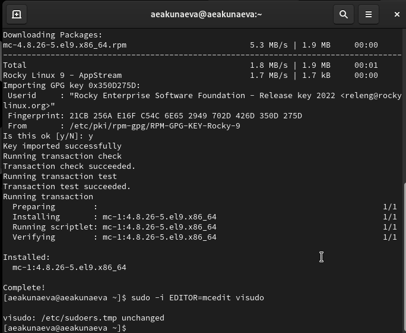
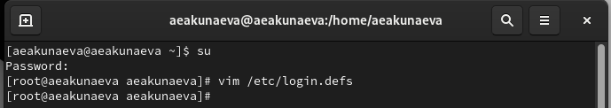
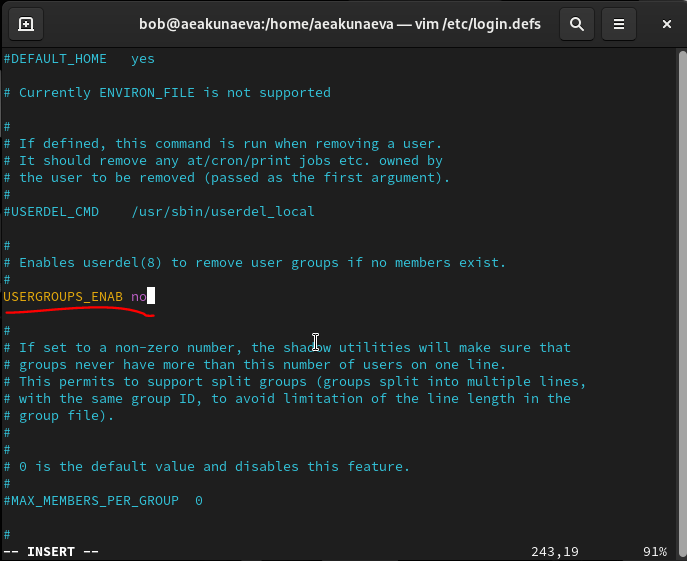
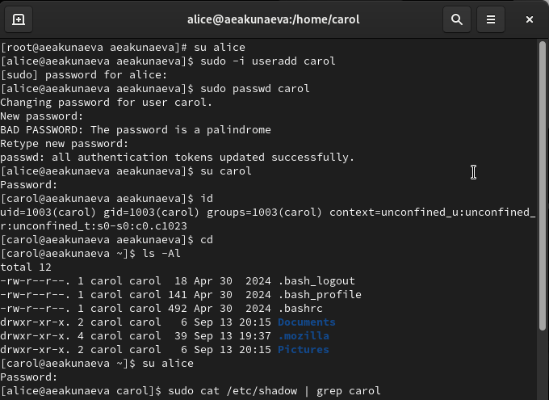
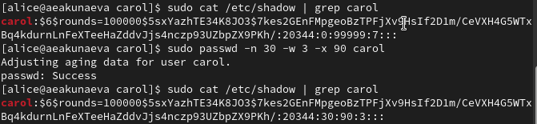
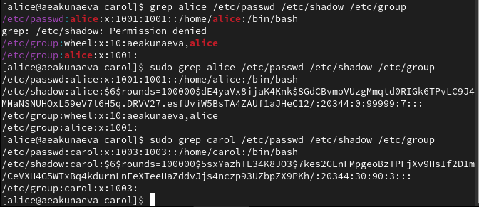

---
## Front matter
lang: ru-RU
title: Лабораторная работа №2
subtitle: Управление пользователями и группами
author:
  - Акунаева Антонина Эрдниевна
institute:
  - Российский университет дружбы народов, Москва, Россия
  
date: 2025-09-13

## i18n babel
babel-lang: russian
babel-otherlangs: english

## Formatting pdf
toc: false
toc-title: Содержание
slide_level: 2
aspectratio: 169
section-titles: true
theme: metropolis
header-includes:
 - \metroset{progressbar=frametitle,sectionpage=progressbar,numbering=fraction}
---

# Информация

## Докладчик

:::::::::::::: {.columns align=center}
::: {.column width="70%"}

  * Акунаева Антонина Эрдниевна
  * студент ФФМиЕН, НПИбд-01-24
  * Российский университет дружбы народов
  * [1032240492@pfur.ru](mailto:1032240492@pfur.ru)
  * <https://github.com/Akuxee>

:::
::: {.column width="30%"}


:::
::::::::::::::

# Цели и задачи

- Получить представление о работе с учётными записями пользователей и группами пользователей в операционной системе типа Linux.

1. Прочитайте справочное описание man по командам ls, whoami, id, groups, su, sudo, passwd, vi, visudo, useradd, usermod, userdel, groupadd, groupdel.
2. Выполните действия по переключению между учётными записями пользователей, по управлению учётными записями пользователей (раздел 2.4.1).
3. Выполните действия по созданию пользователей и управлению их учётными записями (раздел 2.4.2).
4. Выполните действия по работе с группами пользователей (раздел 2.4.3).

# Материалы и методы

- Linux (дистрибутив Rocky 9.6)
- Linux Fedora Workstation (Markdown)
- Oracle VirtualBox

# Выполнение лабораторной работы

## Определение информации об учётной записи пользователя

```
whoami
id
```

{#fig:001 width=70%}

## Учётная запись пользователя root

```
su
id
su aeakunaeva
```

{#fig:002 width=70%}

## visudo и текстовый редактор vi

{#fig:003 width=70%}

## Установка mcedit и открытие visudo

```
sudo -i visudo
sudo -i EDITOR=mcedit visudo
```

{#fig:004 width=70%}

## Файл /etc/sudoers и группа wheel

```
%wheel	ALL=(ALL)	ALL
```

{#fig:005 width=70%}

## Создание нового пользователя alice

{#fig:006 width=70%}

## Создание пользователя bob вне wheel

{#fig:007 width=70%}

## Открытие файла в vim через суперпользователя

```
su
vim /etc/login.defs
```

{#fig:008 width=70%}

## Редактирование файла /etc/login.defs: CREATE_HOME yes

{#fig:009 width=70%}

## Редактирование файла /etc/login.defs: USERGROUPS_ENAB no

{#fig:010 width=70%}

## Добавление каталогов в домашние каталоги пользователей по умолчанию

```
sudo mkdir Pictures
sudo mkdir Documents
```

{#fig:011 width=70%}

## Установка текстового редактора по умолчанию

```
vim .bashrc
```

{#fig:012 width=70%}

## Создание пользователя carol и проверка информации о нём

{#fig:013 width=70%}

## /etc/shadow: пароль пользователя carol

{#fig:014 width=70%}

## Идентификаторы alice и carol в разных файлах

{#fig:015 width=70%}

## Добавление пользователей в группы

```
sudo groupadd main
sudo groupadd third
```

{#fig:016 width=70%}

## Проверка добавленных в группы пользователей

```
id dan
id dave
id david
```

{#fig:017 width=70%}


# Выводы

Я получила представление о работе с учётными записями пользователей и группами пользователей в операционной системе типа Linux.


