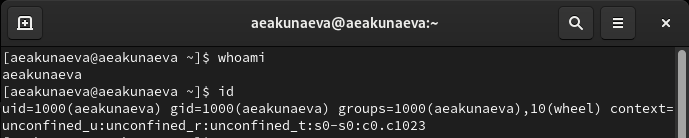
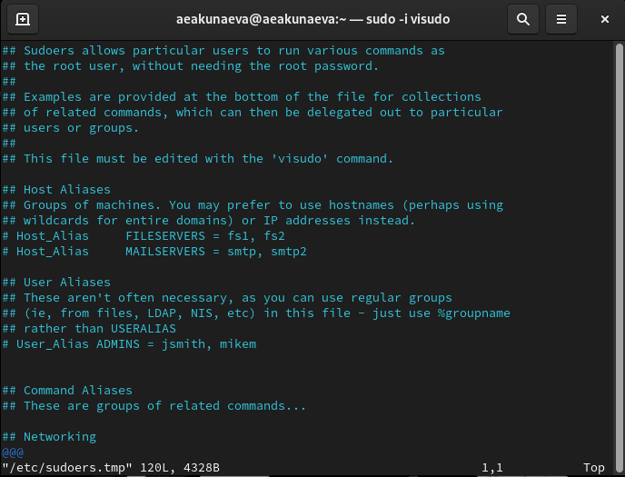
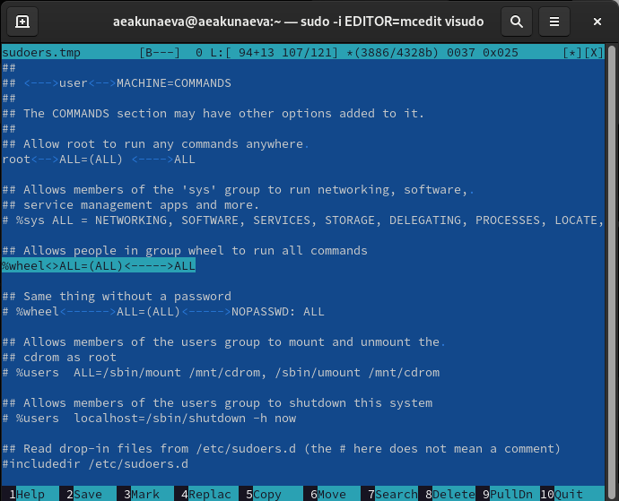
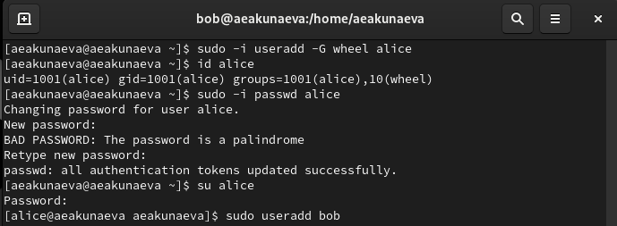
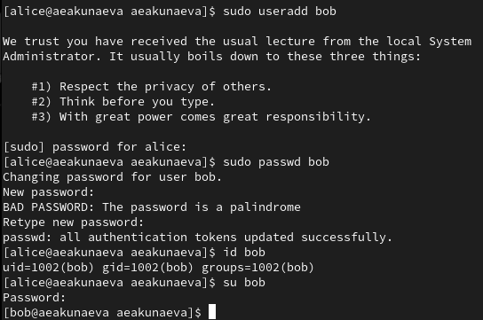
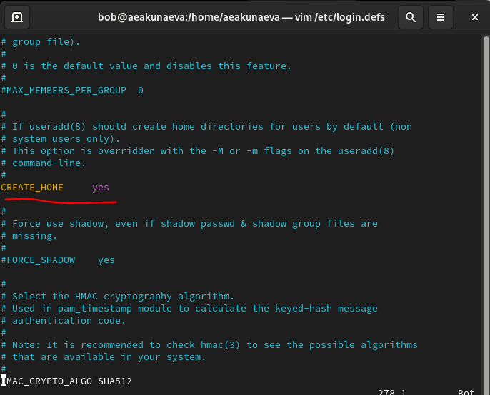
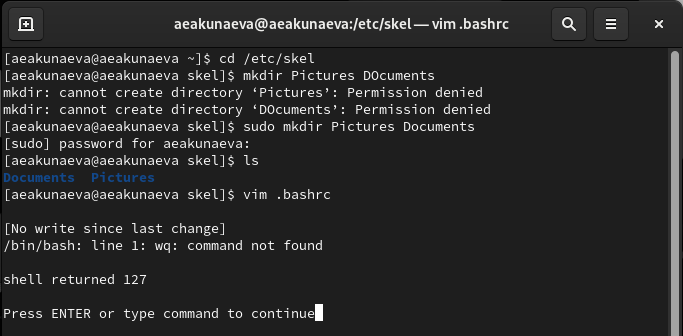
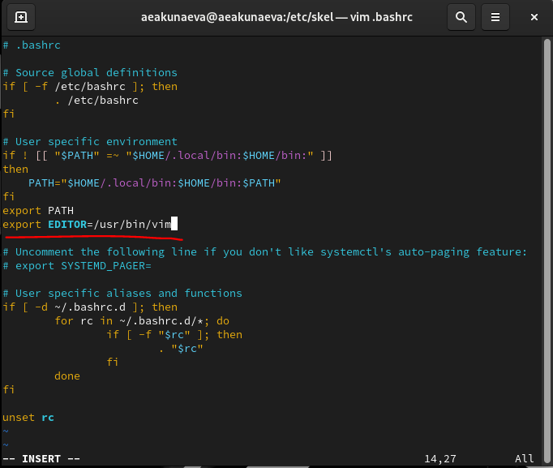
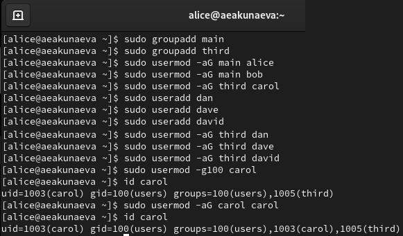
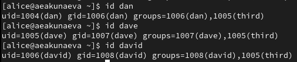

---
## Front matter
title: "Отчёт по лабораторной работе №2"
subtitle: "Управление пользователями и группами"
author: "Акунаева Антонина Эрдниевна"

## Generic otions
lang: ru-RU
toc-title: "Содержание"

## Bibliography
bibliography: bib/cite.bib
csl: pandoc/csl/gost-r-7-0-5-2008-numeric.csl

## Pdf output format
toc: true # Table of contents
toc-depth: 2
lof: true # List of figures
lot: true # List of tables
fontsize: 12pt
linestretch: 1.5
papersize: a4
documentclass: scrreprt
## I18n polyglossia
polyglossia-lang:
  name: russian
  options:
	- spelling=modern
	- babelshorthands=true
polyglossia-otherlangs:
  name: english
## I18n babel
babel-lang: russian
babel-otherlangs: english
## Fonts
mainfont: IBM Plex Serif
romanfont: IBM Plex Serif
sansfont: IBM Plex Sans
monofont: IBM Plex Mono
mathfont: STIX Two Math
mainfontoptions: Ligatures=Common,Ligatures=TeX,Scale=0.94
romanfontoptions: Ligatures=Common,Ligatures=TeX,Scale=0.94
sansfontoptions: Ligatures=Common,Ligatures=TeX,Scale=MatchLowercase,Scale=0.94
monofontoptions: Scale=MatchLowercase,Scale=0.94,FakeStretch=0.9
mathfontoptions:
## Biblatex
biblatex: true
biblio-style: "gost-numeric"
biblatexoptions:
  - parentracker=true
  - backend=biber
  - hyperref=auto
  - language=auto
  - autolang=other*
  - citestyle=gost-numeric
## Pandoc-crossref LaTeX customization
figureTitle: "Рис."
tableTitle: "Таблица"
listingTitle: "Листинг"
lofTitle: "Список иллюстраций"
lotTitle: "Список таблиц"
lolTitle: "Листинги"
## Misc options
indent: true
header-includes:
  - \usepackage{indentfirst}
  - \usepackage{float} # keep figures where there are in the text
  - \floatplacement{figure}{H} # keep figures where there are in the text
---


# Цель работы

Получить представление о работе с учётными записями пользователей и группами пользователей в операционной системе типа Linux. [@TUIS-lab2]

# Задание

1. Прочитайте справочное описание man по командам ls, whoami, id, groups, su, sudo, passwd, vi, visudo, useradd, usermod, userdel, groupadd, groupdel.
2. Выполните действия по переключению между учётными записями пользователей, по управлению учётными записями пользователей (раздел 2.4.1).
3. Выполните действия по созданию пользователей и управлению их учётными записями (раздел 2.4.2).
4. Выполните действия по работе с группами пользователей (раздел 2.4.3).

# Выполнение лабораторной работы

**2.4.1.** Откроем терминал со своей учётной записи. Проверим, под какой учётной записью мы зашли при помощи команды ([рис. @fig:001]):

```
whoami
```

Также выведем подробную информацию об учётной записи при помощи

```
id
```

Команда сообщает нам информацию о пользователе (учётной записи), её уникальном номере (user id), основной группе (gid=1000(aeakunaeva)), а также информацию о дополнительных группах, куда входит пользователь и комментарии.

{#fig:001 width=70%}

Переключимся на учётную запись пользователя root (наша учётная запись aeakunaeva root), введя пароль root. Получим также дополнительную информацию о пользователе и заметим, что пользователь root имеет UID = 0, как "основной", "первый" и "главный" пользователь; также номера основных и дополнительных групп обозначены как 0, т.к. пользователь root имеет доступ ко всему в ОС ([рис. @fig:002]):

```
su
id
```

Вернёмся к своей учётной записи aeakunaeva при помощи той же команды, но указав имя пользователя:

```
su aeakunaeva
```

{#fig:002 width=70%}

Откроем файл */etc/sudoers* при помощи visudo в текстовом редакторе vi, либо mcedit (в зависимости от указания редактора, по умолчанию будет открываться vi, потому можно дополнить запись EDITOR=[текстовый редактор]). Возможно потребуется предварительная установка mcedit и/или vim ([рис. @fig:003]-[рис. @fig:004]):

```
sudo -i visudo
sudo -i EDITOR=mcedit visudo
```

Мы используем visudo для редактирования важных системных файлов или файлов конфигурации для того, чтобы предотвратить возможные ошибки, вызванные неверным синтаксисом, т.к. visudo предупреждает о них перед закрытием.

{#fig:003 width=70%}

{#fig:004 width=70%}

В открытом файле */etc/sudoers* найдём строку ([рис. @fig:005]):

```
%wheel	ALL=(ALL)	ALL
```

Строка означает, что все пользователи, которые добавлены в группу wheel смогут использовать все команды.

{#fig:005 width=70%}

Создадим нового пользователя alice, который будет добавлен в группу wheel через указание ключа -G для дополнительной группы. Зададим пароль для пользователя, введя его дважды и переключимся на alice ([рис. @fig:006]):

```
sudo -i useradd -G wheel alice
sudo -i passwd alice
su alice
```

{#fig:006 width=70%}

Далее создадим нового пользователя bob, находясь в аккаунте пользователя alice, потому сможем использовать все команды sudo (т.к. alice в wheel). Зададим пароль для bob, проверим информацию о группах bob через id и попробуем зайти как bob, чтобы убедиться, что всё установлено правильно. Заметим, что пользователь bob состоит в обособленных группах bob, не состоя в wheel, т.к. не было указано обратное ([рис. @fig:007]):

```
sudo useradd bob
sudo passwd bob
id bob
su bob
```

{#fig:007 width=70%}

**2.4.2.** Перейдём обратно к суперпользователю, введя пароль. Откроем файл конфигурации */etc/login.defs* для редактирования, используя vim и изменим несколько параметров ([рис. @fig:008]):

```
su
vim /etc/login.defs
```

{#fig:008 width=70%}

Проверим установку параметра *CREATE_HOME yes* в файле (для создания домашнего каталога для новых пользователей) ([рис. @fig:009]):

{#fig:009 width=70%}

Проверим установку параметра *USERGROUPS_ENAB no* в файле (для того, чтобы не позволить добавлять нового пользователя в группу с тем же именем, а использовать группу users) ([рис. @fig:010]):

{#fig:010 width=70%}

Перейдём в каталог */etc/skel* и создадим в нём каталоги *Pictures* и *Documents* (при надобности использовать sudo или суперпользователя) ([рис. @fig:011]):

```
cd /etc/skel
sudo mkdir Pictures
sudo mkdir Documents
ls
```

Это позволит создавать их автоматически в домашних каталогах новых пользователей.

{#fig:011 width=70%}

Откроем файл *.bashrc* и добавим в файл строку *export EDITOR=/usr/bin/vim* (или *mceditor* при желании, в нашем случае это vim) для открытия по умолчанию в этих текстовых редакторах файлов дял редактирования ([рис. @fig:012]):

```
vim .bashrc
```

{#fig:012 width=70%}

Переключимся в учётную запись alice

```
su alice
```

и добавим нового пользователя carol через alice, зададим пароль и проверим информацию о пользователе, а также каталогах домашнего каталога carol через ls и ключ -Al для удобного показа всех каталогов и файлов ([рис. @fig:013]):

```
sudo -i useradd carol
sudo passwd carol
su carol
id
cd
ls -Al
```

Заметим, что каталоги Pictures и Documents, ранее указаны в конфигурационных файлах и правда были созданы в домашнем каталоге carol, а сам пользователь carol состоит только в своих группах carol.

{#fig:013 width=70%}

Снова переключимся на alice:

```
su alice
```

И выведем информацию о паролях из файла */etc/shadow* пользователя carol ([рис. @fig:014]). Заметим, что в файле */etc/shadow* содержится инфомрация о пользователе, его зашифрованном пароле и датах, связанных с ним, как время последнего изменения или необходимость в последующих:

```
sudo cat /etc/shadow | grep carol
```

Изменим инфомрацию о пароле carol через passwd, поставив ограничение на пароль в 90 дней (-x 90) с предупреждением за 3 дня (-w 3) и необходимостью использования хотя бы раз за 30 дней до следующего изменения пароля (-n 30), что будет отображаться в последних данных вывода cat:

```
sudo passwd -n 30 -w 3 -x 90 carol
sudo cat /etc/shadow | grep carol
```

{#fig:014 width=70%}

Теперь узнаем информацию о пользователя alice через перечисление каталогов с информацией о группах и убедимся, что alice состоит во всех группах alice, passwd, shadow, а также wheel. При этом пользователь carol будет находится в аналогичных и своих группах, но не будет состоять в wheel, т.к. не был туда доабвлен ([рис. @fig:015]):

```
grep alice /etc/passwd /etc/shadow /etc/group
sudo grep carol /etc/passwd /etc/shadow /etc/group
```

{#fig:015 width=70%}

**2.4.3.** От имени alice создадим группы main и third ([рис. @fig:016]):

```
sudo groupadd main
sudo groupadd third
```

Добавим пользователей alice, bob и carol в эти группы благодаря команде *usermod* с указанием дополнительных групп ключом -aG:

```
sudo usermod -aG main alice
sudo usermod -aG main bob
sudo usermod -aG third carol
```

Создадим также пользователей dan, dave и david и также доабвим их в группу third:

```
sudo useradd dan
sudo useradd dave
sudo useradd david
sudo usermod -aG third dan
sudo usermod -aG third dave
sudo usermod -aG third david
```

Проверим добавление пользователя carol в группу third через id:

```
id carol
```

В параметре groups= будет указана помимо группы 100(users) и 1003(carol) также группа 1005(third), так что пользователь был добавлен в группу успешно. Кроме того, можно добавить carol в основную группу gid=100(users) через команду:

```
sudo usermod -g100 carol
```

где -g - параметр для основной группы и 100 - номер группы (users).

{#fig:016 width=70%}

Проверим в какие группы входят новые участники dan, dave и david, используя команду id для каждого ([рис. @fig:017]):

```
id dan
id dave
id david
```

И убедимся, что каждый из них входит в свои основные группы, а также каждый из них состоит в группе third, как мы указали ранее.

{#fig:017 width=70%}

# Выводы

Я получила представление о работе с учётными записями пользователей и группами пользователей в операционной системе типа Linux.

# Список литературы{.unnumbered}

::: {#refs}
:::
