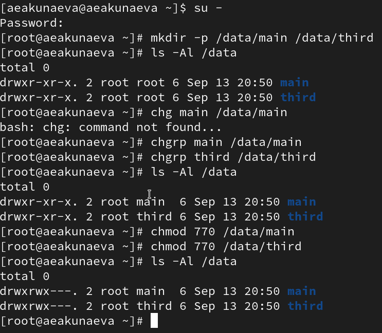
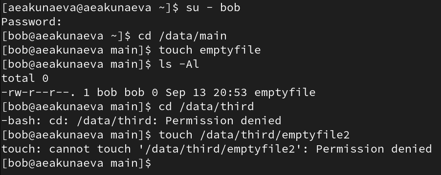
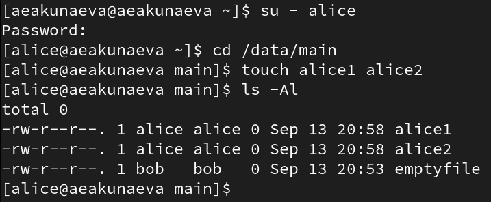
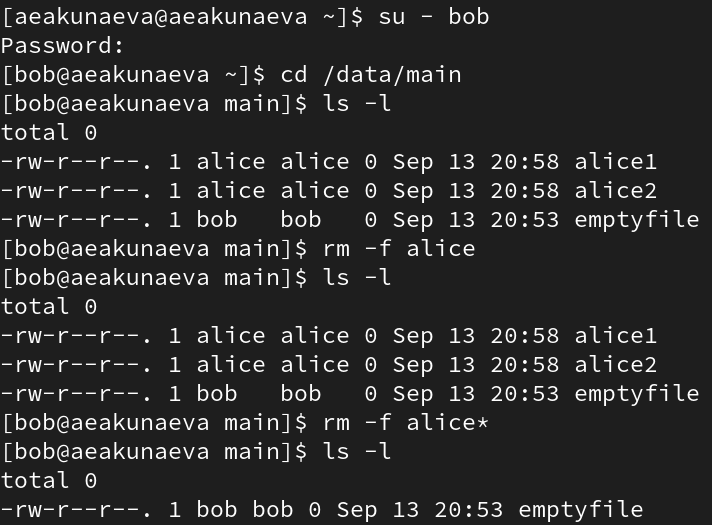
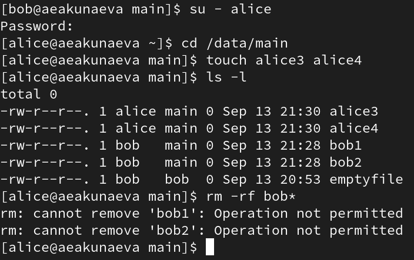
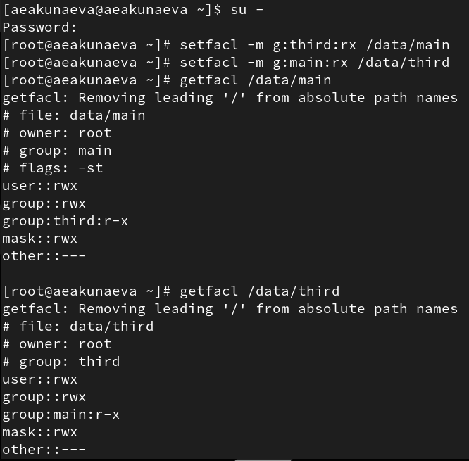

---
## Front matter
lang: ru-RU
title: Лабораторная работа №3
subtitle: Настройка прав доступа
author:
  - Акунаева Антонина Эрдниевна
institute:
  - Российский университет дружбы народов, Москва, Россия
  
date: 2025-09-20

## i18n babel
babel-lang: russian
babel-otherlangs: english

## Formatting pdf
toc: false
toc-title: Содержание
slide_level: 2
aspectratio: 169
section-titles: true
theme: metropolis
header-includes:
 - \metroset{progressbar=frametitle,sectionpage=progressbar,numbering=fraction}
---

# Информация

## Докладчик

:::::::::::::: {.columns align=center}
::: {.column width="70%"}

  * Акунаева Антонина Эрдниевна
  * студент ФФМиЕН, НПИбд-01-24
  * Российский университет дружбы народов
  * [1032240492@pfur.ru](mailto:1032240492@pfur.ru)
  * <https://github.com/Akuxee>

:::
::: {.column width="30%"}


:::
::::::::::::::

# Цели и задачи

- Получение навыков настройки базовых и специальных прав доступа для групп пользователей в операционной системе типа Linux.

1. Прочитайте справочное описание man по командам chgrp, chmod, getfacl, setfacl.
2. Выполните действия по управлению базовыми разрешениями для групп пользователей (раздел 3.3.1).
3. Выполните действия по управлению специальными разрешениями для групп пользователей (раздел 3.3.2).
4. Выполните действия по управлению расширенными разрешениями с использованием списков ACL для групп пользователей (раздел 3.3.3).

# Материалы и методы

- Linux (дистрибутив Rocky 9.6)
- Linux Fedora Workstation (Markdown)
- Oracle VirtualBox

# Выполнение лабораторной работы

## Изменение групп и прав для каталогов

```
chgrp main /data/main
chgrp third /data/third
chmod 770 /data/main
chmod 770 /data/third
```

{#fig:001 width=70%}

## Взаимодействие пользователя с файлами и каталогами из разных групп

{#fig:002 width=70%}

## Создание файлов в каталоге той же группы, что и пользователь

{#fig:003 width=70%}

## Удаление файлов другого пользователя той же группы

```
rm -f alice*
```

{#fig:004 width=70%}

## Отображение общей группы пользователя у созданного им файла

{#fig:005 width=70%}

## Установка битов идентификатора и sticky-bit для каталога

```
chmod g+s,o+t /data/main
```

{#fig:006 width=70%}

## Удаление чужих файлов при наличии sticky-bit

```
rm -rf bob*
```

{#fig:007 width=70%}

## Изменение прав и получение информации о них через ACL

```
setfacl -m g:third:rx /data/main
setfacl -m g:main:rx /data/third
getfacl /data/main
```

{#fig:008 width=70%}

## Создание файлов после взаимодействий с ACL

{#fig:009 width=70%}

## Установка стандартных прав через ACL

{#fig:010 width=70%}

## Взаимодействие со старыми и новыми файлами после изменений прав ACL

{#fig:011 width=70%}


# Выводы

Я получила навыки настройки базовых и специальных прав доступа для групп пользователей в операционной системе типа Linux.


