---
## Front matter
title: "Отчёт по лабораторной работе №3"
subtitle: "Настройка прав доступа"
author: "Акунаева Антонина Эрдниевна"

## Generic otions
lang: ru-RU
toc-title: "Содержание"

## Bibliography
bibliography: bib/cite.bib
csl: pandoc/csl/gost-r-7-0-5-2008-numeric.csl

## Pdf output format
toc: true # Table of contents
toc-depth: 2
lof: true # List of figures
lot: true # List of tables
fontsize: 12pt
linestretch: 1.5
papersize: a4
documentclass: scrreprt
## I18n polyglossia
polyglossia-lang:
  name: russian
  options:
	- spelling=modern
	- babelshorthands=true
polyglossia-otherlangs:
  name: english
## I18n babel
babel-lang: russian
babel-otherlangs: english
## Fonts
mainfont: IBM Plex Serif
romanfont: IBM Plex Serif
sansfont: IBM Plex Sans
monofont: IBM Plex Mono
mathfont: STIX Two Math
mainfontoptions: Ligatures=Common,Ligatures=TeX,Scale=0.94
romanfontoptions: Ligatures=Common,Ligatures=TeX,Scale=0.94
sansfontoptions: Ligatures=Common,Ligatures=TeX,Scale=MatchLowercase,Scale=0.94
monofontoptions: Scale=MatchLowercase,Scale=0.94,FakeStretch=0.9
mathfontoptions:
## Biblatex
biblatex: true
biblio-style: "gost-numeric"
biblatexoptions:
  - parentracker=true
  - backend=biber
  - hyperref=auto
  - language=auto
  - autolang=other*
  - citestyle=gost-numeric
## Pandoc-crossref LaTeX customization
figureTitle: "Рис."
tableTitle: "Таблица"
listingTitle: "Листинг"
lofTitle: "Список иллюстраций"
lotTitle: "Список таблиц"
lolTitle: "Листинги"
## Misc options
indent: true
header-includes:
  - \usepackage{indentfirst}
  - \usepackage{float} # keep figures where there are in the text
  - \floatplacement{figure}{H} # keep figures where there are in the text
---


# Цель работы

Получение навыков настройки базовых и специальных прав доступа для групп пользователей в операционной системе типа Linux. [@TUIS-lab3]

# Задание

1. Прочитайте справочное описание man по командам chgrp, chmod, getfacl, setfacl.
2. Выполните действия по управлению базовыми разрешениями для групп пользователей (раздел 3.3.1).
3. Выполните действия по управлению специальными разрешениями для групп пользователей (раздел 3.3.2).
4. Выполните действия по управлению расширенными разрешениями с использованием списков ACL для групп пользователей (раздел 3.3.3).

# Выполнение лабораторной работы

**3.3.1. Управление базовыми разрешениями**

Заходим от имени пользователя root в терминал через команду, введя пароль после:

```
su -
``` 

Создаём каталоги main и third в data и получим информацию о правах пользователей и групп на работу с каталогами:

```
mkdir -p /data/main /data/third
ls - Al /data
```

Изменим группы для этих каталогов на main и third соответственно и снова проверим через ls - убедимся, что третий столбец действительно изменился на новые группы каталогов:

```
chgrp main /data/main
chgrp third /data/third
ls -Al /data
```

Изменим права пользователей и групп для этих каталогов так, чтобы все, кроме "других" (o - others) пользователей могли как угодно обращаться с каталогами и файлами в main и third, установив параметр для chmod - 770, где 7 = rwx = полный доступ, 0 = --- = отсутствие прав. Проверим и удостоверимя ([рис. @fig:001]):

```
chmod 770 /data/main
chmod 770 /data/third
ls -Al /data
```

{#fig:001 width=70%}

Перейдём во второй терминал и зайдём от пользователя bob из ЛР №2 ([рис. @fig:002]):

```
su - bob
```

Перейдём в новый каталог main и создадим там файл emptyfile, проверив также сведения о правах на него. Так как файл был создан пользователем bob, то группа и владелец (создатель) файла будет bob:

```
cd /data/main
touch emptyfile
ls -Al
```

Однако, если мы попытаемся повторить операцию с каталогом /data/third и создать в нём файл emptyfile2, то получим отказ. Это объясняется тем, что ранее мы установили группу и права на пользование каталогами, и если bob может взаимодействовать с файлами в /data/main, т.к. он состоит в группе main (из ЛР №2), то в third он не сможет делать то же самое:

```
cd /data/third
touch /data/third/emptyfile2
```

{#fig:002 width=70%}

**3.3.2. Управление специальными разрешениями**

В новом терминале зайдём как пользователь alice и перейдём в новый каталог /data/main ([рис. @fig:003]):

```
su - alice
cd /data/main
```

В каталоге создадим файлы alice1 и alice2 и проверим их наличие через ls. Файлы будутсозданы, т.к. alice состоит в main, они будут иметь владельца и группу alice:

```
touch alice1 alice2
ls -Al
```

{#fig:003 width=70%}

Теперь откроем терминал как bob, перейдём в тот же каталог и снова проверим, какие файлы есть в каталоге - действительно, файлы alice1 и alice2 были созданы и имеют ту же инфомрацию о правах и группах ([рис. @fig:004]):

```
su - bob
cd /data/main
ls -l
```

При этом, если мы удалим файлы пользователя alice, указав ключ -f и имя пользователя* со звёздочкой для обозначения владельца файлов и проверив, мы не обнаружим их наличие - т.к. пользователь bob не имеет ограничений на удаление файлов других пользователей. Останется только emptyfile:

```
rm -f alice*
ls -l
```

{#fig:004 width=70%}

Создадим файлы bob1 и bob2 как bob и проверим. Новые файлы будут иметь группу main ([рис. @fig:005]):

```
touch bob1 bob2
ls -l
```

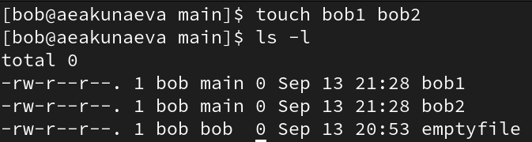{#fig:005 width=70%}

От лица пользователя root в прошлом терминале изменим права на каталог /data/main, обозначив его бит идентификатора для группы и sticky-bit для пользователей, указав ключи соответственно +s и +t ([рис. @fig:006]):

```
su -
chmod g+s,o+t /data/main
```

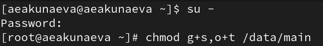{#fig:006 width=70%}

Снова зайдём как alice в каталог main и создадим теперь файлы alice3 и alice4, проверим. Файлы также будут теперь иметь группу main ([рис. @fig:007]):

```
su - alice
cd /data/main
touch alice3 alice4
ls -l
```

При этом, попытавшись удалить теперь файлы пользователя bob, мы получим отказ, т.к. sticky-bit запрещает воздействие на чужие файлы, даже если пользователи находятся в одной группе:

```
rm -rf bob*
```

{#fig:007 width=70%}

**3.3.3. Управление расширенными разрешениями с использованием списков ACL**

Как root-пользователь, установим права на чтение и выполнение для каталогов main и third как для групп third и main соответственно, указав ключ -m для внесения изменений в права командой setfacl и проверим результат через getfacl - действительно, у каталогов будет подпункт с группами с названиями друг друга и установка прав r-x ([рис. @fig:008]):

```
su -
setfacl -m g:third:rx /data/main
setfacl -m g:main:rx /data/third
getfacl /data/main
```

{#fig:008 width=70%}

Создадим новый файл в каталоге main, проверим его данные о правах и группах - пользователем будет являться root (т.к. мы его создавали), а в группе будет указана main. Повторив то же самое для каталога third, получим, что группа будет также root, как и владелец, т.к. мы не изменяли данных для third ([рис. @fig:009]):

```
touch /data/main/newfile1
getfacl /data/main/newfile1

touch /data/third/newfile2
getfacl /data/third/newfile2
```

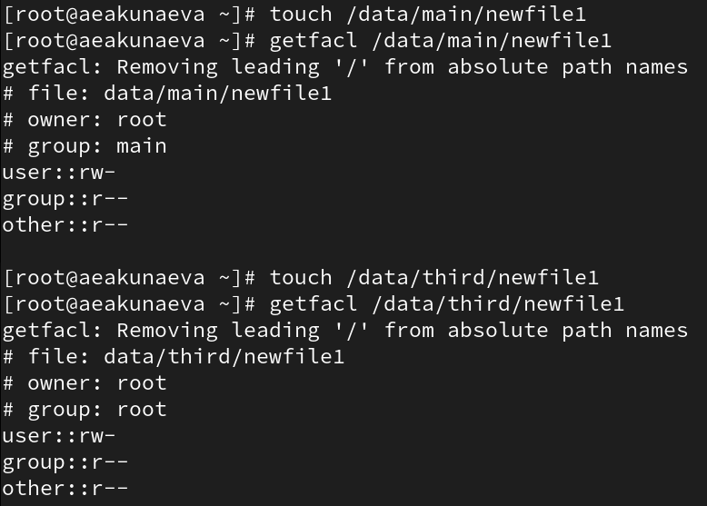{#fig:009 width=70%}

Установим теперь для этих каталогов базовые значения для групп (default - d) - rwx, создадим в каждом из них файлы и проверим данные новых файлов. Заметим, что добавится у новых файлов пункт на права для групп third и main соответственно с полным набором rwx, т.к. базовая установка позволяет влиять на новые файлы и каталоге, созданные в этом каталоге ([рис. @fig:010]):

```
setfacl -m d:g:third:rwx /data/main
setfacl -m d:g:main:rwx /data/third
touch /data/main/newfile2
getfacl /data/main/newfile2
touch /data/third/newfile2
getfacl /data/third/newfile2
```

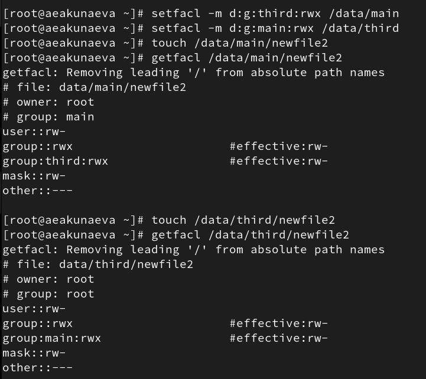{#fig:010 width=70%}

Теперь зайдём как пользователь carol из группы third. Попытавшись удалить файлы newfile1-2, мы получим отказ, т.к. sticky-bit не позволяет удалить файлы, не являясь их владельцем. При этом, попытавшись сделать запись в файл newfile1 каталога main, столкнёмся также с запретом, хотя записать в newfile2 выйдет - т.к. второй файл был создан после установки новых прав, пользователи группы third могут на него воздействовать, тогда как для старого файла newfile1 права не изменились ([рис. @fig:011]):

```
su - carol
rm /data/main/newfile1 /data/main/newfile2
ls /data/main
echo "Hello, world" >> /data/main/newfile1
echo "Hello, world" >> /data/main/newfile2
cat /data/main/newfile2
```

{#fig:011 width=70%}


# Контрольные вопросы

1. **Как следует использовать команду chown, чтобы установить владельца группы для файла? Приведите пример.**

Команду chown нужно использовать по схеме ([рис. @fig:012]):

```
chown [group] [file/catalogue]
```

- где group - новый владелец группы, а затем указан файл или каталог, для которого он меняется.

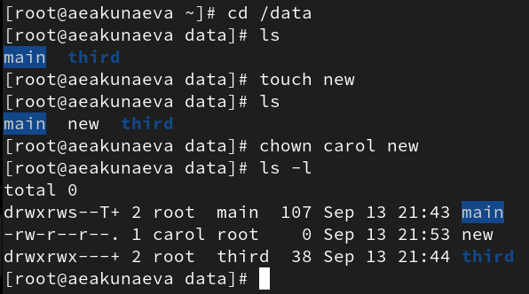{#fig:012 width=70%}

2. **С помощью какой команды можно найти все файлы, принадлежащие конкретному пользователю? Приведите пример.**

При помощи команды ([рис. @fig:013]):

```
find -user [username]
```

- где username - имя пользователя, чьи файлы нужно найти, а -user - ключ, для обозначения имени пользователя как ключа поиска.

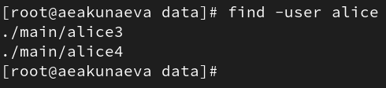{#fig:013 width=70%}

3. **Как применить разрешения на чтение, запись и выполнение для всех файлов в каталоге /data для пользователей и владельцев групп, не устанавливая никаких прав для других? Приведите пример.**

Благодаря команде chmod можно изменить права для файла или каталога /data, установив значение 770 (где 7 - rwx, полный набор прав, а 0 - отсутсвие прав) ([рис. @fig:014]):

```
chmod 770 test
ls -l
```

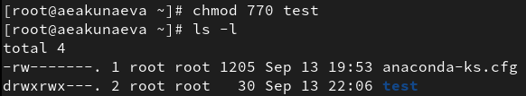{#fig:014 width=70%}

4. **Какая команда позволяет добавить разрешение на выполнение для файла, который  необходимо сделать исполняемым?**

При помощи команды chmod можно поставить параметр x для файла, чтобы сделать его исполняемым для какой-либо группы или пользователя:

```
chmod x [file/catalogue]
```

5. **Какая команда позволяет убедиться, что групповые разрешения для всех новых файлов, создаваемых в каталоге, будут присвоены владельцу группы этого каталога? Приведите пример.**

Установив бит идентификатора владельца группы для каталога через ключ +s для параметра g (group) (что будет видно при проверке getfacl в строке flags: -s-) ([рис. @fig:015]):

```
chmod g+s test
```

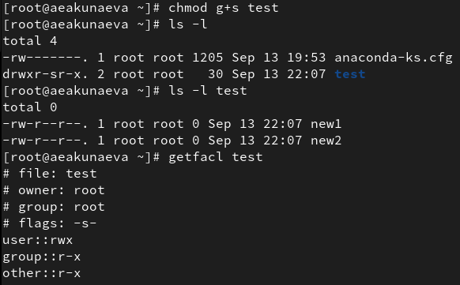{#fig:015 width=70%}

6. **Необходимо, чтобы пользователи могли удалять только те файлы, владельцами которых они являются, или которые находятся в каталоге, владельцами которого они являются. С помощью какой команды можно это сделать? Приведите пример.**

Чтобы пользователи удаляли только свои файлы,нужно поставить sticky-bit для каталога через ключ +t (будет отображаться как --t или подобное во flags после проверки getfacl) ([рис. @fig:016]):

```
chmod o+t test
```

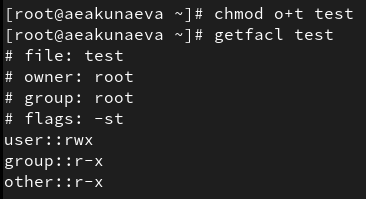{#fig:016 width=70%}

7. **Какая команда добавляет ACL, который предоставляет членам группы права доступа на чтение для всех существующих файлов в текущем каталоге?**

```
setfacl -m g:[groupname]:r [catalogue/.]
```

8. **Что нужно сделать для гарантии того, что члены группы получат разрешения на чтение для всех файлов в текущем каталоге и во всех его подкаталогах, а также для всех файлов, которые будут созданы в этом каталоге в будущем? Приведите пример.**

Чтобы все будущие файлы и каталоги в текущем каталоге сохраняли те же права доступа, нужно установить бит идентификатора группы для него ([рис. @fig:017]):

```
chmod g+s test
```

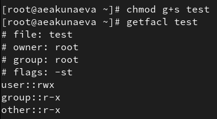{#fig:017 width=70%}

9. **Какое значение umask нужно установить, чтобы «другие» пользователи не получали какие-либо разрешения на новые файлы? Приведите пример.**

Можно установить значение umask на 077 (где 7 - rwx, 0 - ---) ([рис. @fig:018]):

```
umask 077
```

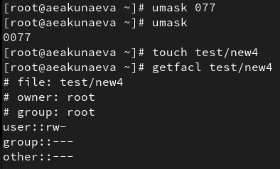{#fig:018 width=70%}

10. **Какая команда гарантирует, что никто не сможет удалить файл myfile случайно?**

Команда chmod с указанием параметра -r или -w, но не -x:

```
chmod -rw myfile
```

# Выводы

Я получила навыки настройки базовых и специальных прав доступа для групп пользователей в операционной системе типа Linux.

# Список литературы{.unnumbered} 

::: {#refs}
:::
