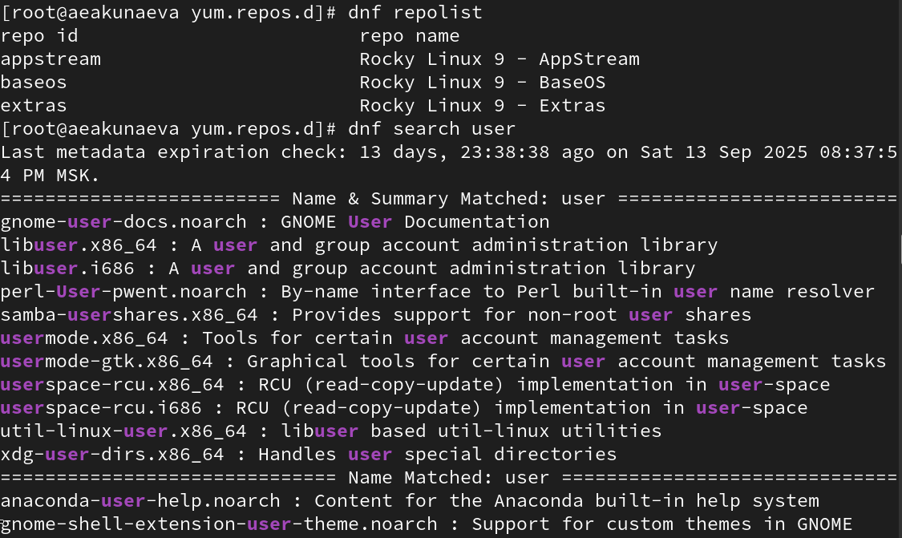
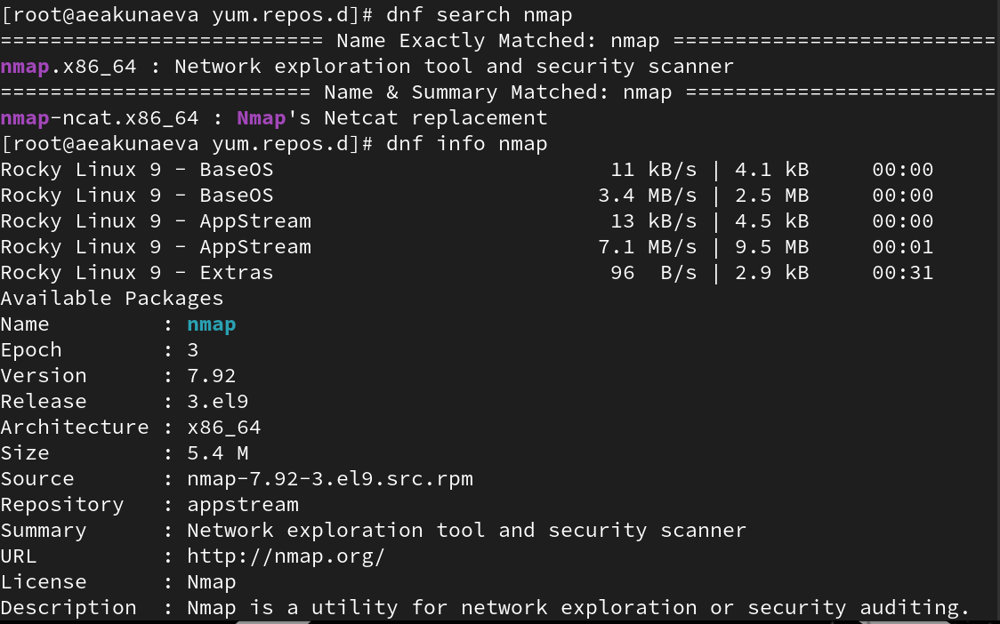
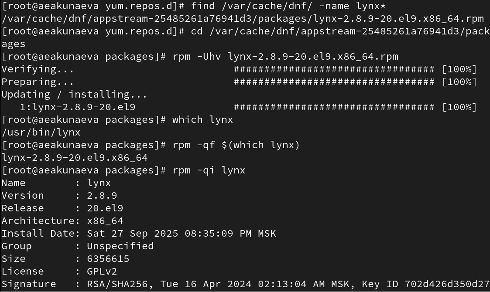
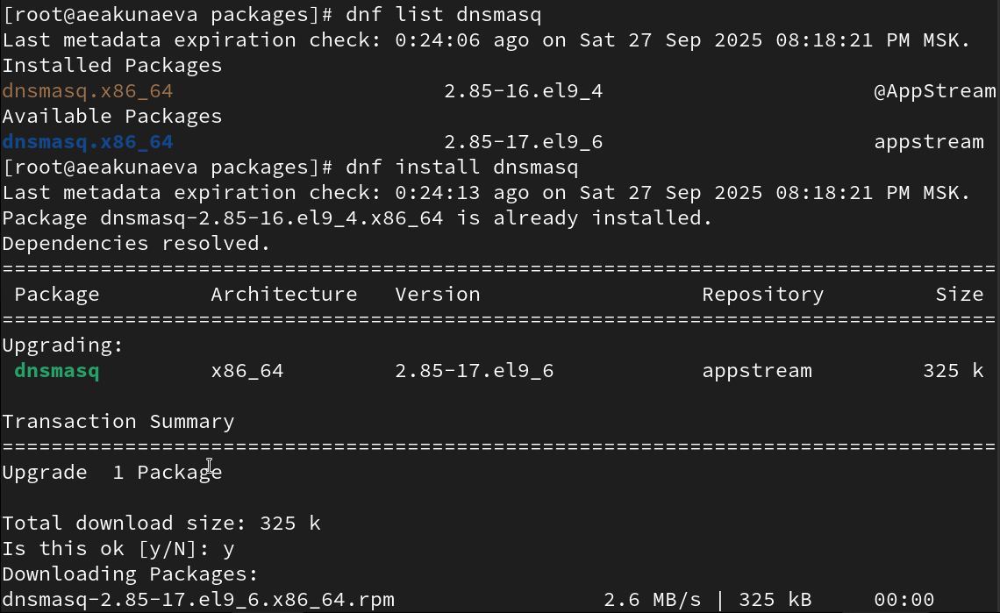
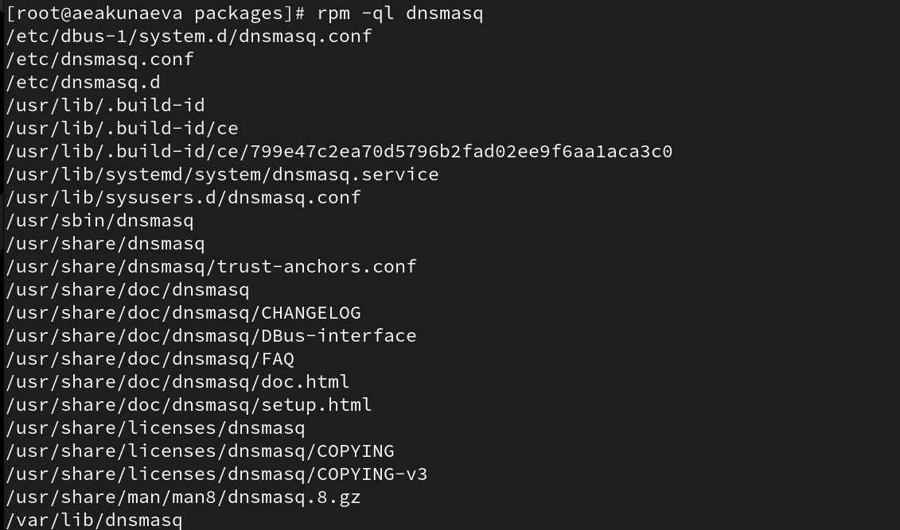
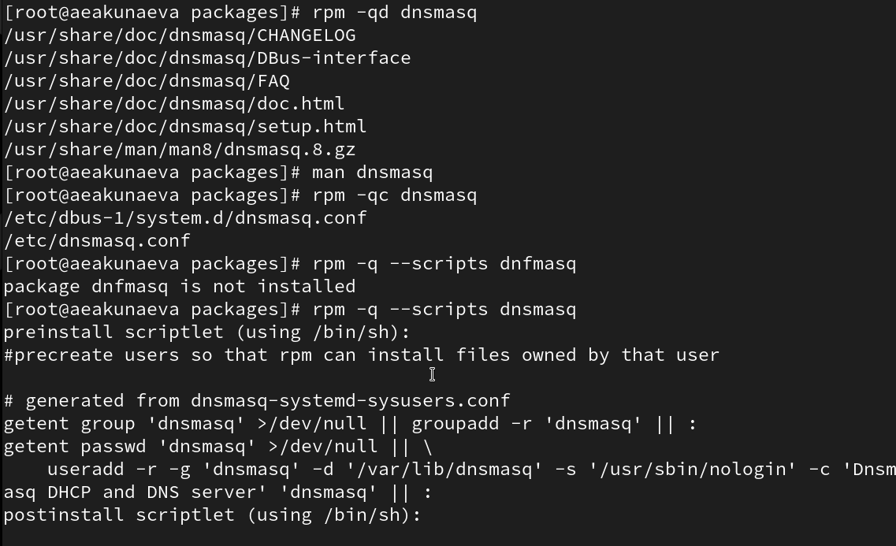
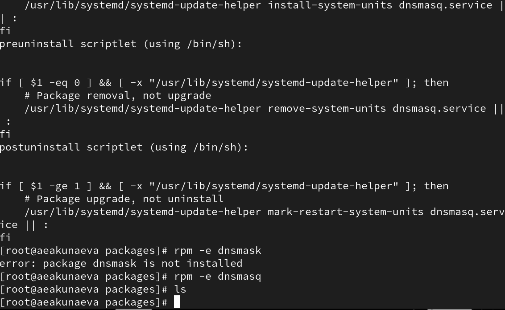

---
## Front matter
lang: ru-RU
title: Лабораторная работа №3
subtitle: Настройка прав доступа
author:
  - Акунаева Антонина Эрдниевна
institute:
  - Российский университет дружбы народов, Москва, Россия
  
date: 2025-09-14

## i18n babel
babel-lang: russian
babel-otherlangs: english

## Formatting pdf
toc: false
toc-title: Содержание
slide_level: 2
aspectratio: 169
section-titles: true
theme: metropolis
header-includes:
 - \metroset{progressbar=frametitle,sectionpage=progressbar,numbering=fraction}
---

# Информация

## Докладчик

:::::::::::::: {.columns align=center}
::: {.column width="70%"}

  * Акунаева Антонина Эрдниевна
  * студент ФФМиЕН, НПИбд-01-24
  * Российский университет дружбы народов
  * [1032240492@pfur.ru](mailto:1032240492@pfur.ru)
  * <https://github.com/Akuxee>

:::
::: {.column width="30%"}

:::
::::::::::::::

# Цели и задачи

- Получение навыков настройки базовых и специальных прав доступа для групп пользователей в операционной системе типа Linux.

1. Прочитайте справочное описание man по командам chgrp, chmod, getfacl, setfacl.
2. Выполните действия по управлению базовыми разрешениями для групп пользователей (раздел 3.3.1).
3. Выполните действия по управлению специальными разрешениями для групп пользователей (раздел 3.3.2).
4. Выполните действия по управлению расширенными разрешениями с использованием списков ACL для групп пользователей (раздел 3.3.3).

# Материалы и методы

- Linux (дистрибутив Rocky 9.6)
- Linux Fedora Workstation (Markdown)
- Oracle VirtualBox

# Выполнение лабораторной работы

## 

{#fig:001 width=70%}

## 

{#fig:002 width=70%}

## 

{#fig:003 width=70%}

## 

{#fig:004 width=70%}

## 

{#fig:005 width=70%}

## 

{#fig:006 width=70%}

## 

{#fig:007 width=70%}

## 

{#fig:008 width=70%}

## 

{#fig:009 width=70%}

## 

{#fig:010 width=70%}

## 

{#fig:011 width=70%}

## 

{#fig:012 width=70%}

## 

{#fig:013 width=70%}

## 

{#fig:014 width=70%}

## 

{#fig:015 width=70%}

## 
{#fig:016 width=70%}

## 

{#fig:017 width=70%}

## 

{#fig:018 width=70%}

## 

{#fig:019 width=70%}

## 

{#fig:020 width=70%}

## 

{#fig:021 width=70%}

## 

{#fig:022 width=70%}

# Выводы

Я получила навыки настройки базовых и специальных прав доступа для групп пользователей в операционной системе типа Linux.

