---
## Front matter
title: "Отчёт по лабораторной работе №4"
subtitle: "Работа с программными пакетами"
author: "Акунаева Антонина Эрдниевна"

## Generic otions
lang: ru-RU
toc-title: "Содержание"

## Bibliography
bibliography: bib/cite.bib
csl: pandoc/csl/gost-r-7-0-5-2008-numeric.csl

## Pdf output format
toc: true # Table of contents
toc-depth: 2
lof: true # List of figures
lot: true # List of tables
fontsize: 12pt
linestretch: 1.5
papersize: a4
documentclass: scrreprt
## I18n polyglossia
polyglossia-lang:
  name: russian
  options:
	- spelling=modern
	- babelshorthands=true
polyglossia-otherlangs:
  name: english
## I18n babel
babel-lang: russian
babel-otherlangs: english
## Fonts
mainfont: IBM Plex Serif
romanfont: IBM Plex Serif
sansfont: IBM Plex Sans
monofont: IBM Plex Mono
mathfont: STIX Two Math
mainfontoptions: Ligatures=Common,Ligatures=TeX,Scale=0.94
romanfontoptions: Ligatures=Common,Ligatures=TeX,Scale=0.94
sansfontoptions: Ligatures=Common,Ligatures=TeX,Scale=MatchLowercase,Scale=0.94
monofontoptions: Scale=MatchLowercase,Scale=0.94,FakeStretch=0.9
mathfontoptions:
## Biblatex
biblatex: true
biblio-style: "gost-numeric"
biblatexoptions:
  - parentracker=true
  - backend=biber
  - hyperref=auto
  - language=auto
  - autolang=other*
  - citestyle=gost-numeric
## Pandoc-crossref LaTeX customization
figureTitle: "Рис."
tableTitle: "Таблица"
listingTitle: "Листинг"
lofTitle: "Список иллюстраций"
lotTitle: "Список таблиц"
lolTitle: "Листинги"
## Misc options
indent: true
header-includes:
  - \usepackage{indentfirst}
  - \usepackage{float} # keep figures where there are in the text
  - \floatplacement{figure}{H} # keep figures where there are in the text
---


# Цель работы

Получить навыки работы с репозиториями и менеджерами пакетов. [@TUIS-lab4]

# Задание

1. Изучите, как и в каких файлах подключаются репозитории для установки программного обеспечения; изучите основные возможности (поиск, установка, обновление, удаление пакета, работа с историей действий) команды dnf (см. раздел 4.4.1).
2. Изучите и повторите процесс установки/удаления определённого пакета с использованием возможностей dnf (см. раздел 4.4.1).
3. Изучите и повторите процесс установки/удаления определённого пакета с использованием возможностей rpm (см. раздел 4.4.2).

# Выполнение лабораторной работы

**4.4.1. Работа с репозиториями**

Зайдём в аккаунт и терминал как суперпользователь. Перейдём в каталог репозиториев /etc/yum.repos.d и выведем на экран список репозиториев, а после содержимое каждого из файлов репозиториев через команду cat с подстановкой названия одного из 4-ёх имеющихся пакетов ([рис. @fig:001]):

```
su -
cd /etc/yum.repos.d
ls
cat rocky[name].repo
```

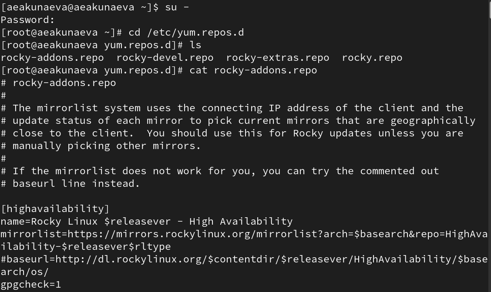{#fig:001 width=70%}

Выведем список репозиториев ([рис. @fig:002]):

```
dnf repolist
```

Список отображает ID репозитория и название - в нашем случае это три репозитория для Rocky Linux версии 9, стандартные установленные AppStream, BaseOS и Extras.  
Выведем также список пакетов, имеющих где-либо в названии или описании *user*:

```
dnf search user
```

Получим список всех возможных названий установленных пакетов, имеющих *user* в названии - и, следующими по списку, в описании.

{#fig:002 width=70%}

Установим nmap, изучив инфморацию о нём ([рис. @fig:003]-[рис. @fig:005]):

```
dnf search nmap
dnf info nmap
dnf install nmap
dnf install nmap\*
```

{#fig:003 width=70%}

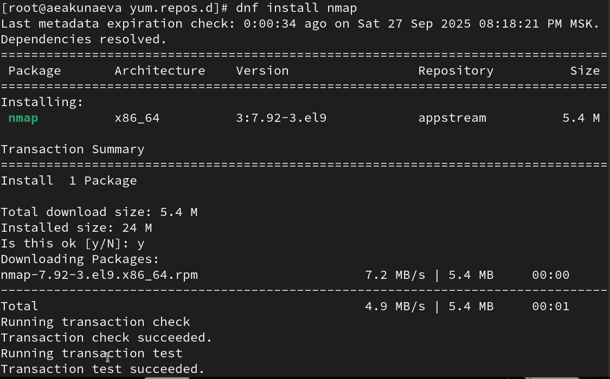{#fig:004 width=70%}

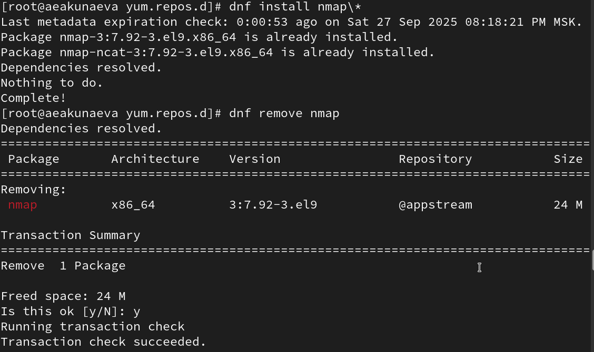{#fig:005 width=70%}

Запись *dnf install nmap* отличается от *dnf install nmap\8* тем, что первая просто устанавливает пакет nmap, тогда как nmap\* устанавливает все пакеты, связанные с nmap (в нашем случае nmap и ncat).  
Удаление работает по тому же принципу. После установки удалим установленные пакеты ([рис. @fig:006]):

```
dnf remove nmap
dnf remove nmap\
```

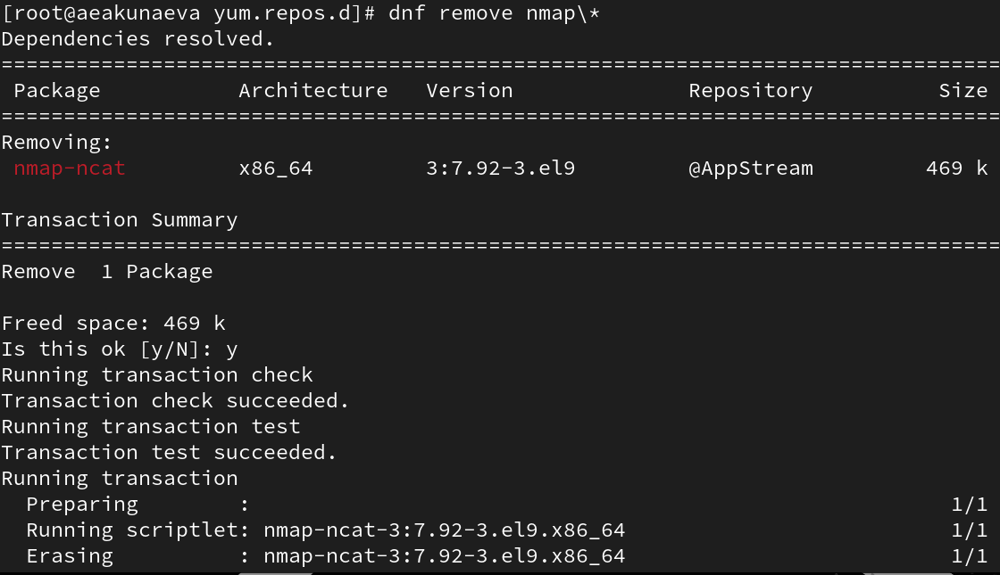{#fig:006 width=70%}

Нужно установить RPM Development Tools, для этого перед установкой получим информацию о группах пакетов dnf ([рис. @fig:007]-[рис. @fig:008]):

```
dnf groups list
LANG=C dnf groups list
dnf groups info "RPM Development Tools"
```

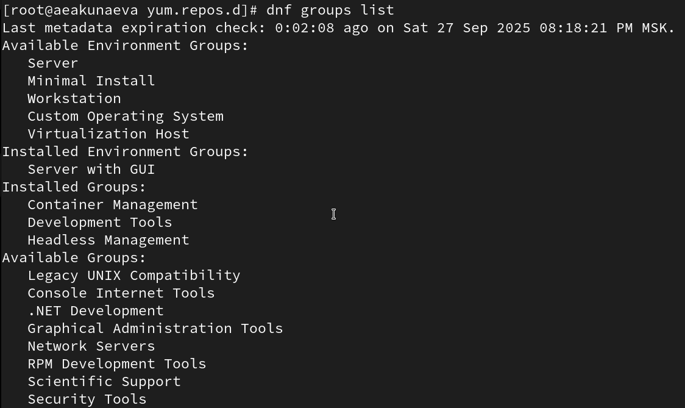{#fig:007 width=70%}

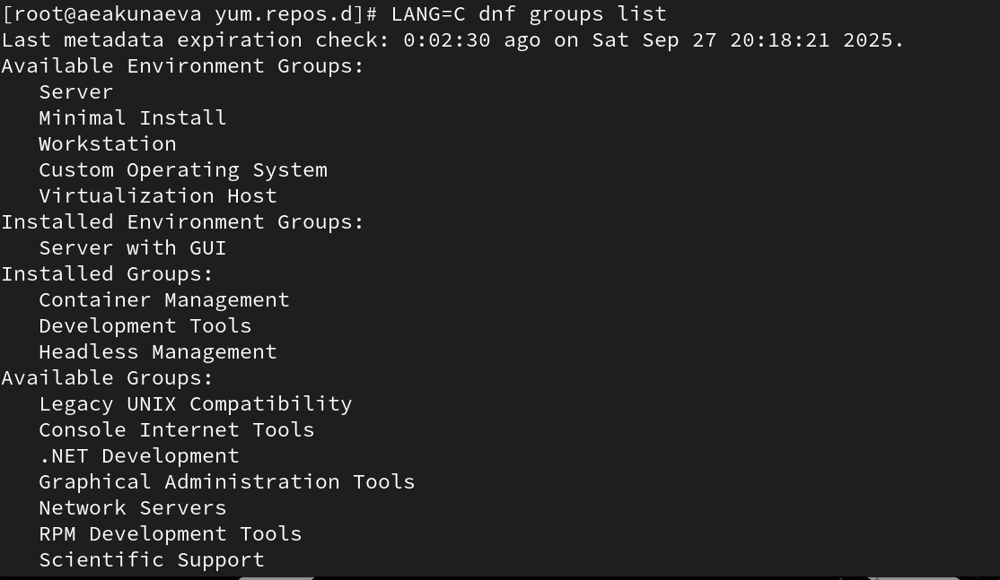{#fig:008 width=70%}

Установим теперь группу RPM Development Tools ([рис. @fig:009]):

```
dnf groupinstall "RPM Development Tools"
```

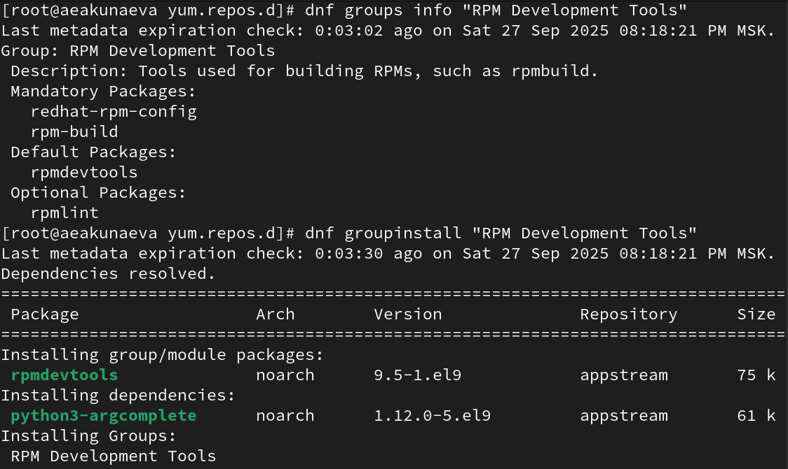{#fig:009 width=70%}

Удалим группы пакетов RPM Development Tools и убедимся через ls, что он не установлен ([рис. @fig:010]):

```
dnf groupremove "RPM Development Tools"
```

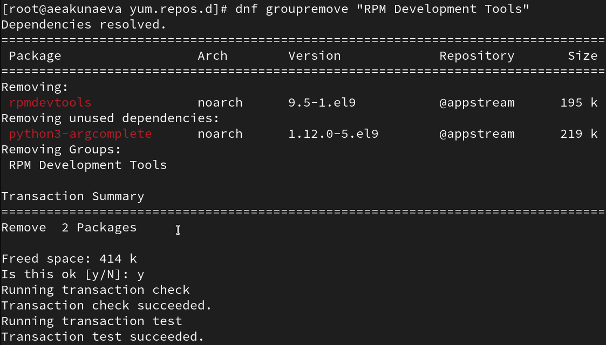{#fig:010 width=70%}

Определим историю использования команды dnf и получим семь строк за всё время использования. Нам нужно отменить 6-ое действие (удаление RPM Development Tools), но, т.к. это является сельмым действием в нашем случае, а шестым - его установка, ничего не выйдет, потому вручную установим снова RPM Development Tools, как было сделано ранее ([рис. @fig:011]):
 
```
dnf history
dnf history undo 6
```

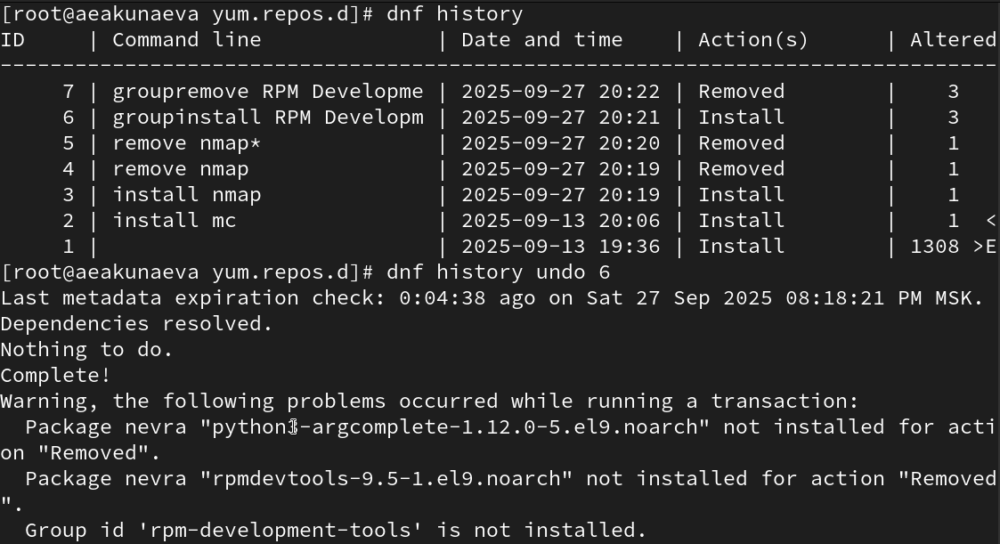{#fig:011 width=70%}

**4.4.2. Использование rpm**

Установим rpm-пакет lynx, предварительно выведя список пакетов lynx. Установим, добавим ключ *--downloadonly* для исключительно установки пакета без дальнейших манипуляций ([рис. @fig:012]):
 
```
dnf list lynx
dnf install lynx --downloadonly
```

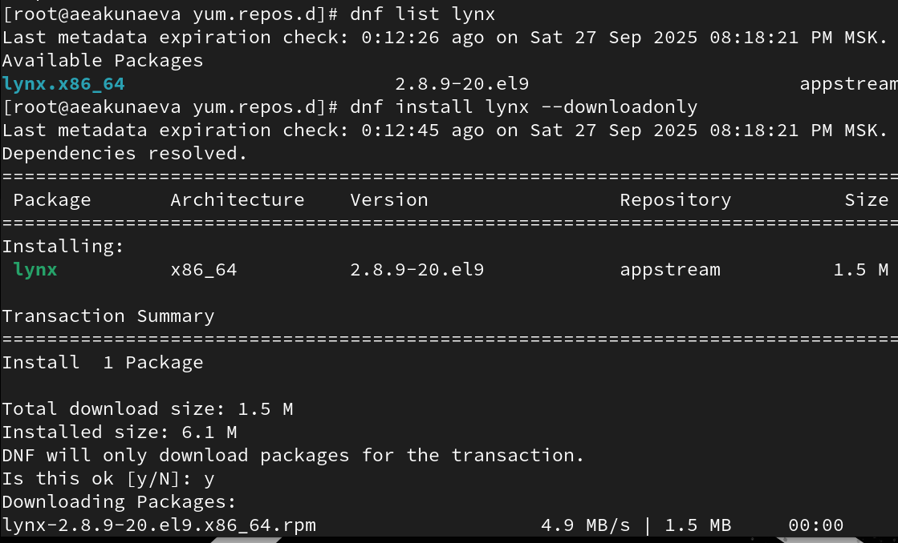{#fig:012 width=70%}

Найдём каталог с установленным пакетом lynx */var/cache/dnf/appstream-25485261a76941d3/packages* и перейдём в него, установим lynx указанной версии и далее определим его местоположение (*/usr/bin*). Определим местоположение lynx, его пакетов и получим информацию о нём (название, версия, описание и пр.) через -qi ([рис. @fig:013]):

```
find /var/cache/dnf/ -name lynx*
rpm -Uhv lynx-<версия>.rpm

which lynx
rpm -qf $(which lynx)
rpm -qi lynx
```

{#fig:013 width=70%}

Выведем список всех файлов в пакете ([рис. @fig:014]):
 
```
rpm -ql lynx
```

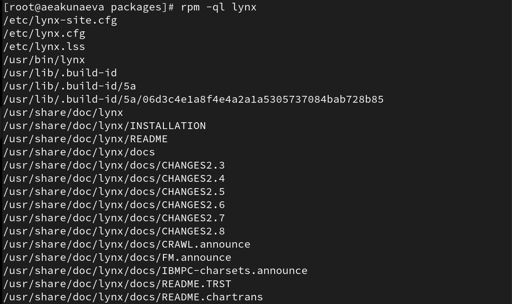{#fig:014 width=70%}

Выведем перечень файлов с документацией пакета ([рис. @fig:015]):

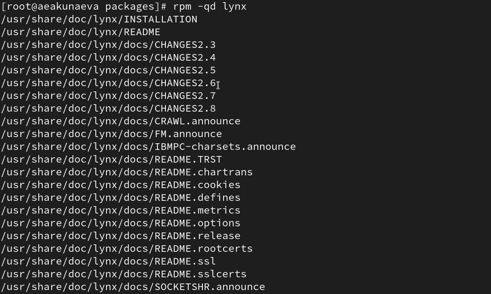{#fig:015 width=70%}

```
rpm -qd lynx
```

НАглядно ознакомимся с документацией lynx через man. ЗАтем выведем местоположение и список скриптов пакета. Запустим в другом терминале lynx, введя команду *lynx*, чтобы убедиться, что всё было установлено корректно. После удаляем пакет lynx. Проверим корректность удаления через ls ([рис. @fig:016]):
 
```
man lynx
rpm -qc lynx
rpm -q --scripts lynx
rpm -e lynx
ls
```

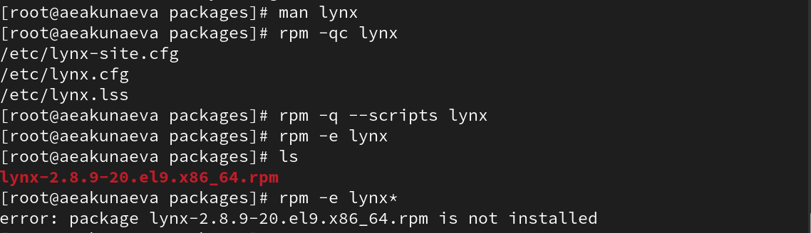{#fig:016 width=70%}

```
lynx
``` ([рис. @fig:017]):

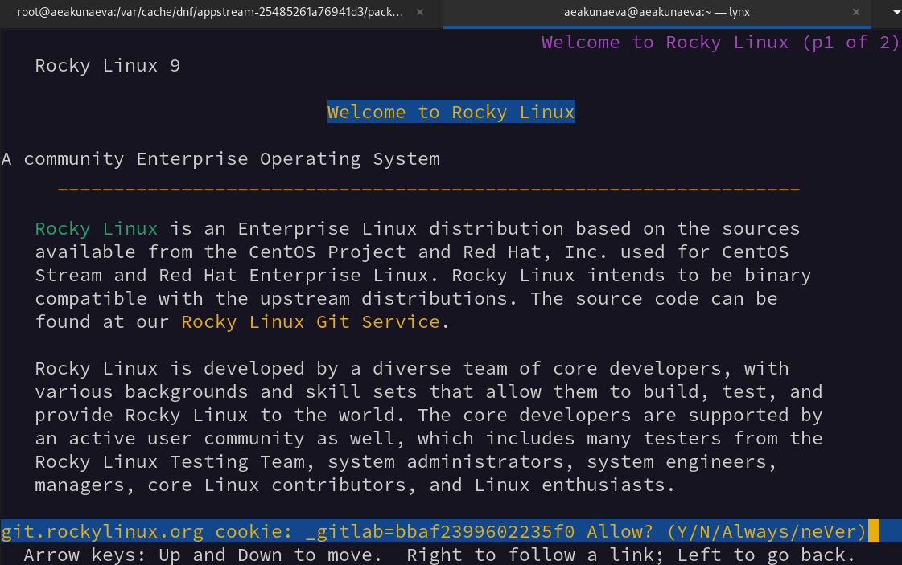{#fig:017 width=70%}

**Установка dnsmasq**

Установим dnsmasq, предварительно выведя список пакетов ([рис. @fig:018]):

```
dnf list dnsmasq
dnf install dnsmasq
```

{#fig:018 width=70%}

Определим расположение пакетов установленных пакетов rpm и самого dnsmasq. Выведем информацию о rpm-пакете dnsmasq и ознакомимся с ней ([рис. @fig:019]):
 
```
which dnsmasq
rpm -qf $(which dnsmasq)
rpm -qi dnsmasq
```

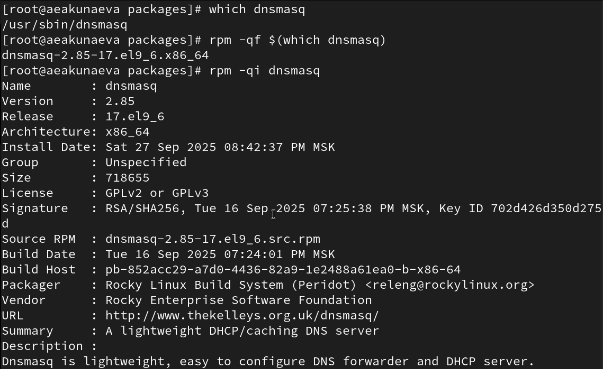{#fig:019 width=70%}

Получим также дополнительную информацию в списках о всех файлах пакета, файлах документации и конфигурационных файлов. Также проверим и ознакомимся с документацией dnsmasq ([рис. @fig:020]):

```
rpm -ql dnsmasq
rpm -qd dnsmasq
man dnsmasq
rpm -qc dnsmasq
```

{#fig:020 width=70%}

Выведем скрипты пакетов dnsmasq. Скрипты наглядно показывают использование нескольких команд (0-1-больше) для взаимодействия с пакетами dnsmasq ([рис. @fig:021]):

```
rpm -q --scripts dnsmasq
```

- 1 - установка и обновление пакетов
- 0 - удаление пакетов без обновления
- <=1 - обновление пакетов без удаления

{#fig:021 width=70%}

После удаляем пакеты dnsmasq и проверяем успешность через ls ([рис. @fig:022]):

```
rpm -e dnsmask
```

{#fig:022 width=70%}

# Контрольные вопросы
1. **Какая команда позволяет вам искать пакет rpm, содержащий файл useradd?**

```
rpm -qf [filename]
```

2. **Какие команды вам нужно использовать, чтобы показать имя группы dnf, которая содержит инструменты безопасности и показывает, что находится в этой группе?**

```
dnf groupinfo
dnf grouplist
```

3. **Какая команда позволяет вам установить rpm, который вы загрузили из Интернета и который не находится в репозиториях?**

```
rpm -i [packagename].rpm
```

4. **Вы хотите убедиться, что пакет rpm, который вы загрузили, не содержит никакого опасного кода сценария. Какая команда позволяет это сделать?**

```
rpm -pq --scripts [packagename]
```

5. **Какая команда показывает всю документацию в rpm?**

```
rpm -qd
```

6. **Какая команда показывает, какому пакету rpm принадлежит файл?**

```
rpm -qf
```

# Выводы

Я получила навыки работы с репозиториями и менеджерами пакетов.

# Список литературы{.unnumbered}

::: {#refs}
:::
