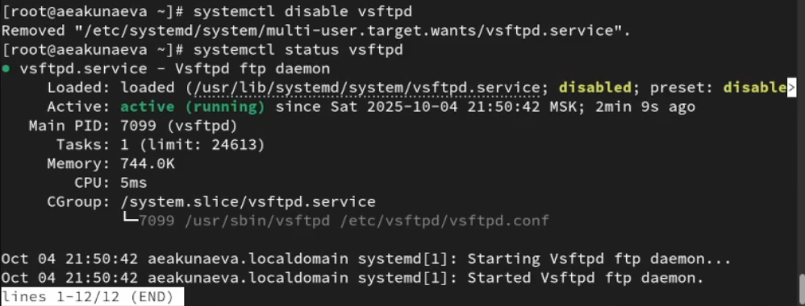
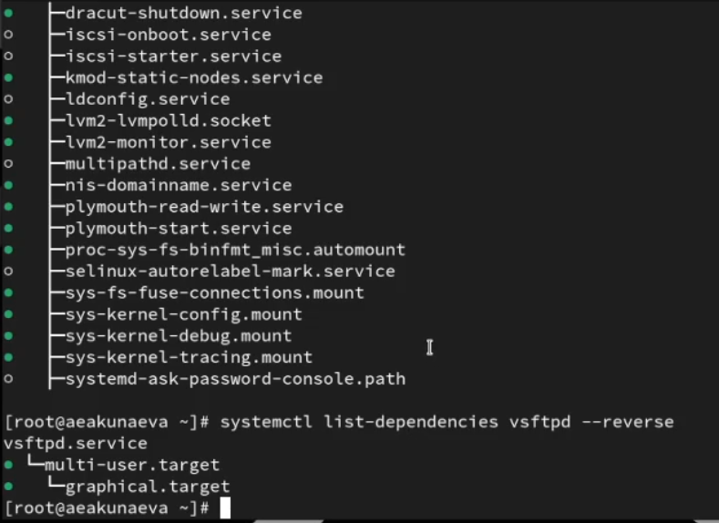
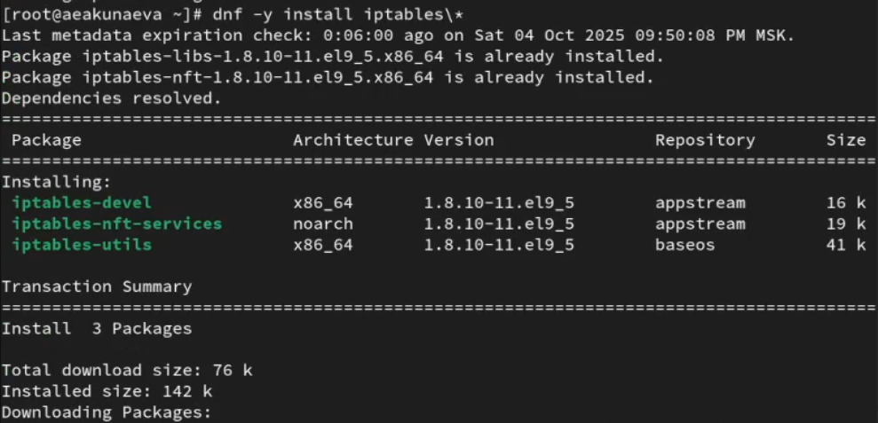
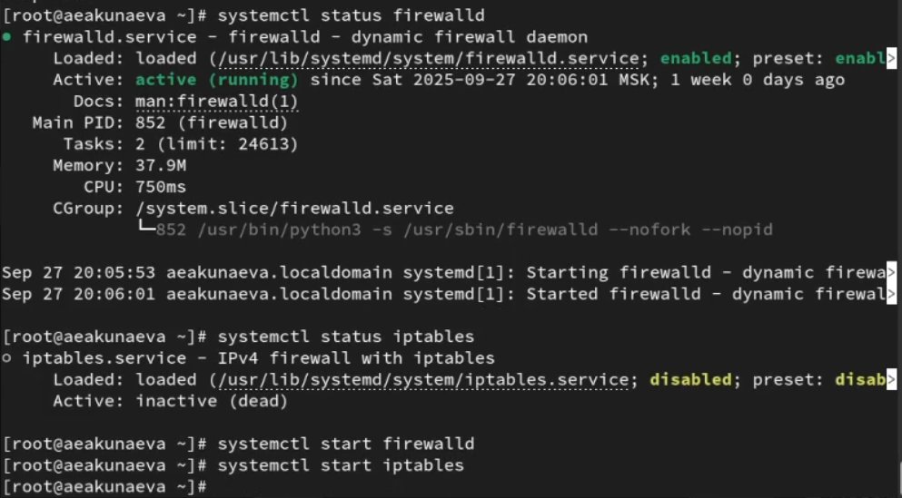
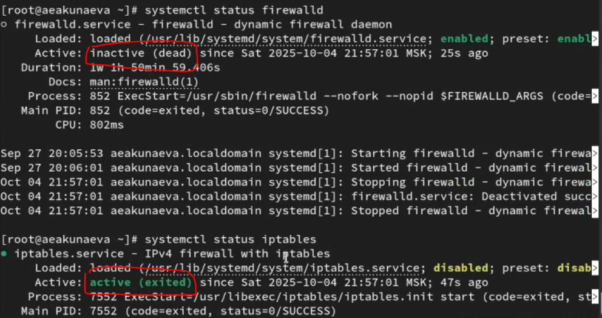
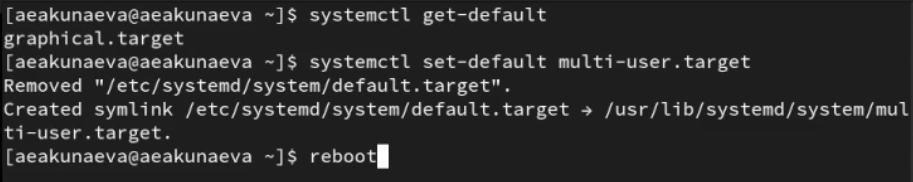
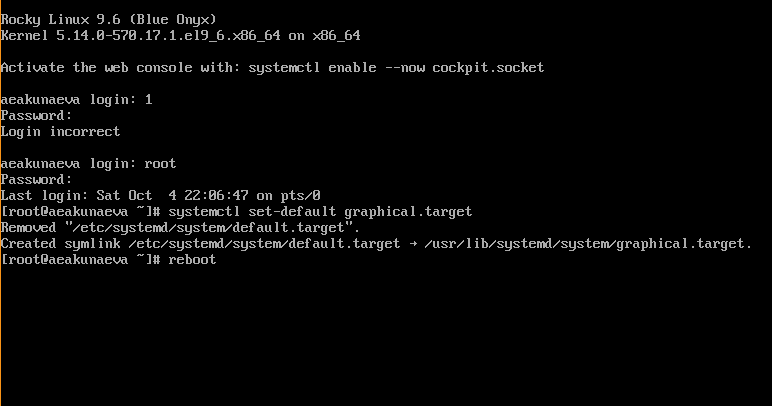
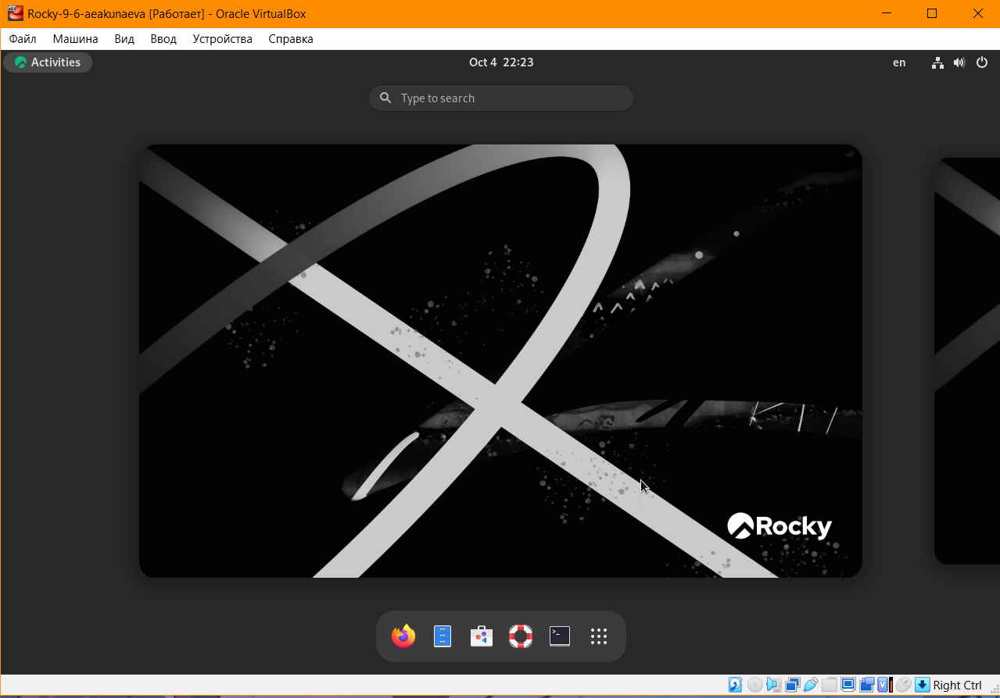

---
## Front matter
lang: ru-RU
title: Лабораторная работа №5
subtitle: Управление системными службами
author:
  - Акунаева Антонина Эрдниевна
institute:
  - Российский университет дружбы народов, Москва, Россия
  
date: 2025-10-04

## i18n babel
babel-lang: russian
babel-otherlangs: english

## Formatting pdf
toc: false
toc-title: Содержание
slide_level: 2
aspectratio: 169
section-titles: true
theme: metropolis
header-includes:
 - \metroset{progressbar=frametitle,sectionpage=progressbar,numbering=fraction}
---

# Информация

## Докладчик

:::::::::::::: {.columns align=center}
::: {.column width="70%"}

  * Акунаева Антонина Эрдниевна
  * студент ФФМиЕН, НПИбд-01-24
  * Российский университет дружбы народов
  * [1032240492@pfur.ru](mailto:1032240492@pfur.ru)
  * <https://github.com/Akuxee>

:::
::: {.column width="30%"}

:::
::::::::::::::

# Цели и задачи

- Получить навыки управления системными службами операционной системы посредством systemd.

1. Выполните основные операции по запуску (останову), определению статуса, добавлению (удалению) в автозапуск и пр. службы Very Secure FTP (раздел 5.4.1).
2. Продемонстрируйте навыки по разрешению конфликтов юнитов для служб firewalld и iptables (раздел 5.4.2).
3. Продемонстрируйте навыки работы с изолированными целями (разделы 5.4.3, 5.4.4).

# Материалы и методы

- Linux (дистрибутив Rocky 9.6)
- Linux Fedora Sway (Markdown)
- Oracle VirtualBox

# Выполнение лабораторной работы

## Проверка статуса и установка Very Secure FTP

{#fig:001 width=70%}

## Запуск Very Secure FTP

{#fig:002 width=70%}

## Подключение автозапуск Very Secure FTP

{#fig:003 width=70%}

## Отключение автозапуск Very Secure FTP

{#fig:004 width=70%}

## Список символических ссылок запуска сервисов

{#fig:005 width=70%}

## Статус VSFTPD: запущенный файл юнита

{#fig:006 width=70%}

## Список зависимостей юнита VSFTPD

{#fig:007 width=70%}

## Список юнитов, зависимых от юнита VSFTPD

{#fig:008 width=70%}

## Установка iptables

{#fig:009 width=70%}

## Включение служб firewalld и iptables

{#fig:010 width=70%}

## Статус firewalld и iptables

{#fig:011 width=70%}

## Настройки конфликтов firewalld и iptables

{#fig:012 width=70%}

## Блокирование службы iptables

{#fig:013 width=70%}

## Список доступных для блокировки целей

{#fig:014 width=70%}

## Перевод системы в режим восстановления

{#fig:015 width=70%}

## Перезапуск системы

{#fig:016 width=70%}

## Установка текстового режима системы

{#fig:017 width=70%}

## Установка графического режима системы

{#fig:018 width=70%}

## Графический режим системы

{#fig:019 width=70%}

# Выводы

Я получила навыки управления системными службами операционной системы посредством systemd.

