---
## Front matter
title: "Отчёт по лабораторной работе №5"
subtitle: "Управление системными службами"
author: "Акунаева Антонина Эрдниевна"

## Generic otions
lang: ru-RU
toc-title: "Содержание"

## Bibliography
bibliography: bib/cite.bib
csl: pandoc/csl/gost-r-7-0-5-2008-numeric.csl

## Pdf output format
toc: true # Table of contents
toc-depth: 2
lof: true # List of figures
lot: true # List of tables
fontsize: 12pt
linestretch: 1.5
papersize: a4
documentclass: scrreprt
## I18n polyglossia
polyglossia-lang:
  name: russian
  options:
	- spelling=modern
	- babelshorthands=true
polyglossia-otherlangs:
  name: english
## I18n babel
babel-lang: russian
babel-otherlangs: english
## Fonts
mainfont: IBM Plex Serif
romanfont: IBM Plex Serif
sansfont: IBM Plex Sans
monofont: IBM Plex Mono
mathfont: STIX Two Math
mainfontoptions: Ligatures=Common,Ligatures=TeX,Scale=0.94
romanfontoptions: Ligatures=Common,Ligatures=TeX,Scale=0.94
sansfontoptions: Ligatures=Common,Ligatures=TeX,Scale=MatchLowercase,Scale=0.94
monofontoptions: Scale=MatchLowercase,Scale=0.94,FakeStretch=0.9
mathfontoptions:
## Biblatex
biblatex: true
biblio-style: "gost-numeric"
biblatexoptions:
  - parentracker=true
  - backend=biber
  - hyperref=auto
  - language=auto
  - autolang=other*
  - citestyle=gost-numeric
## Pandoc-crossref LaTeX customization
figureTitle: "Рис."
tableTitle: "Таблица"
listingTitle: "Листинг"
lofTitle: "Список иллюстраций"
lotTitle: "Список таблиц"
lolTitle: "Листинги"
## Misc options
indent: true
header-includes:
  - \usepackage{indentfirst}
  - \usepackage{float} # keep figures where there are in the text
  - \floatplacement{figure}{H} # keep figures where there are in the text
---


# Цель работы

Получить навыки управления системными службами операционной системы посредством systemd. [@TUIS-lab5]

# Задание

1. Выполните основные операции по запуску (останову), определению статуса, добавлению (удалению) в автозапуск и пр. службы Very Secure FTP (раздел 5.4.1).
2. Продемонстрируйте навыки по разрешению конфликтов юнитов для служб firewalld и iptables (раздел 5.4.2).
3. Продемонстрируйте навыки работы с изолированными целями (разделы 5.4.3, 5.4.4).

# Выполнение лабораторной работы

**5.4.1. Управление сервисами**

Зайдём как супер-пользователь через *su -*. Проверим статус службы Very Secure FTP и получим сообщение о том, что такой службы нет. Тогда устанавливаем службу ([рис. @fig:001]):

```
systemctl status vsftpd
dnf -y install vsftpd
```

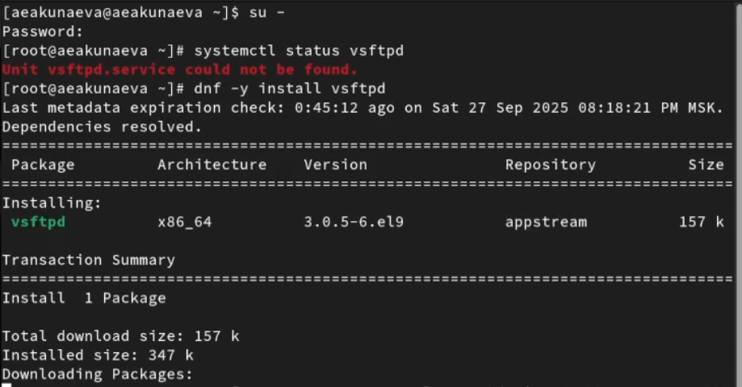{#fig:001 width=70%}

Запустим VSFTPD и снова проверим статус: теперь служба запущена, но при перезапуске подключена не будет ([рис. @fig:002]):

```
systemctl start vsftpd
systemctl status vsftpd
```

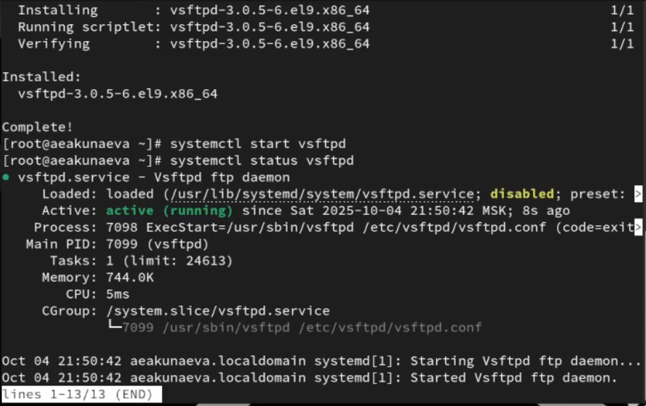{#fig:002 width=70%}

Подключаем службу к автозапуску вместе с системой. Заметим, что в статусе появится отметка о подключении автозапуска ([рис. @fig:003]):

```
systemctl enable vsftpd
```

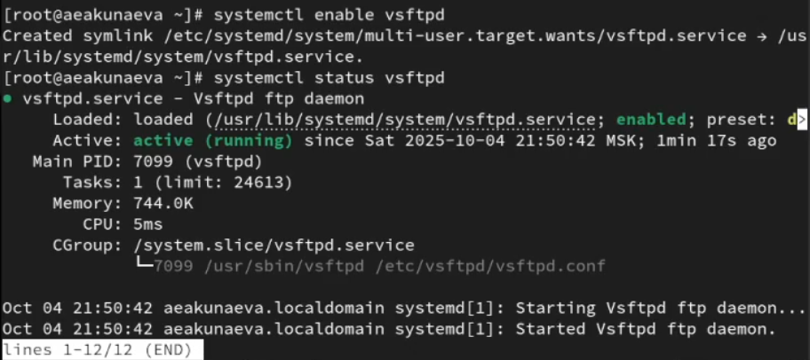{#fig:003 width=70%}

Теперь отключим автозапуск ([рис. @fig:004]):

```
systemctl disable vsftpd
```

{#fig:004 width=70%}

Выведем на экран список символических ссылок запуска разных сервисов через ls. Среди них не будет VSFTPD, пока мы снова не подключим автозапуск через systemctl enable ([рис. @fig:005]):

```
ls /etc/systemd/system/multi-user.target.wants
```

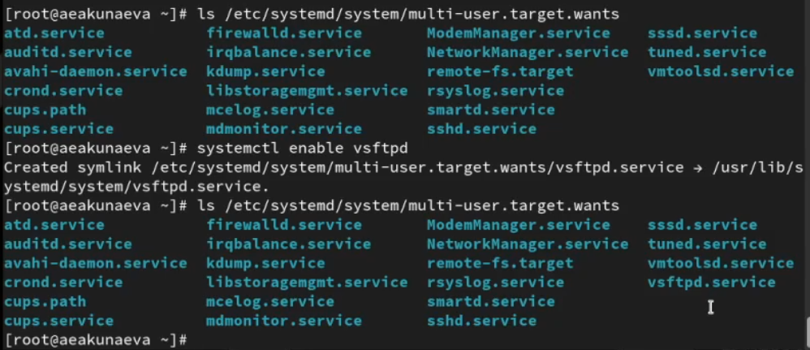{#fig:005 width=70%}

В статусе будет теперь отображаться запущенный файл юнита ([рис. @fig:006]):

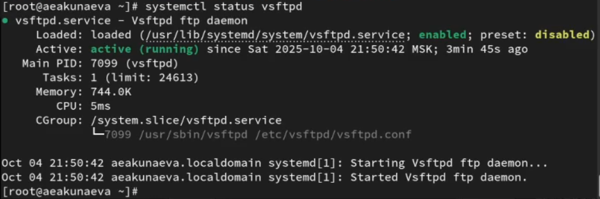{#fig:006 width=70%}

Выведем список зависимостей и список юнитов ([рис. @fig:007]), зависящих от юнита VSFTPD ([рис. @fig:008]):

```
systemctl list-dependencies vsftpd
systemctl list-dependencies vsftpd --reverse
```

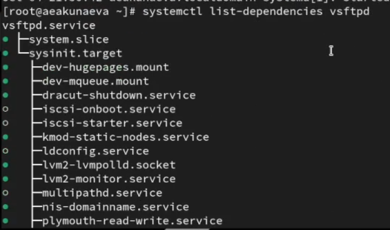{#fig:007 width=70%}

{#fig:008 width=70%}

**5.4.2. Конфликты юнитов**

Установим iptables ([рис. @fig:009]):

```
dnf -y install iptables\*
```

{#fig:009 width=70%}

Проверим статус firewalld и iptables: первая служба будет включена, тогда как вторая - нет, т.к. мы только её установили. Попробуем включить обе службы ([рис. @fig:010]):

```
systemctl status firewalld
systemctl status iptables

systemctl start firewalld
systemctl start iptables
```

{#fig:010 width=70%}

При этом при включении одной (последней была запущена iptables) вторая будет отключена ([рис. @fig:011]).

{#fig:011 width=70%}

Выведем на экран список настроек firewalld и iptables. В конфликтах указаны будут они же друг у друга, что и вызывает отключение второго при включении первого ([рис. @fig:012]):

```
cat /usr/lib/systemd/system/firewalld.service
cat /usr/lib/systemd/system/iptables.service
```

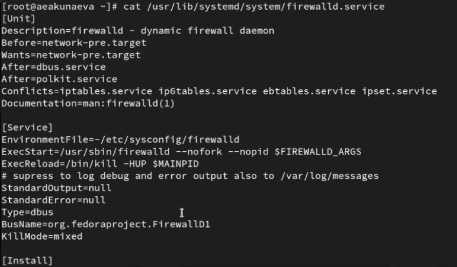{#fig:012 width=70%}

Выгрузим службу iptables и загрузим firewalld. Заблокируем iptables, получим символическую ссылку на service-файл. Тогда при попытке запустить или добавить в автозапуск служб, получим ошибки ([рис. @fig:013]):

```
systemctl stop iptables
systemctl start firewalld
systemctl mask iptables
systemctl start iptables
systemctl enable iptables
```

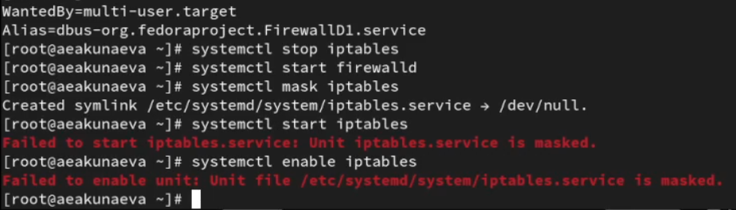{#fig:013 width=70%}

**5.4.3. Изолируемые цели**

Перейдём в каталог /usr/lib/systemd/system и выведем список целей, доступных для блокировки ([рис. @fig:014]):

```
cd /usr/lib/systemd/system
grep Isolate *.target
```

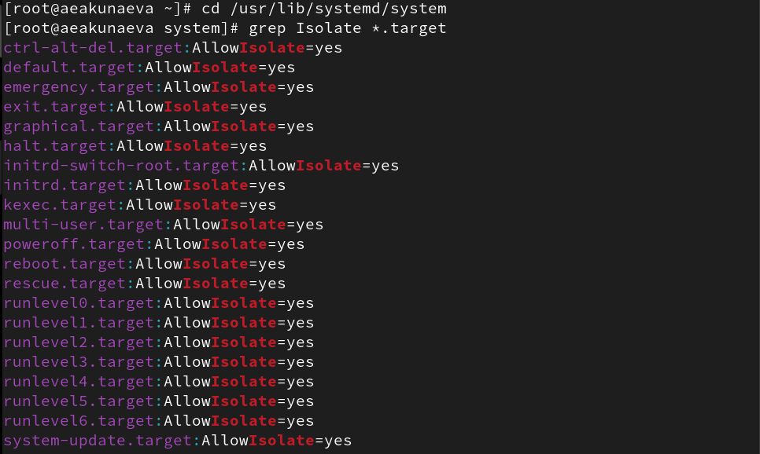{#fig:014 width=70%}

Изолируем службу rescue.target, чтобы перевести систему в режим восстановления, позже также введя пароль ([рис. @fig:015]):

```
systemctl isolate rescue.target
```

{#fig:015 width=70%}

В появившемся окне вводим пароль от root-аккаунта и перезапускаем систему командой ([рис. @fig:016]):
 
```
systemctl isolate reboot.target
```

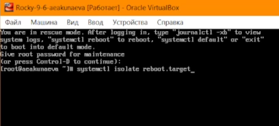{#fig:016 width=70%}

**5.4.4. Цель по умолчанию**

Проверим установленную по умолчанию цель и получим, что установлен графиечский режим. Тогда установим текстовый режим и перезапустим систему ([рис. @fig:017]):

```
systemctl get-default
systemctl set-default multi-user.target
reboot
```

{#fig:017 width=70%}

После перезапуска заходим как администратор и переводим цель обратно на графический режим и снова перезапускаем ([рис. @fig:018]):
 
```
systemctl set-default graphical.targe
reboot
```

{#fig:018 width=70%}

Графический режим возвращён после перезапуска ([рис. @fig:019]).

{#fig:019 width=70%}

# Контрольные вопросы

**1. Что такое юнит (unit)? Приведите примеры.**

Юнитами (units) называются файлы конфигурации операционной системы с определённым синтаксисом, который определяет их поведение. Они описывают какой-то объект в systemd ([рис. @fig:00]):

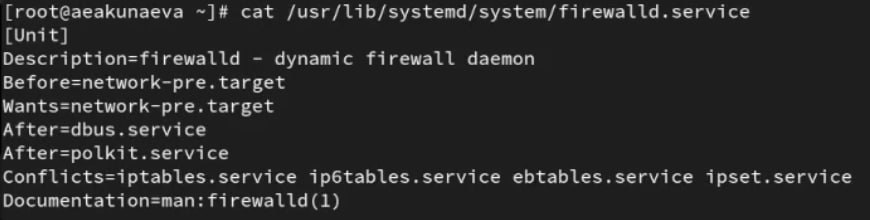{#fig:00 width=70%}

**2. Какая команда позволяет вам убедиться, что цель больше не входит в список автоматического запуска при загрузке системы?**

```
systemctl disable [service]
```

**3. Какую команду вы должны использовать для отображения всех сервисных юнитов, которые в настоящее время загружены?**

```
systemctl list-units
```

**4. Как создать потребность (wants) в сервисе?**

Нужно использовать *Wants=* в юнит-файле для записи зависимостей wants.

**5. Как переключить текущее состояние на цель восстановления (rescue target)?**

При помощи команды:

```
systemctl isolate rescue.target
```

**6. Поясните причину получения сообщения о том, что цель не может быть изолирована.**

Это сообщение означает, что какие-то в системе цель изоирована быть не может, т.к. у неё не подключена опция изоляции AllowIsolate. Если возможно, можно изменить значение параметра на "yes" и тогда цель можно будет изолировать.

**7. Вы хотите отключить службу systemd, но, прежде чем сделать это, вы хотите узнать, какие другие юниты зависят от этой службы. Какую команду вы бы использовали?**

```
systemctl list-dependencies
```

# Выводы

Я получила навыки управления системными службами операционной системы посредством systemd.

# Список литературы{.unnumbered}

::: {#refs}
:::
