---
## Front matter
lang: ru-RU
title: Лабораторная работа №7
subtitle: Установка и конфигурация операционной системы на виртуальную машину
author:
  - Акунаева Антонина Эрдниевна
institute:
  - Российский университет дружбы народов, Москва, Россия
  
date: 2025-12-20

## i18n babel
babel-lang: russian
babel-otherlangs: english

## Formatting pdf
toc: false
toc-title: Содержание
slide_level: 2
aspectratio: 169
section-titles: true
theme: metropolis
header-includes:
 - \metroset{progressbar=frametitle,sectionpage=progressbar,numbering=fraction}
---

# Информация

## Докладчик

:::::::::::::: {.columns align=center}
::: {.column width="70%"}

  * Акунаева Антонина Эрдниевна
  * студент ФФМиЕН, НПИбд-01-24
  * Российский университет дружбы народов
  * [1032240492@pfur.ru](mailto:1032240492@pfur.ru)
  * <https://github.com/Akuxee>

:::
::: {.column width="30%"}


:::
::::::::::::::

# Цели и задачи

Получить навыки работы с журналами мониторинга различных событий в системе.

1. Продемонстрируйте навыки работы с журналом мониторинга событий в реальном времени (см. раздел 7.4.1).
2. Продемонстрируйте навыки создания и настройки отдельного файла конфигурации мониторинга отслеживания событий веб-службы (см. раздел 7.4.2).
3. Продемонстрируйте навыки работы с journalctl (см. раздел 7.4.3).
4. Продемонстрируйте навыки работы с journald (см. раздел 7.4.4).

# Материалы и методы

- Linux (дистрибутив Rocky 9.6)
- Linux Fedora Sway (Markdown)
- Oracle VirtualBox

# Выполнение лабораторной работы

## 7.4.1. Мониторинг журнала системных событий в реальном времени

```
logger hello
```

{#fig:001 width=65%}

## Журнал системных событий

```
tail -f /var/log/messages
```

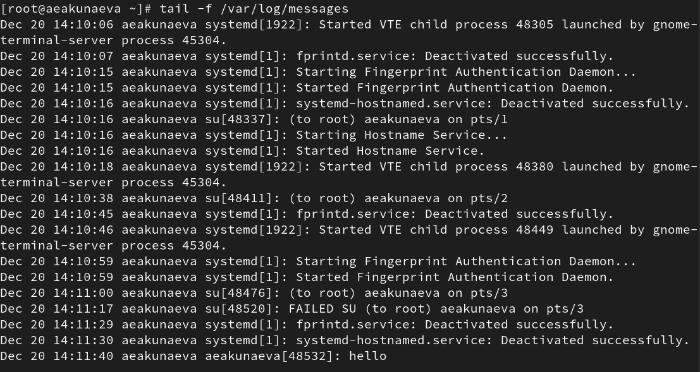{#fig:002 width=65%}

## Журнал мониторинга сообщений безопасности

```
tail -n 20 /var/log/secure
```

{#fig:003 width=65%}

## 7.4.2. Изменение правил rsyslog.conf

```
dnf -y install httpd
systemctl start httpd
systemctl enable httpd
```

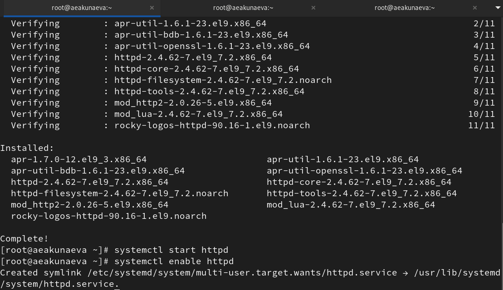{#fig:004 width=60%}

## Журнал сообщений об ошибках веб-службы

```
tail -f /var/log/httpd/error_log
```

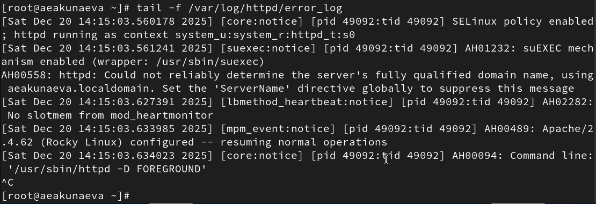{#fig:005 width=70%}

## Файл /etc/httpd/conf/httpd.conf

```
nano /etc/httpd/conf/httpd.conf
ErrorLog syslog:local1
```

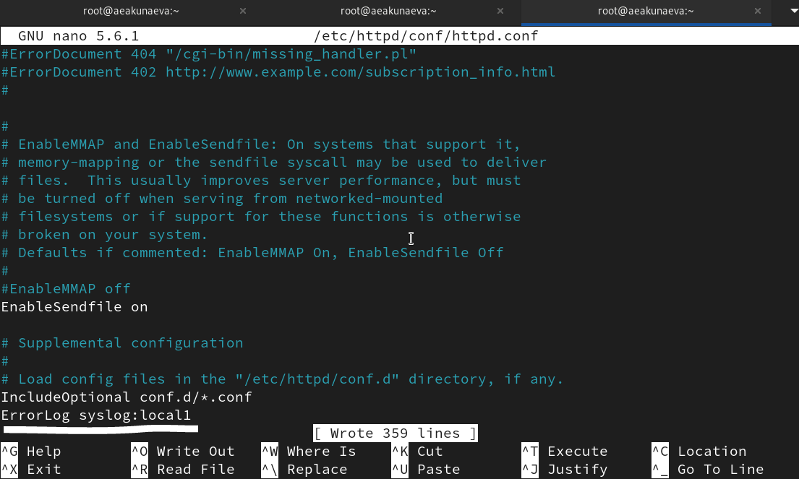{#fig:006 width=65%}

## Создание файлов мониторинга и их редактирование

```
cd /etc/rsyslog.d
touch httpd.conf
cd /etc/rsyslog.d
touch debug.conf
echo "*.debug /var/log/messages-debug" > /etc/rsyslog.d/debug.conf
logger -p daemon.debug "Daemon Debug Message"
```

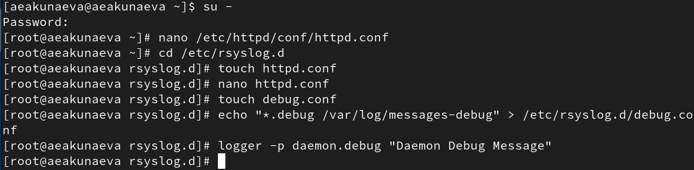{#fig:007 width=55%}

## Файл httpd.conf

```
local1.* -/var/log/httpd-error.log
```

{#fig:008 width=65%}

## Перезагрузка веб-службы и конфигурации rsyslogd

```
systemctl restart rsyslog.service
systemctl restart httpd
```

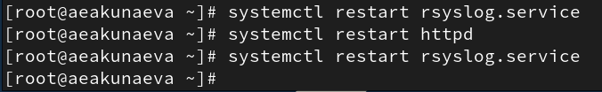{#fig:009 width=60%}

## Журнал мониторинга отладочной информации

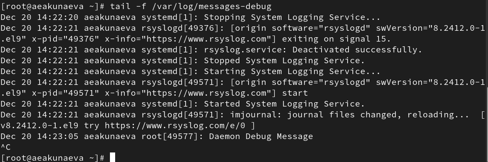{#fig:010 width=65%}

## 7.4.3. Использование journalctl

```
journalctl
```

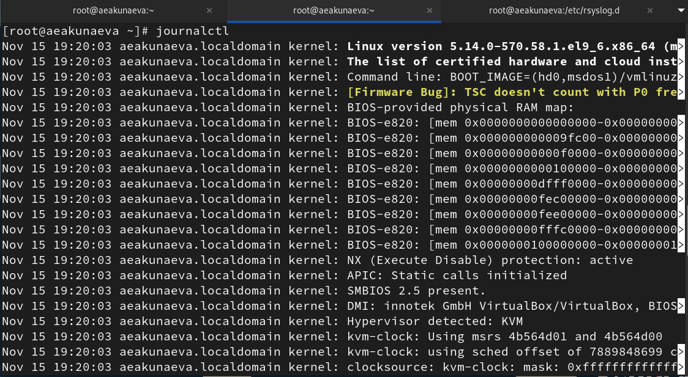{#fig:011 width=65%}

## Журнал событий journald

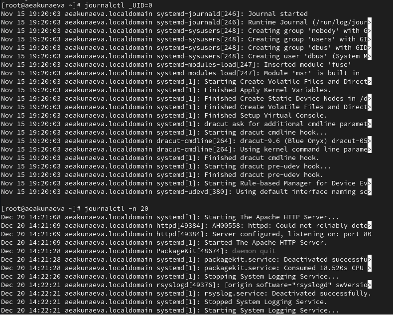{#fig:012 width=65%}

## Журнал событий journald

{#fig:013 width=65%}

## Журнал событий journald

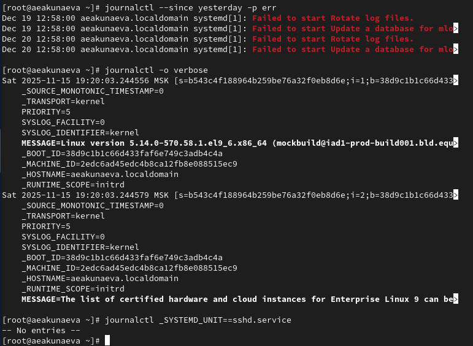{#fig:014 width=65%}

## 7.4.4. Постоянный журнал journald

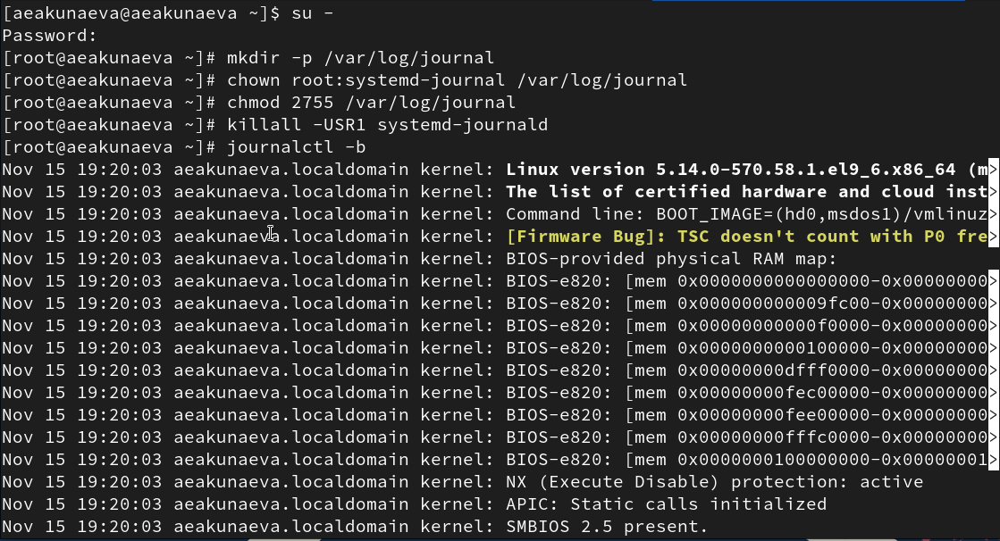{#fig:015 width=65%}

# Выводы

Я получила навыки работы с журналами мониторинга различных событий в системе.


