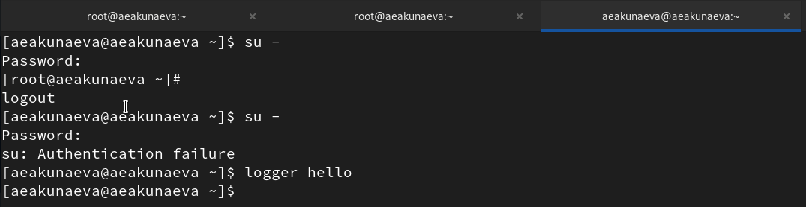
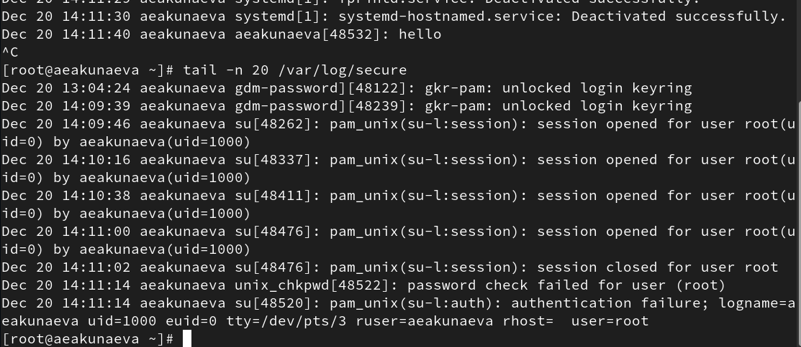
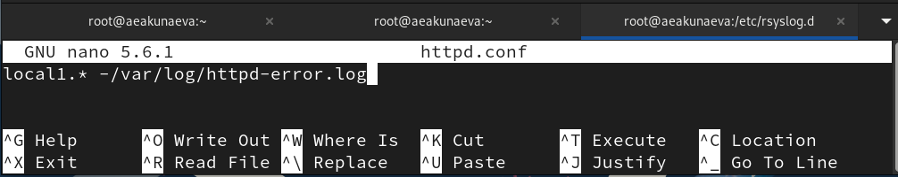
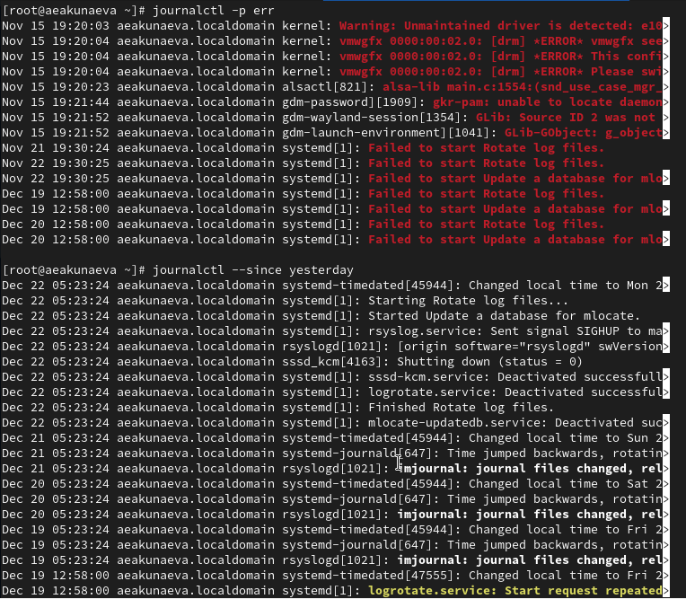
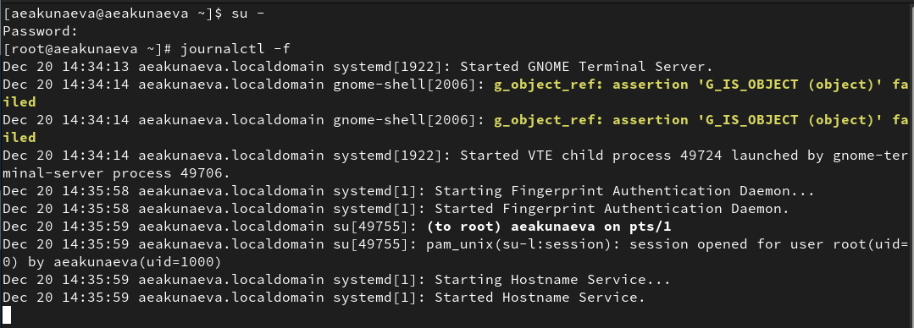
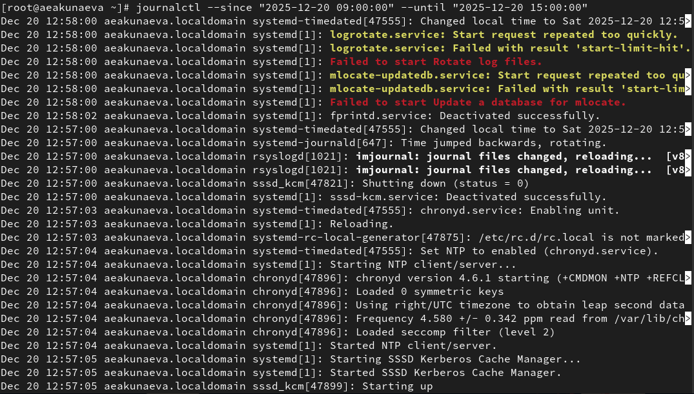
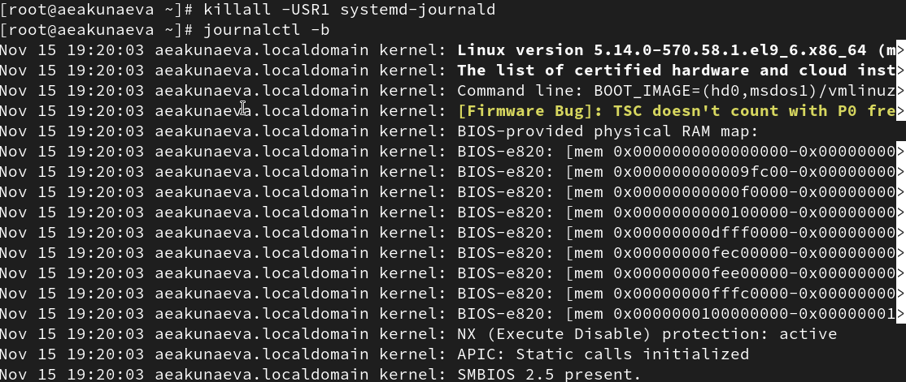

---
## Front matter
title: "Отчёт по лабораторной работе №7"
subtitle: "Управление журналами событий в системе"
author: "Акунаева Антонина Эрдниевна"

## Generic otions
lang: ru-RU
toc-title: "Содержание"

## Bibliography
bibliography: bib/cite.bib
csl: pandoc/csl/gost-r-7-0-5-2008-numeric.csl

## Pdf output format
toc: true # Table of contents
toc-depth: 2
lof: true # List of figures
lot: true # List of tables
fontsize: 12pt
linestretch: 1.5
papersize: a4
documentclass: scrreprt
## I18n polyglossia
polyglossia-lang:
  name: russian
  options:
	- spelling=modern
	- babelshorthands=true
polyglossia-otherlangs:
  name: english
## I18n babel
babel-lang: russian
babel-otherlangs: english
## Fonts
mainfont: IBM Plex Serif
romanfont: IBM Plex Serif
sansfont: IBM Plex Sans
monofont: IBM Plex Mono
mathfont: STIX Two Math
mainfontoptions: Ligatures=Common,Ligatures=TeX,Scale=0.94
romanfontoptions: Ligatures=Common,Ligatures=TeX,Scale=0.94
sansfontoptions: Ligatures=Common,Ligatures=TeX,Scale=MatchLowercase,Scale=0.94
monofontoptions: Scale=MatchLowercase,Scale=0.94,FakeStretch=0.9
mathfontoptions:
## Biblatex
biblatex: true
biblio-style: "gost-numeric"
biblatexoptions:
  - parentracker=true
  - backend=biber
  - hyperref=auto
  - language=auto
  - autolang=other*
  - citestyle=gost-numeric
## Pandoc-crossref LaTeX customization
figureTitle: "Рис."
tableTitle: "Таблица"
listingTitle: "Листинг"
lofTitle: "Список иллюстраций"
lotTitle: "Список таблиц"
lolTitle: "Листинги"
## Misc options
indent: true
header-includes:
  - \usepackage{indentfirst}
  - \usepackage{float} # keep figures where there are in the text
  - \floatplacement{figure}{H} # keep figures where there are in the text
---


# Цель работы

Получить навыки работы с журналами мониторинга различных событий в системе. [@TUIS-lab7]

# Задание

1. Продемонстрируйте навыки работы с журналом мониторинга событий в реальном времени (см. раздел 7.4.1).
2. Продемонстрируйте навыки создания и настройки отдельного файла конфигурации мониторинга отслеживания событий веб-службы (см. раздел 7.4.2).
3. Продемонстрируйте навыки работы с journalctl (см. раздел 7.4.3).
4. Продемонстрируйте навыки работы с journald (см. раздел 7.4.4).

# Выполнение лабораторной работы

**7.4.1. Мониторинг журнала системных событий в реальном времени**

Запустим терминал и зайдём как администратор, введя пароль ([рис. @fig:001]).

Откроем второе окно терминала и запустим мониторинг системных событий в реальном времени ([рис. @fig:002]):

```
tail -f /var/log/messages
```

В третьем терминале попытаемся зайти как суперпользователь, введя неправильный пароль. Получим ошибку: *su: Authemtication failure*. Тогда во второй вкладке отобразится *FAILED SU (to root) aeakunaeva on pts/3*.

Введём в третьем окне:

```
logger hello
```

Сообщение *hello* отобразится во второй вкладке.

{#fig:001 width=70%}

{#fig:002 width=70%}

Остановим трассировку файла мониторинга в реальном времени комбинацией *Ctrl+C* и выведем журнал мониторинга сообщений безопасности, последние 20 строк, указав соответствующий параметр ([рис. @fig:003]):

```
tail -n 20 /var/log/secure
```

{#fig:003 width=70%}

**7.4.2. Изменение правил rsyslog.conf**

Установим Apache ([рис. @fig:004]):

```
dnf -y install httpd
```

Как только установка завершится, хапустим веб-службу:

```
systemctl start httpd
systemctl enable httpd
```

Будет создана symlink ссылка.

{#fig:004 width=70%}

Во второй вкладке терминала откроем журнал сообщений об ошибках веб-службы (и затем закроем активные службы на *Ctrl+C*) ([рис. @fig:005]):

```
tail -f /var/log/httpd/error_log
```

{#fig:005 width=70%}

Откроем в текстовом редакторе nano файл */etc/httpd/conf/httpd.conf* и добавим в самый конец строку *ErrorLog syslog:local1*. Сохраним изменения и закроем файл ([рис. @fig:006]):

```
nano /etc/httpd/conf/httpd.conf
```

{#fig:006 width=70%}

Теперь перейдём в /etc/rsyslog.d и создадим файл мониторинга событий веб-службы httpd.conf ([рис. @fig:007]):

```
cd /etc/rsyslog.d
touch httpd.conf
nano httpd.conf
```

Введём в нём строку, чтобы отправлять все получаемые local1 сообщения ([рис. @fig:008]):

```
local1.* -/var/log/httpd-error.log
```

{#fig:007 width=70%}

{#fig:008 width=70%}

В первой вкладке перезагрузим конфигурацию rsyslogd и веб-службу httpd ([рис. @fig:009]):

```
systemctl restart rsyslog.service
systemctl restart httpd
```

В третьей вкладке создадим ещё один файл ([рис. @fig:007]):

```
cd /etc/rsyslog.d
touch debug.conf
```

И введём:

```
echo "*.debug /var/log/messages-debug" > /etc/rsyslog.d/debug.conf
```

И снова в первой перезагрузим rsyslogd ([рис. @fig:009]):

```
systemctl restart rsyslog.service
```

{#fig:009 width=70%}

Во второй вкладке запустим мониторинг отладочной информации ([рис. @fig:010]):

```
tail -f /var/log/messages-debug
```

В третьей введём ([рис. @fig:007]):

```
logger -p daemon.debug "Daemon Debug Message"
```

И увидим сообщение *Daemon Debug Message* во второй. Закроем на *Ctrl+C*.

{#fig:010 width=70%}

**7.4.3. Использование journalctl**

Во второй вкладке откроем журнал с событиями с момента последнего запуска системы (текущего). Просмотрим на *Enter* и выйдем на *q* ([рис. @fig:011]):

```
journalctl
```

{#fig:011 width=70%}

Кроме того, можем просмотреть журнал в режимах ([рис. @fig:012]-[рис. @fig:014]):

1. Без использования пейджера

```
journalctl --no-pager
```

2. Реального времени

```
journalctl -f
```
3. C использованием фильтрации просмотра конкретных параметров журнала, нажав дважды на *Tab* после запуска journalctl

4. Просматривая события для UID0

```
journalctl _UID=0
```

5. С отображением последних n=20 строк журнала

```
journalctl -n 20
```

{#fig:012 width=70%}

6. Для просмотра только сообщений об ошибках

```
journalctl -p err
```

7. С отображением событий за определённый промежуток времени, используя ключи --since и --until, указывая время в формате "YYYY-MM-DD hh:mm:ss" или параметры как "yesterday/tomorrow/today"

```
journalctl --since yesterday
```

{#fig:013 width=70%}

Также возможно отобразить журнал событий с ошибками, например, только за вчера:

```
journalctl --since yesterday -p err
```

Для получения детальной информации о журнале можно ввести:

```
journalctl -o verbose
```

А для просмотра детальной информации о модуле sshd (в нашем случае записей нет):

```
journalctl _SYSTEMD_UNIT=sshd.service
```

{#fig:014 width=70%}

**7.4.4. Постоянный журнал journald**

Войдём как суперпользователь в терминал. Создадим каталог */var/log/journal* для того, чтобы хранить в нём записи журнала, чтобы сделать его постоянным ([рис. @fig:015]):

```
mkdir -p /var/log/journal
```

Скорректируем права для администратора, чтобы были осуществимы записи в файл журнала:

```
chown root:systemd-journal /var/log/journal
chmod 2755 /var/log/journal
```

Чтобы сохранить изменения, перезагрузим систему или введём команду:

```
killall -USR1 systemd-journald
```

Теперь журнал journald постоянный. Можем просмотреть записи с момента последней перезагрузки:

```
journalctl -b
```

{#fig:015 width=70%}

# Контрольные вопросы

**1. Какой файл используется для настройки rsyslogd?**

```
/etc/rsyslog.conf
```

**2. В каком файле журнала rsyslogd содержатся сообщения, связанные с аутентификацией?**

```
/var/log/secure
```

**3. Если вы ничего не настроите, то сколько времени потребуется для ротации файлов журналов?**

До пяти недель.

**4. Какую строку следует добавить в конфигурацию для записи всех сообщений с приоритетом info в файл /var/log/messages.info?**

```
*.=info /var/log/messages.info
```

**5. Какая команда позволяет вам видеть сообщения журнала в режиме реального времени?**

```
journalctl -f
``` ([рис. @fig:016]).

{#fig:016 width=70%}

**6. Какая команда позволяет вам видеть все сообщения журнала, которые были написаны для PID 1 между 9:00 и 15:00?**

```
journalctl --since "2025-20-12 09:00:00" --until "2025-12-20 15:00:00"
``` ([рис. @fig:017]).

{#fig:017 width=70%}

**7. Какая команда позволяет вам видеть сообщения journald после последней перезагрузки системы?**

```
journalctl -b
```([рис. @fig:018]).

{#fig:018 width=70%}

**8. Какая процедура позволяет сделать журнал journald постоянным?**


Создаём каталог для записей журнала:

```
mkdir -p /var/log/journal
```

Скорректируем права для администратора, чтобы были осуществимы записи в файл журнала:

```
chown root:systemd-journal /var/log/journal
chmod 2755 /var/log/journal
```

Чтобы сохранить изменения, перезагрузим систему или введём команду:

```
killall -USR1 systemd-journald
```
([рис. @fig:019])

{#fig:019 width=70%}

# Выводы

Я получила навыки работы с журналами мониторинга различных событий в системе.

# Список литературы{.unnumbered}

::: {#refs}
:::
