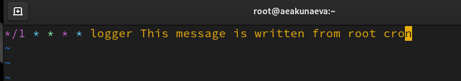
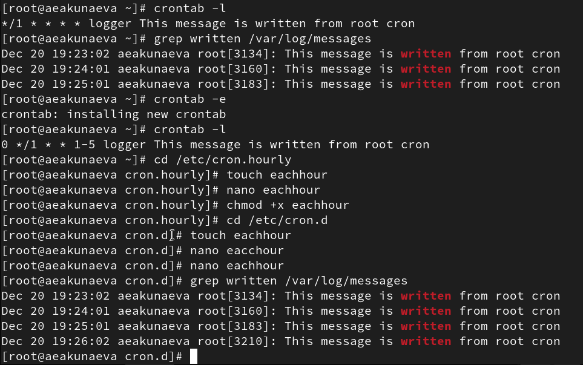
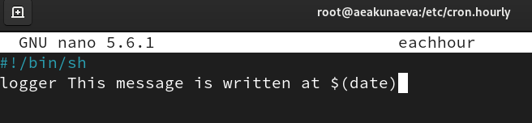
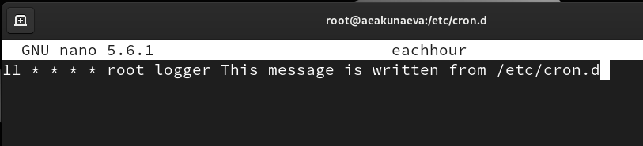
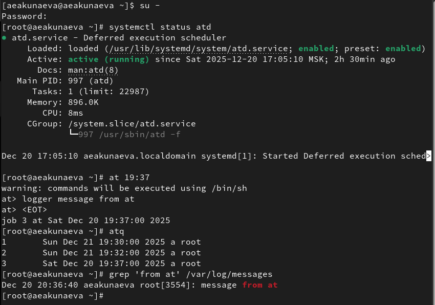

---
## Front matter
lang: ru-RU
title: Лабораторная работа №8
subtitle: Планировщики событий
author:
  - Акунаева Антонина Эрдниевна
institute:
  - Российский университет дружбы народов, Москва, Россия
  
date: 2025-12-20

## i18n babel
babel-lang: russian
babel-otherlangs: english

## Formatting pdf
toc: false
toc-title: Содержание
slide_level: 2
aspectratio: 169
section-titles: true
theme: metropolis
header-includes:
 - \metroset{progressbar=frametitle,sectionpage=progressbar,numbering=fraction}
---

# Информация

## Докладчик

:::::::::::::: {.columns align=center}
::: {.column width="70%"}

  * Акунаева Антонина Эрдниевна
  * студент ФФМиЕН, НПИбд-01-24
  * Российский университет дружбы народов
  * [1032240492@pfur.ru](mailto:1032240492@pfur.ru)
  * <https://github.com/Akuxee>

:::
::: {.column width="30%"}

:::
::::::::::::::

# Цели и задачи

- Получение навыков работы с планировщиками событий cron и at.

1. Выполните задания по планированию задач с помощью crond (см. раздел 8.4.1).
2. Выполните задания по планированию задач с помощью atd (см. раздел 8.4.2).

# Материалы и методы

- Linux (дистрибутив Rocky 9.6)
- Linux Fedora Sway (Markdown)
- Oracle VirtualBox

# Выполнение лабораторной работы

## 

{#fig:001 width=70%}

## 

{#fig:002 width=70%}

## 

{#fig:003 width=70%}

## 

{#fig:004 width=70%}

## 

{#fig:005 width=70%}

## 

{#fig:006 width=70%}

## 

{#fig:007 width=70%}

## 

{#fig:008 width=70%}

## 

{#fig:009 width=70%}

## 

{#fig:010 width=70%}

## 

{#fig:011 width=70%}

## 

{#fig:012 width=70%}

## 

{#fig:013 width=70%}

## 

{#fig:014 width=70%}

## 

{#fig:015 width=70%}

# Выводы

Я получила навыки работы с планировщиками событий cron и at.

