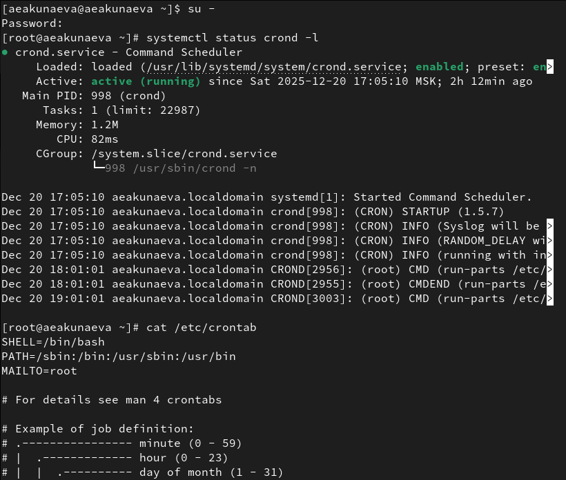
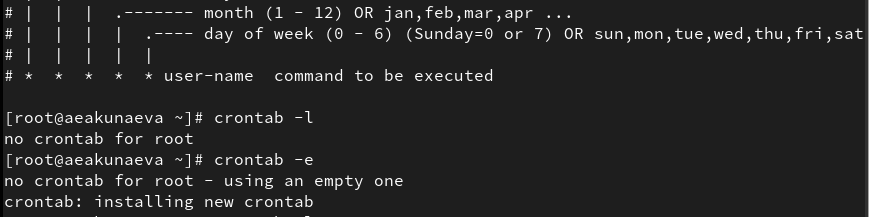
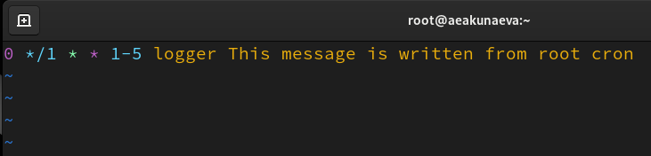
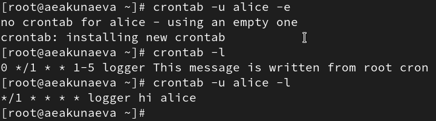
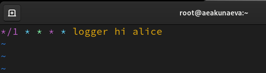
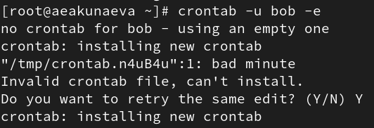
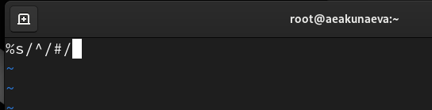
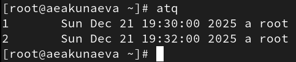

---
## Front matter
title: "Отчёт по лабораторной работе №8"
subtitle: "Планировщики событий"
author: "Акунаева Антонина Эрдниевна"

## Generic otions
lang: ru-RU
toc-title: "Содержание"

## Bibliography
bibliography: bib/cite.bib
csl: pandoc/csl/gost-r-7-0-5-2008-numeric.csl

## Pdf output format
toc: true # Table of contents
toc-depth: 2
lof: true # List of figures
lot: true # List of tables
fontsize: 12pt
linestretch: 1.5
papersize: a4
documentclass: scrreprt
## I18n polyglossia
polyglossia-lang:
  name: russian
  options:
	- spelling=modern
	- babelshorthands=true
polyglossia-otherlangs:
  name: english
## I18n babel
babel-lang: russian
babel-otherlangs: english
## Fonts
mainfont: IBM Plex Serif
romanfont: IBM Plex Serif
sansfont: IBM Plex Sans
monofont: IBM Plex Mono
mathfont: STIX Two Math
mainfontoptions: Ligatures=Common,Ligatures=TeX,Scale=0.94
romanfontoptions: Ligatures=Common,Ligatures=TeX,Scale=0.94
sansfontoptions: Ligatures=Common,Ligatures=TeX,Scale=MatchLowercase,Scale=0.94
monofontoptions: Scale=MatchLowercase,Scale=0.94,FakeStretch=0.9
mathfontoptions:
## Biblatex
biblatex: true
biblio-style: "gost-numeric"
biblatexoptions:
  - parentracker=true
  - backend=biber
  - hyperref=auto
  - language=auto
  - autolang=other*
  - citestyle=gost-numeric
## Pandoc-crossref LaTeX customization
figureTitle: "Рис."
tableTitle: "Таблица"
listingTitle: "Листинг"
lofTitle: "Список иллюстраций"
lotTitle: "Список таблиц"
lolTitle: "Листинги"
## Misc options
indent: true
header-includes:
  - \usepackage{indentfirst}
  - \usepackage{float} # keep figures where there are in the text
  - \floatplacement{figure}{H} # keep figures where there are in the text
---


# Цель работы

Получение навыков работы с планировщиками событий cron и at. [@TUIS-lab8]

# Задание

1. Выполните задания по планированию задач с помощью crond (см. раздел 8.4.1).
2. Выполните задания по планированию задач с помощью atd (см. раздел 8.4.2).

# Выполнение лабораторной работы

**8.4.1. Планирование задач с помощью cron**

Зайдём как суперпользователь в терминал, введя пароль. Посмотрим статус демона crond (активен). Выведем содержимое файла конфигурации */etc/crontab*. В ней указана общая информация с путями к файлам и инструкция для cron ([рис. @fig:001]):

```
su - 
systemctl status crond -l
cat /etc/crontab
```

{#fig:001 width=70%}

Выведем также список заданий в расписании. Оно будет пусто, т.к. мы ещё не вносили никаких записей ([рис. @fig:002]):

```
crontab -l
```

Чтобы внести запись, откроем файл расписания на редактирование:

```
crontab -e
```

Нажмём на *Insert* для внесения изменений (записи) в файл и введём строку ([рис. @fig:003]):

```
*/1 * * * * logger This message is written from root cron
```

Первая часть записи поясняет время задачи (минута-час-день-месяц-день недели) в числах, т.е. каждую минуту, каждую, т.к. указано */, logger - команда для записи и далее следует само сообщение/команда. Сохраним запись, нажав комбинацию *Esc + : + qw*.

{#fig:002 width=70%}

{#fig:003 width=70%}

Снова отобразим список задач и увидим новую созданную задачу с сообщением. Подождав 2-3 минуты, пропишем команду ([рис. @fig:007]):

```
grep written /var/log/messages
```

Будет отображён результат выполнения команды: сообщение выводится каждую минуту (трижды за прошедшие три минуты). Снова откроем редактор cron для записи:

```
crontab -e
```

И введём в нём запись, также возвращающую сообщение каждый (т.к. */) час по будням (1-5, где 1 - понедельник, 5 - пятница) ([рис. @fig:004]):

```
0 */1 * * 1-5 logger This message is written from root cron
```

{#fig:004 width=70%}

Посмотрим список задач: новая задача отобразилась:

```
crontab -l
```

Теперь перейдём в каталог */etc/cron.hourly* и создадим там файл сценария eachhour. Откроем в редакторе nano:

```
cd /etc/cron.hourly
touch eachhour
nano eachhour
```

Впишем строки (запись сообщения в системный журнал) ([рис. @fig:005]):

```
#!/bin/sh
logger This message is written at $(date)
```

{#fig:005 width=70%}

Сохраним, закроем и сделаем файл исполняемым:

```
chmod +x eachhour
```

Теперь перейдём в */etc/crond.d* и создадим в каталоге тоже файл eachhour, откроем в текстовом редакторе:

```
cd /etc/cron.d
touch eachhour
nano eachhour
```

Впишем строку ([рис. @fig:006]):

```
11 * * * * root logger This message is written from /etc/cron.d
```

Запись означает, что задача применена для пользователя root и также выводит сообщение в каждые 11 минут.

{#fig:006 width=70%}

Через некоторое время просмотрим журнал системных событий и убедимся, что задачи выполняются:

```
grep written /var/log/messages
```

{#fig:007 width=70%}

**8.4.2. Планирование заданий с помощью at**

Запустим терминал как администратор ([рис. @fig:008]):

```
su -
```

Проверим, что служба atd загружена и активна:

```
systemctl status atd
```

Зададим выполнение кманды на ближайшее время (19:37) и закроем оболочку на *Ctrl+D*. Проверим, что действие запланировано командой:

```
at 19:37
atq
```

Подождём до назначенного времени и проверим наличие записи:

```
grep 'from at' /var/log/messages
```

{#fig:008 width=70%}

# Контрольные вопросы

**1. Как настроить задание cron, чтобы оно выполнялось раз в 2 недели?**

Откроем cron для записи:

```
crontab -e
```

И введём (тогда будет выполняться дважды в месяц, что равносильно раз в две недели, т.к. в месяце около четырёх недель): 

```
* * * */2 * logger [message]
```

**2. Как настроить задание cron, чтобы оно выполнялось 1-го и 15-го числа каждого месяца в 2 часа ночи?**

```
0 2 1,15 * * logger [message]
```

**3. Как настроить задание cron, чтобы оно выполнялось каждые 2 минуты каждый день?**

```
*/2 * * * * logger [message]
```

**4. Как настроить задание cron, чтобы оно выполнялось 19 сентября ежегодно?**

```
* * 19 */9 * logger [message]
```

**5. Как настроить задание cron, чтобы оно выполнялось каждый четверг сентября ежегодно?**

```
* * * */9 4 logger [message]
```

**6. Какая команда позволяет вам назначить задание cron для пользователя alice? Приведите подтверждающий пример.**

```
crontab -u alice -e
```

где -u alice - указанный нами пользователь, открываем файл для записи для пользователя alice и вносим в файл задачу, например, каждую минуту будет выведено сообщение hi alice для пользователя alice ([рис. @fig:009]-[рис. @fig:010]):

```
*/1 * * * * logger hi alice
```

```
crontab -l
```

Проверим командой выше и действительно увидим сообщение hi alice.

{#fig:009 width=70%}

{#fig:010 width=70%}

**7. Как указать, что пользователю bob никогда не разрешено назначать задания через cron? Приведите подтверждающий пример.**

```
crontab -u bob -e
```
Также откроем файл для пользователя bob и введём ([рис. @fig:011]-[рис. @fig:012]):

```
%s/^/#/
```

{#fig:011 width=70%}

{#fig:012 width=70%}

**8. Вам нужно убедиться, что задание выполняется каждый день, даже если сервер во время выполнения временно недоступен. Как это сделать?**

Проверить файл /var/spool/cron.

**9. Какая команда позволяет узнать, запланированы ли какие-либо задания на выполнение планировщиком atd?**

```
atq
``` ([рис. @fig:013]).

{#fig:013 width=70%}

# Выводы

Я получила навыки работы с планировщиками событий cron и at.

# Список литературы{.unnumbered}

::: {#refs}
:::
