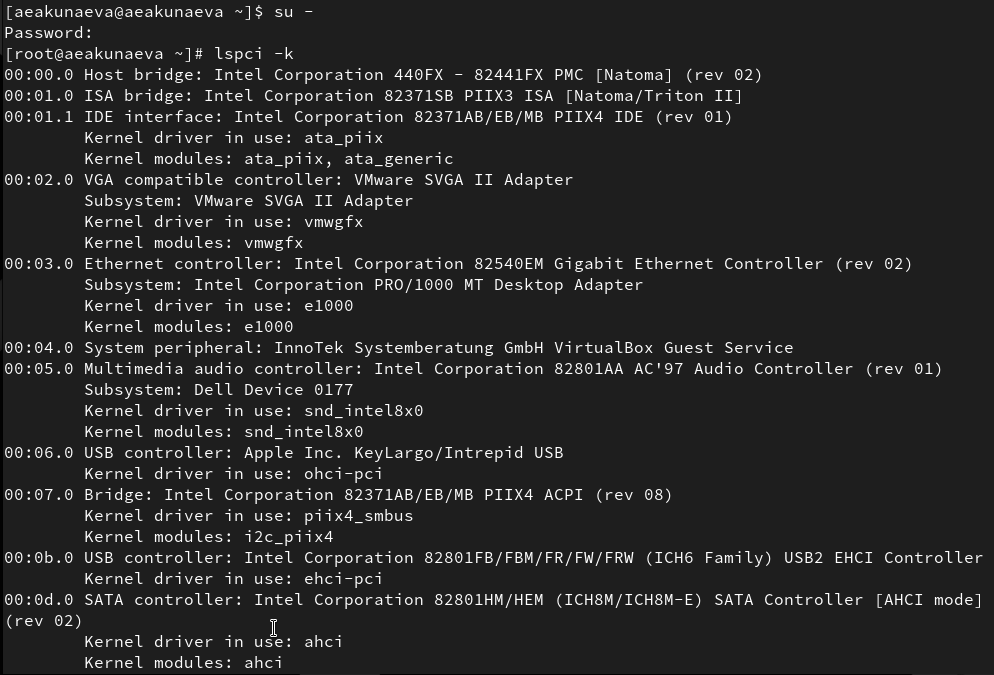
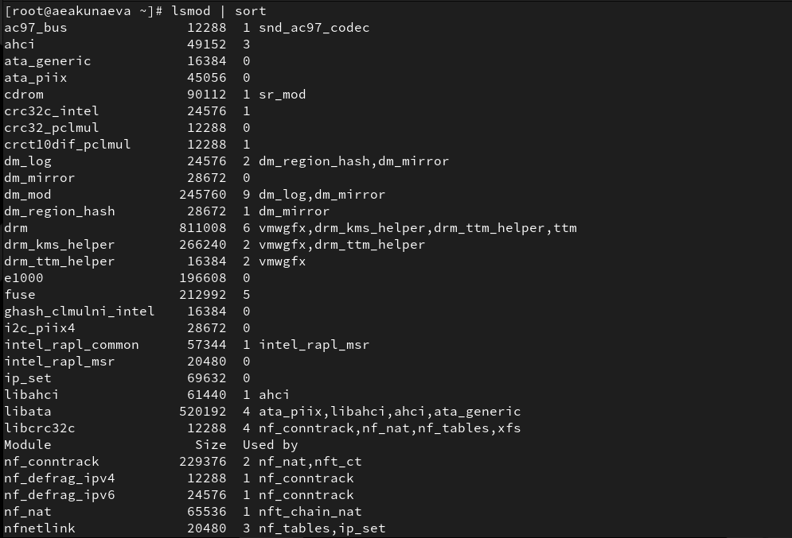
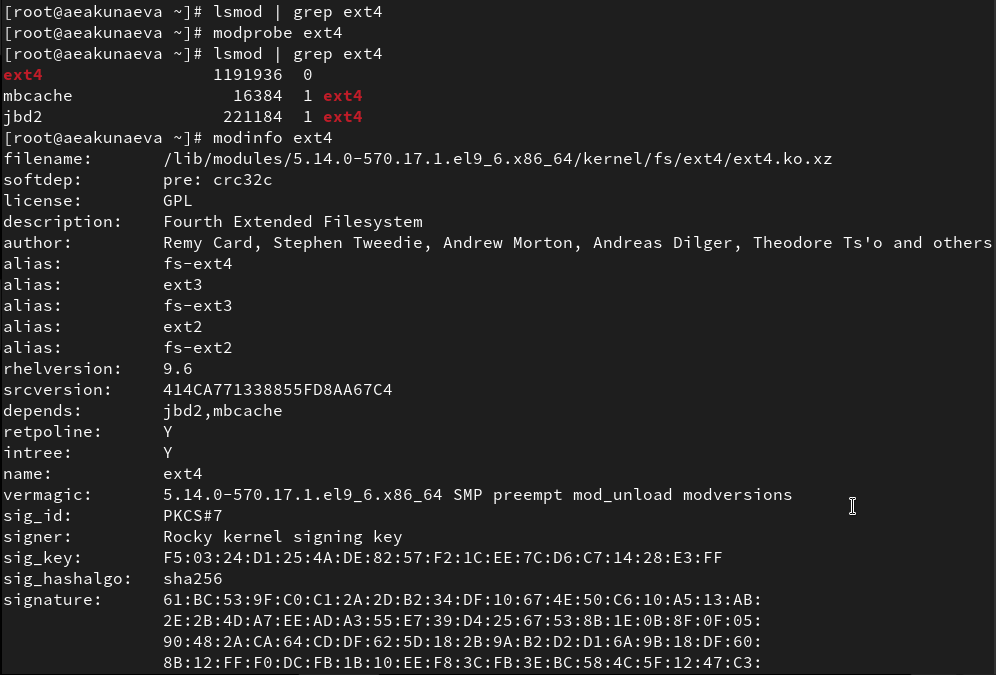
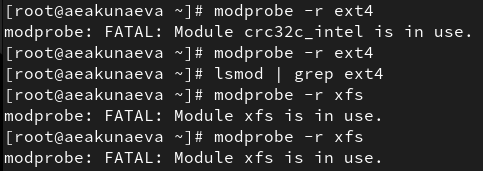
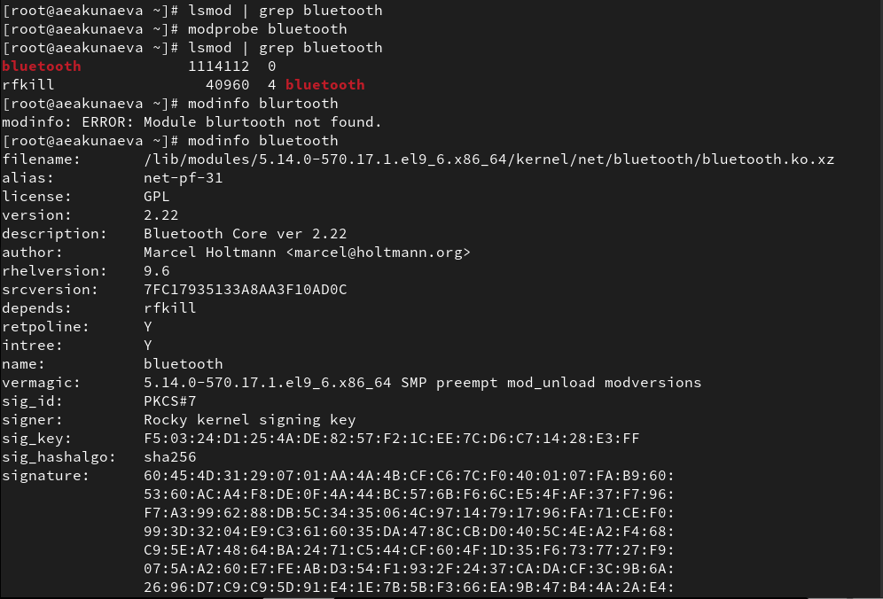
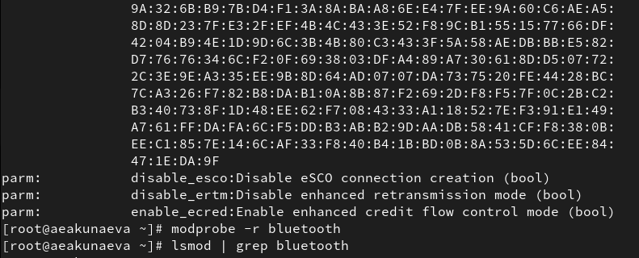
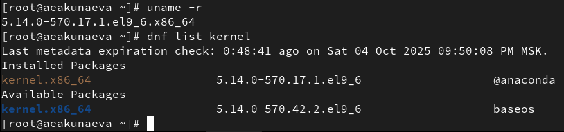

---
## Front matter
lang: ru-RU
title: Лабораторная работа №10
subtitle: Основы работы с модулями ядра операционной системы
author:
  - Акунаева Антонина Эрдниевна
institute:
  - Российский университет дружбы народов, Москва, Россия
  
date: 2025-11-08

## i18n babel
babel-lang: russian
babel-otherlangs: english

## Formatting pdf
toc: false
toc-title: Содержание
slide_level: 2
aspectratio: 169
section-titles: true
theme: metropolis
header-includes:
 - \metroset{progressbar=frametitle,sectionpage=progressbar,numbering=fraction}
---

# Информация

## Докладчик

:::::::::::::: {.columns align=center}
::: {.column width="70%"}

  * Акунаева Антонина Эрдниевна
  * студент ФФМиЕН, НПИбд-01-24
  * Российский университет дружбы народов
  * [1032240492@pfur.ru](mailto:1032240492@pfur.ru)
  * <https://github.com/Akuxee>

:::
::: {.column width="30%"}


:::
::::::::::::::

# Цели и задачи

- Получить навыки работы с утилитами управления модулями ядра операционной системы.  

- Продемонстрируйте навыки работы по управлению модулями ядра (см. раздел 10.4.1).  
- Продемонстрируйте навыки работы по загрузке модулей ядра с параметрами (см. раздел 10.4.2).

# Материалы и методы

- Linux (дистрибутив Rocky 9.6)
- Linux Fedora Sway (Markdown)
- Oracle VirtualBox

# Выполнение лабораторной работы

## Отображение информации об устройствах системы и модулях

```
lspci -k
```

{#fig:001 width=65%}

## Отображение списка загруженных модулей ядра

```
lsmod
```

{#fig:002 width=65%}

## Проверка загрузки модуля ядра (ext4)

```
modprobe [модуль ядра]
lsmod | grep [модуль ядра]
modinfo [модуль ядра]
```

{#fig:003 width=65%}

## Выгрузка модулей ядра (ext4 и xfs)

```
modprobe -r [модуль ядра]
```

{#fig:004 width=65%}

## Загрузка модуля ядра bluetooth

```
modprobe bluetooth 
lsmod | grep bluetooth
```

{#fig:005 width=70%}

## Параметры bluetooth и выгрузка модуля

1. disable_esco  
2. disable_ertm  
3. enable_ecred  

{#fig:006 width=65%}

## Информация о текущей версии ядра и доступных пакетах

```
uname -r
dnf list kernel
```

{#fig:007 width=65%}

## Обновление системы

```
dnf upgrade --refresh
```

{#fig:008 width=65%}

## Обновление ядра и ОС

```
dnf update kernel
dnf update
dnf upgrade --refresh
```

{#fig:009 width=65%}

## Проверка установки новой версии ядра ОС

```
uname -r
hostnamectl
```

{#fig:010 width=65%}


# Выводы

Я получила навыки работы с утилитами управления модулями ядра операционной системы.


