---
## Front matter
title: "Отчёт по лабораторной работе №10"
subtitle: "Основы работы с модулями ядра операционной системы"
author: "Акунаева Антонина Эрдниевна"

## Generic otions
lang: ru-RU
toc-title: "Содержание"

## Bibliography
bibliography: bib/cite.bib
csl: pandoc/csl/gost-r-7-0-5-2008-numeric.csl

## Pdf output format
toc: true # Table of contents
toc-depth: 2
lof: true # List of figures
lot: true # List of tables
fontsize: 12pt
linestretch: 1.5
papersize: a4
documentclass: scrreprt
## I18n polyglossia
polyglossia-lang:
  name: russian
  options:
	- spelling=modern
	- babelshorthands=true
polyglossia-otherlangs:
  name: english
## I18n babel
babel-lang: russian
babel-otherlangs: english
## Fonts
mainfont: IBM Plex Serif
romanfont: IBM Plex Serif
sansfont: IBM Plex Sans
monofont: IBM Plex Mono
mathfont: STIX Two Math
mainfontoptions: Ligatures=Common,Ligatures=TeX,Scale=0.94
romanfontoptions: Ligatures=Common,Ligatures=TeX,Scale=0.94
sansfontoptions: Ligatures=Common,Ligatures=TeX,Scale=MatchLowercase,Scale=0.94
monofontoptions: Scale=MatchLowercase,Scale=0.94,FakeStretch=0.9
mathfontoptions:
## Biblatex
biblatex: true
biblio-style: "gost-numeric"
biblatexoptions:
  - parentracker=true
  - backend=biber
  - hyperref=auto
  - language=auto
  - autolang=other*
  - citestyle=gost-numeric
## Pandoc-crossref LaTeX customization
figureTitle: "Рис."
tableTitle: "Таблица"
listingTitle: "Листинг"
lofTitle: "Список иллюстраций"
lotTitle: "Список таблиц"
lolTitle: "Листинги"
## Misc options
indent: true
header-includes:
  - \usepackage{indentfirst}
  - \usepackage{float} # keep figures where there are in the text
  - \floatplacement{figure}{H} # keep figures where there are in the text
---


# Цель работы

Получить навыки работы с утилитами управления модулями ядра операционной системы. [@TUIS-lab10]

# Задание

1. Продемонстрируйте навыки работы по управлению модулями ядра (см. раздел 10.4.1).  
2. Продемонстрируйте навыки работы по загрузке модулей ядра с параметрами (см. раздел 10.4.2).

# Выполнение лабораторной работы

**10.4.1. Управление модулями ядра из командной строки**

Запустим терминал в Rocky Linux от имени администратора (суперпользователя) через команду и введём пароль от учётной записи:

```
su -
```

Отобразим информацию об имеющихся устройствах в системе и связанными модулями ([рис. @fig:001]):

```
lspci -k
```

Получим подробный список о контроллерах устройства (Ethernet-, USB-, аудиоконтроллер и т.д.), а также связанные с ними драйвера или модули ядра, обозначенные *Kernel modules*. У контроллеров указаны названия (с указанием, в данном случае, компании Intel), у модулей и драйверов - названия.

{#fig:001 width=70%}

Отобразим список загруженных модулей ядра через утилиту *lsmod*, через pipe также добавив команду sort для сортировки модулей по названию в алфавитном порядке для удобства ([рис. @fig:002]):
 
```
lsmod | sort
```

{#fig:002 width=70%}

Проверим, загружен ли модуль ядра ext4, через команду *lsmod* пытаясь найти его с указанием *grep* и названия модуля через pipe ([рис. @fig:003]):

```
lsmod | grep ext4
```

Мы не получим никакой информации, т.к. модуль ext4 не загружен. Тогда загрузим его через следующую утилиту *modprobe* для загрузки модулей ядра и проверим, был ли модуль загружен, тем же способом:

```
modprobe ext4
lsmod | grep ext4
```

На этот раз мы получим информацию о модуле, что будет значить, что он активен. Выведем информацию о модуле ядра через утилиту *modinfo*:

```
modinfo ext4
```

Здесь мы увидим полную информацию о модуле: название, лицензия, подпись, описание и ключи модуля (предназначенные для Rocky), тем не менее не будут указаны параметры, т.к. их нет.

{#fig:003 width=70%}

Теперь попробуем выгрузить модуль ext4 той же командой, но с добавлением ключа -r ([рис. @fig:004]):

```
modprobe -r ext4
```

Получим сперва фатальную ошибку, т.к. модуль "используется". Повторим выгрузку и на этот раз успешно (проверим дополнительно через lsmod | grep ext4):

```
modprobe -r ext4
lsmod | grep ext4
```

Выгрузим также модуль ядра xfs: однако, обнаружим, что не все модули ядра могут быть отключены повторным вводом команды (получим фатальную ошибку, т.к. модуль используется ядром):

```
modprobe -r xfs
```

{#fig:004 width=70%}

**10.4.2. Загрузка модулей ядра с параметрами**

Также, через суперпользователя, проверим, загружен ли модуль ядра bluetooth (отрицательно) ([рис. @fig:005]):

```
lsmod | grep bluetooth
```

Тогда загрузим его и проверим ещё раз, загружен ли модуль, заодно выведем список модулей ядра, отвечающих за работу с Bluetooth:

```
modprobe bluetooth 
lsmod | grep bluetooth
```

Затем выведем информацию о модуле bluetooth: получим такой же набор с названием, описанием, лицензией, подписью и т.п., только в конце будут указаны три параметра, которые могут быть установлены для работы модуля ([рис. @fig:006]):

1. disable_esco  
2. disable_ertm  
3. enable_ecred

```
modinfo bluetooth
```

Выгрузим модуль:

```
modprobe -r bluetooth
```

{#fig:005 width=70%}

{#fig:006 width=70%}

**10.4.3. Обновление ядра системы**

Как суперпользователь, определим текущую версию ядра ОС (5.14.0-570.17.1.el9_6.86_64) ([рис. @fig:007]):

```
uname -r
```

И выведем список пакетов, которые относятся к ядру: в нашем случае это установленный пакет kernel.x86_64 5.14.0-570.17.1.el9_6.86_64, но также отображён будет доступный для установки пакет новой версии ядра 5.14.0-570.42.2.el9_6.86_64:

```
dnf list kernel
```

{#fig:007 width=70%}

Обновим систему во избежание конфликтов между пакетами ядра ([рис. @fig:008]):

```
dnf upgrade --refresh
```

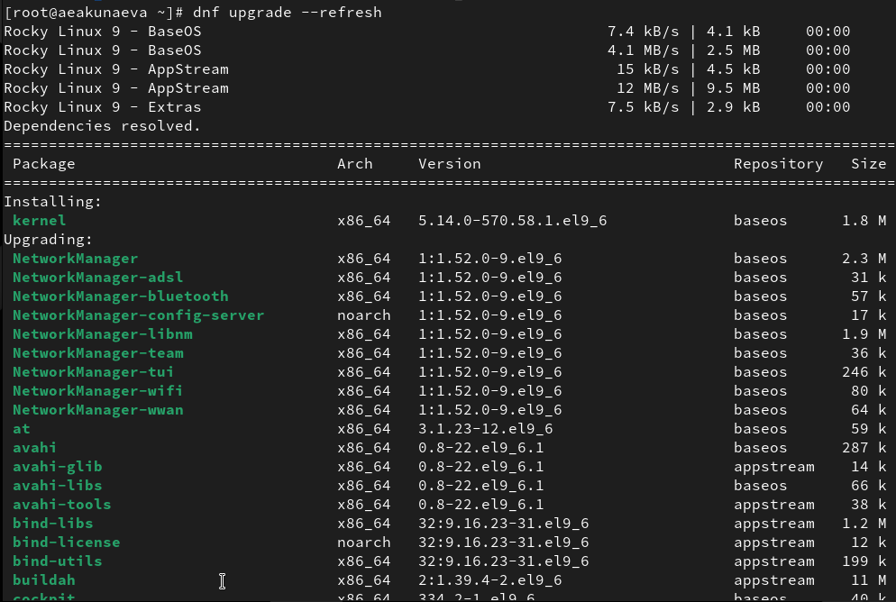{#fig:008 width=70%}

После обновления системы обновим ядро ОС и саму ОС после: будут установлены новые версии из доступных пакетов ([рис. @fig:009]):

```
dnf update kernel
dnf update
dnf upgrade --refresh
```

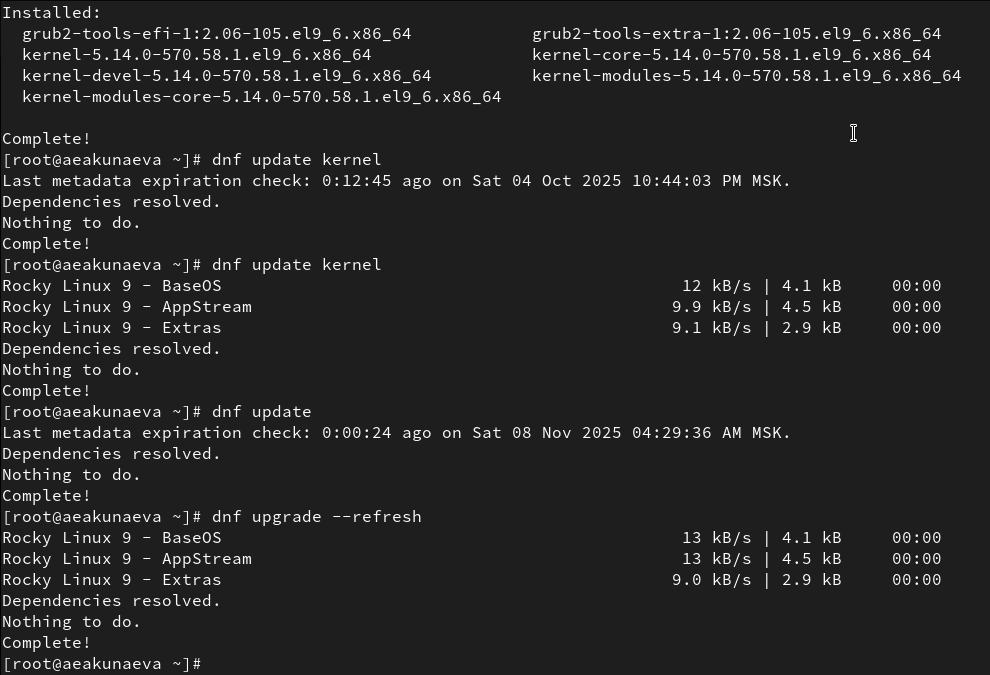{#fig:009 width=70%}

Затем перезагрузим систему: появится подпись *Blue Onyx* при выборе ядра. Выбираем первое и самое доступное, заходим под своей учётной записью и проверяем версию ядра в терминале (новая - 5.14.0-570.58.1.el9_6.86_64) ([рис. @fig:010]):

```
uname -r
hostnamectl
```

Теперь установлена новая версия ядра ОС и при получении более подробной информации о ядре, также убеждаемся в этом в строке *Kernel*.

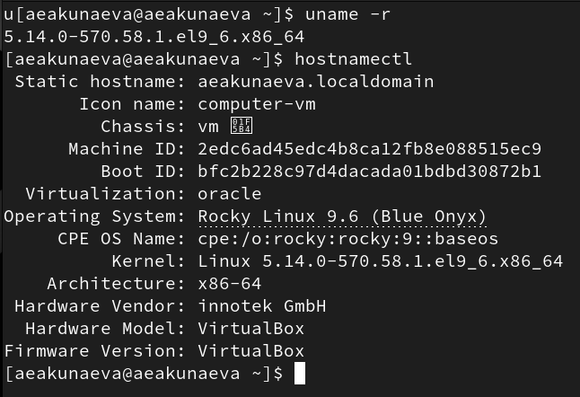{#fig:010 width=70%}

# Контрольные вопросы

**1. Какая команда показывает текущую версию ядра, которая используется на вашей системе?**

```
uname -r
``` ([рис. @fig:011]):

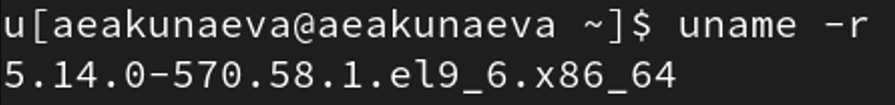{#fig:011 width=70%}

**2. Как можно посмотреть более подробную информацию о текущей версии ядра операционной системы?**

```
hostnamectl
``` ([рис. @fig:012]):

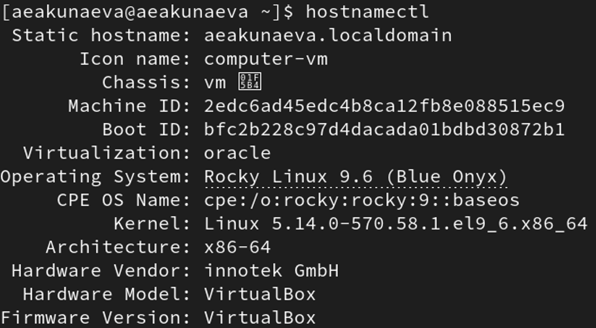{#fig:012 width=70%}

**3. Какая команда показывает список загруженных модулей ядра?**

```
lsmod
```

(Пояснение: на рис. добавлен параметр sort через pipe дял удобного отображения информации) ([рис. @fig:013]):

{#fig:013 width=70%}

**4. Какая команда позволяет вам определять параметры модуля ядра?**

Команда modinfo позволяет получить информацию о модуле ядра, в том числе об имеющихся параметрах (в самом конце выведенного списка) ([рис. @fig:014]-[рис. @fig:015]):

```
modinfo [модуль ядра]
```

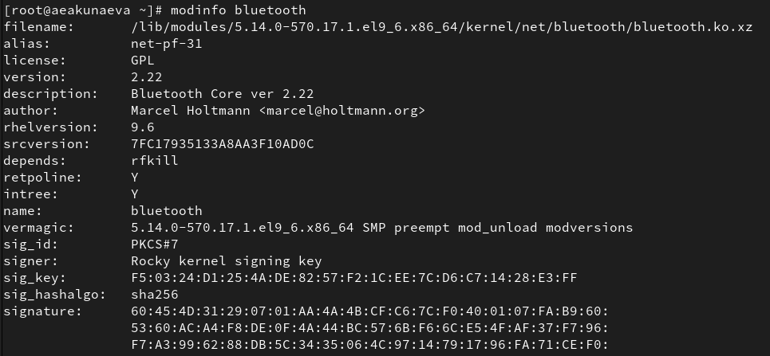{#fig:014 width=70%}

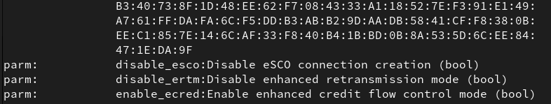{#fig:015 width=70%}

**5. Как выгрузить модуль ядра?**

Через утилиту modprobe с указанием параметра -r (проверить загрузку/выгрузку монжо через lsmod | grep [модуль ядра]) ([рис. @fig:016]):

```
modprobe -r [модуль ядра]
```

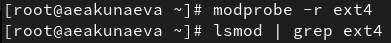{#fig:016 width=70%}

**6. Что вы можете сделать, если получите сообщение об ошибке при попытке выгрузить модуль ядра?**

Можно попытаться повторно ввести команду для выгрузки. Однако, это необязательно поможет ([рис. @fig:017]):

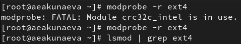{#fig:017 width=70%}

**7. Как определить, какие параметры модуля ядра поддерживаются?**

Через modinfo можно получить информацию о поддерживаемых модулях ядра ([рис. @fig:018]):

```
modinfo [модуль ядра]
```

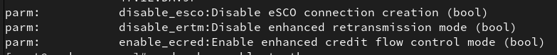{#fig:018 width=70%}

**8. Как установить новую версию ядра?**

С предварительным обновлением системы во избежание непредвиденных ситуаций, можно обновить ядро следующим набором команд и после перезагрузить систему ([рис. @fig:019]):

```
dnf upgrade --refresh
dnf update kernel
dnf update
dnf upgrade --refresh
```

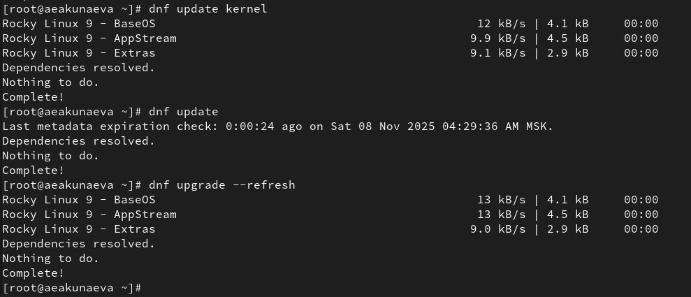{#fig:019 width=70%}


# Выводы

Я получила навыки работы с утилитами управления модулями ядра операционной системы.

# Список литературы{.unnumbered}

::: {#refs}
:::
