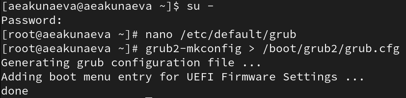
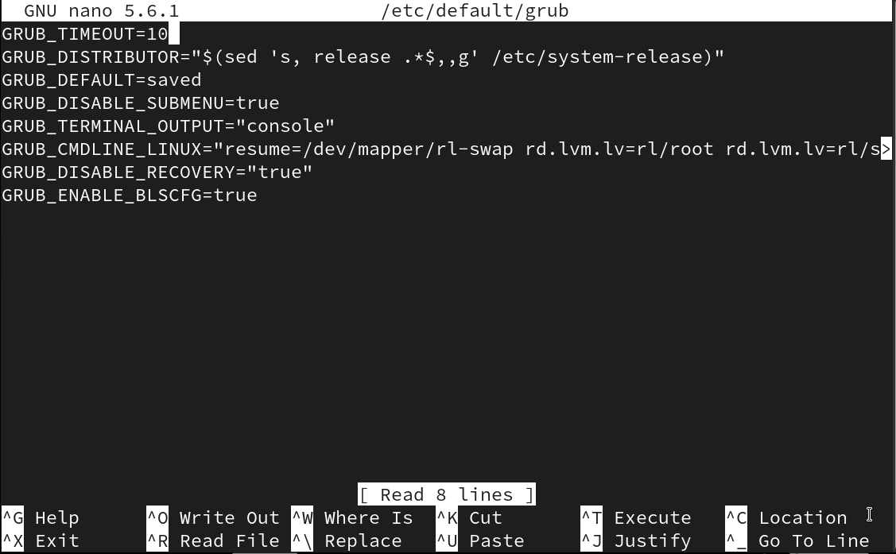
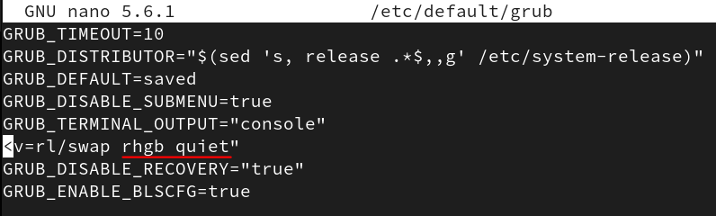
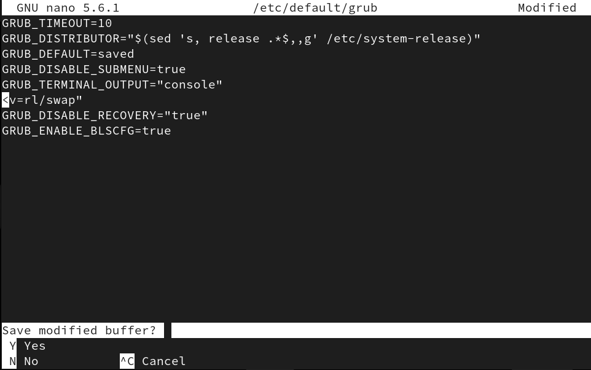
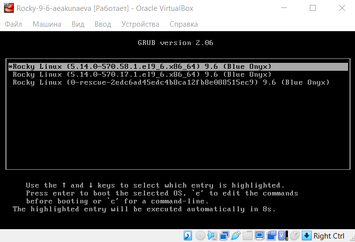
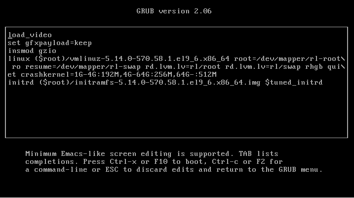
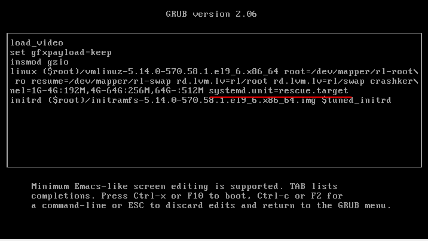
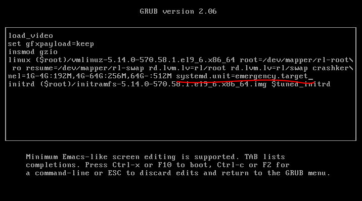
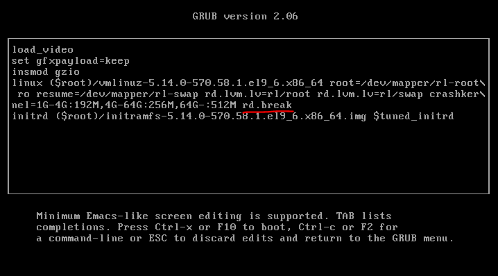

---
## Front matter
lang: ru-RU
title: Лабораторная работа №11
subtitle: Управление загрузкой системы 
author:
  - Акунаева Антонина Эрдниевна
institute:
  - Российский университет дружбы народов, Москва, Россия
  
date: 2025-11-15

## i18n babel
babel-lang: russian
babel-otherlangs: english

## Formatting pdf
toc: false
toc-title: Содержание
slide_level: 2
aspectratio: 169
section-titles: true
theme: metropolis
header-includes:
 - \metroset{progressbar=frametitle,sectionpage=progressbar,numbering=fraction}
---

# Информация

## Докладчик

:::::::::::::: {.columns align=center}
::: {.column width="70%"}

  * Акунаева Антонина Эрдниевна
  * студент ФФМиЕН, НПИбд-01-24
  * Российский университет дружбы народов
  * [1032240492@pfur.ru](mailto:1032240492@pfur.ru)
  * <https://github.com/Akuxee>

:::
::: {.column width="30%"}


:::
::::::::::::::

# Цели и задачи

- Получить навыки работы с загрузчиком системы GRUB2.

1. Продемонстрируйте навыки по изменению параметров GRUB и записи изменений в файл конфигурации (см. раздел 11.4.1).
2. Продемонстрируйте навыки устранения неполадок при работе с GRUB (см. раздел 11.4.2).
3. Продемонстрируйте навыки работы с GRUB без использования root (см. раздел 11.4.3).

# Материалы и методы

- Linux (дистрибутив Rocky 9.6)
- Linux Fedora Sway (Markdown)
- Oracle VirtualBox

# Выполнение лабораторной работы

## Модификация параметров GRUB2

```
su -
nano /etc/default/grub
```

{#fig:001 width=65%}

## Параметр отображения меню загрузки в /etc/default/grub

```
GRUB_TIMEOUT=10
```

{#fig:002 width=65%}

## Параметр запуска ядра системы GRUB2 в /etc/default/grub

{#fig:003 width=65%}

## Изменения сокрытия загрузочных сообщений GRUB2 в /etc/default/grub

```
grub2-mkconfig > /boot/grub2/grub.cfg
```

{#fig:004 width=65%}

## Меню загрузочных сообщений GRUB2

{#fig:005 width=65%}

## Меню выбора версии ядра GRUB2

{#fig:006 width=65%}

## Редактор GRUB2

{#fig:007 width=65%}

## Изменение опций запуска ядра системы на режим rescue

```
systemd.unit=rescue.target
```

{#fig:008 width=65%}

## Просмотр модулей и переменных в режиме восстановления GRUB2

```
systemctl list-units
systemctl show-environment
systemctl reboot
```

{#fig:009 width=65%}

## Изменение опций запуска ядра системы на режим emergency

```
systemd.unit=emergency.target
```

{#fig:010 width=65%}

## Просмотр модулей в режиме мин. кол-ва системных единиц GRUB2

```
systemctl list-units
systemctl reboot
```

{#fig:011 width=65%}

## Добавлении опции rd.break в редакторе GRUB2

```
rd.break
```

{#fig:012 width=65%}

## Сброс пароля root

```
mount -o remount,rw /sysroot
chroot /sysroot
passwd
chcon -t shadow_t /etc/shadow
reboot -f
```

{#fig:013 width=60%}

## Вход под новым паролем

{#fig:014 width=65%}


# Выводы

Я получила навыки работы с загрузчиком системы GRUB2.


