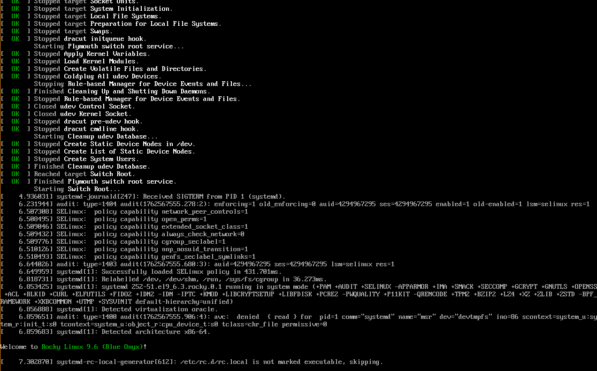
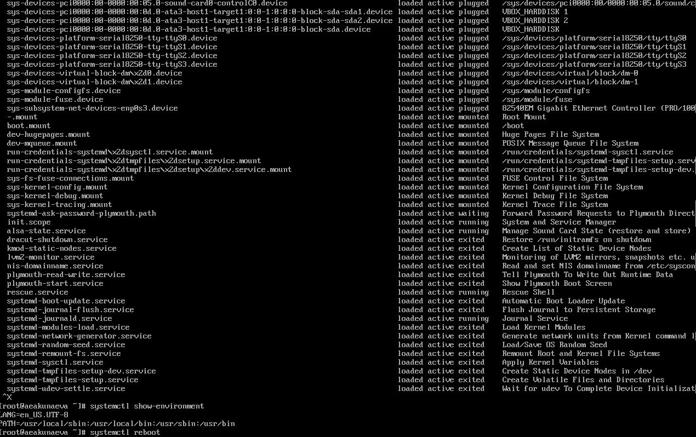
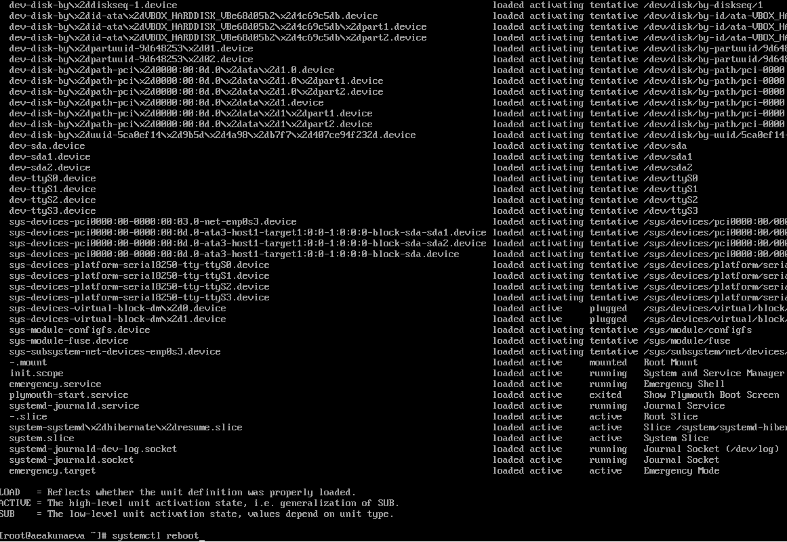
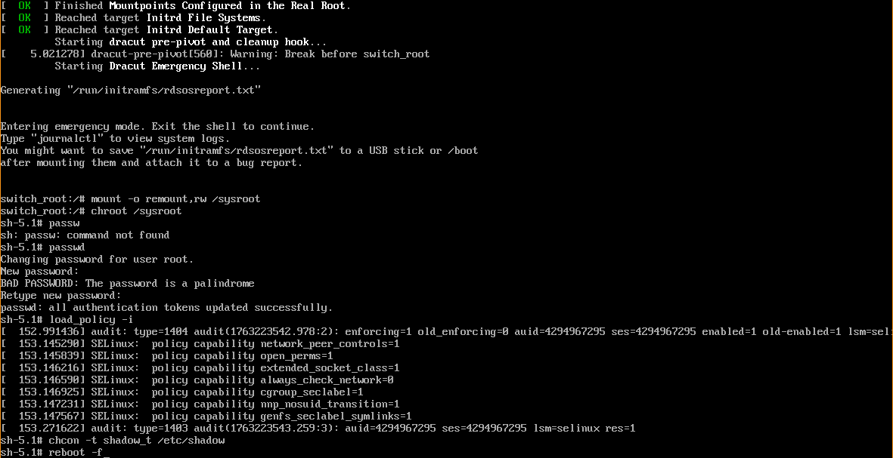
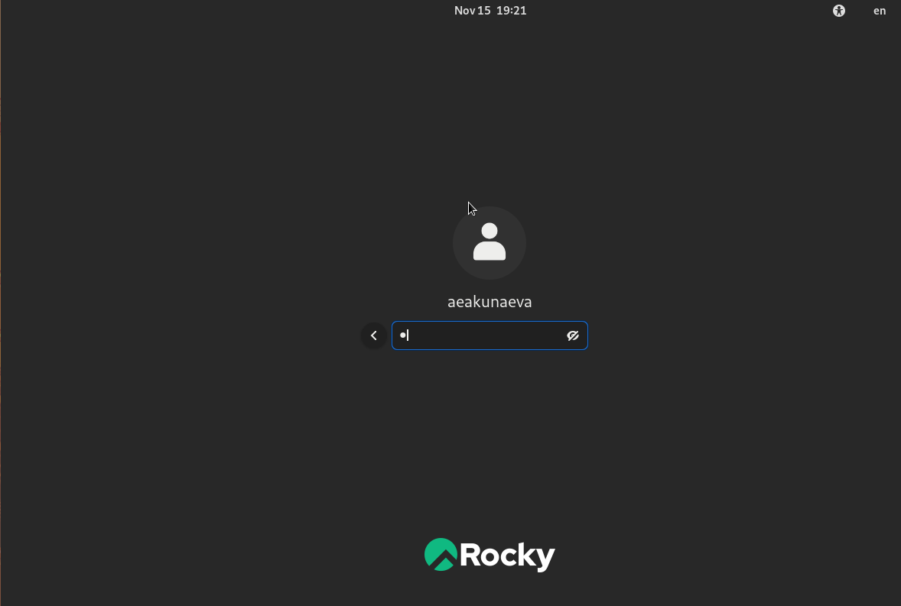
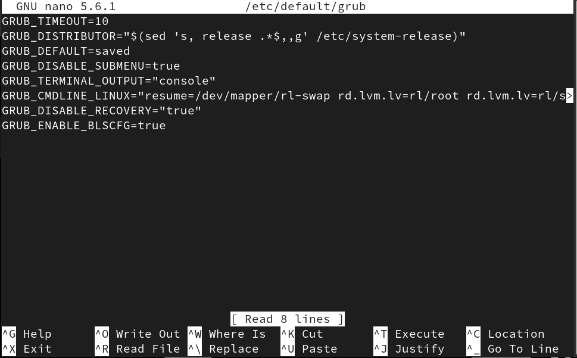
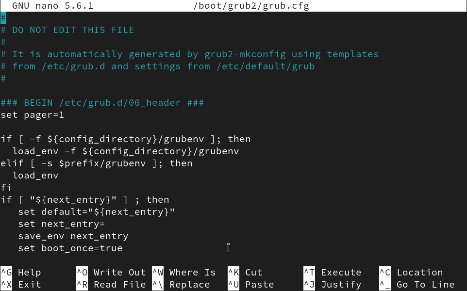
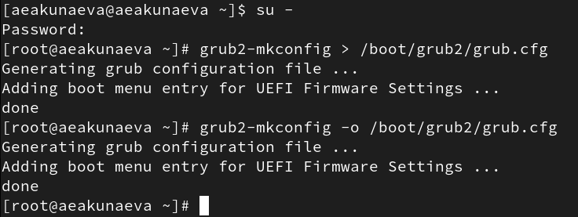

---
## Front matter
title: "Отчёт по лабораторной работе №11"
subtitle: "Управление загрузкой системы"
author: "Акунаева Антонина Эрдниевна"

## Generic otions
lang: ru-RU
toc-title: "Содержание"

## Bibliography
bibliography: bib/cite.bib
csl: pandoc/csl/gost-r-7-0-5-2008-numeric.csl

## Pdf output format
toc: true # Table of contents
toc-depth: 2
lof: true # List of figures
lot: true # List of tables
fontsize: 12pt
linestretch: 1.5
papersize: a4
documentclass: scrreprt
## I18n polyglossia
polyglossia-lang:
  name: russian
  options:
	- spelling=modern
	- babelshorthands=true
polyglossia-otherlangs:
  name: english
## I18n babel
babel-lang: russian
babel-otherlangs: english
## Fonts
mainfont: IBM Plex Serif
romanfont: IBM Plex Serif
sansfont: IBM Plex Sans
monofont: IBM Plex Mono
mathfont: STIX Two Math
mainfontoptions: Ligatures=Common,Ligatures=TeX,Scale=0.94
romanfontoptions: Ligatures=Common,Ligatures=TeX,Scale=0.94
sansfontoptions: Ligatures=Common,Ligatures=TeX,Scale=MatchLowercase,Scale=0.94
monofontoptions: Scale=MatchLowercase,Scale=0.94,FakeStretch=0.9
mathfontoptions:
## Biblatex
biblatex: true
biblio-style: "gost-numeric"
biblatexoptions:
  - parentracker=true
  - backend=biber
  - hyperref=auto
  - language=auto
  - autolang=other*
  - citestyle=gost-numeric
## Pandoc-crossref LaTeX customization
figureTitle: "Рис."
tableTitle: "Таблица"
listingTitle: "Листинг"
lofTitle: "Список иллюстраций"
lotTitle: "Список таблиц"
lolTitle: "Листинги"
## Misc options
indent: true
header-includes:
  - \usepackage{indentfirst}
  - \usepackage{float} # keep figures where there are in the text
  - \floatplacement{figure}{H} # keep figures where there are in the text
---


# Цель работы

Получить навыки работы с загрузчиком системы GRUB2. [@TUIS-lab11]

# Задание

1. Продемонстрируйте навыки по изменению параметров GRUB и записи изменений в файл конфигурации (см. раздел 11.4.1).
2. Продемонстрируйте навыки устранения неполадок при работе с GRUB (см. раздел 11.4.2).
3. Продемонстрируйте навыки работы с GRUB без использования root (см. раздел 11.4.3).

# Выполнение лабораторной работы

**11.4.1. Модификация параметров GRUB2**

Зайдём в терминал Linux Rocky как суперпользователь, введём пароль. Откроем через текстовый редактор nano файл конфигурации GRUB2 */etc/default/grub* и изменим параметр отображения меню загрузки на 10 секунд вместо установленных по умолчанию 5 ([рис. @fig:001]-[рис. @fig:002]):

```
su -
nano /etc/default/grub
```

```
GRUB_TIMEOUT=10
```

После сохраним изменения на *CTRL+S* и закроем файл на *CTRL+X*. Запишем изменения в GRUB2 (через запись в основной конфигурационный файл, генерируемый автоматически), введя команду:

```
grub2-mkconfig > /boot/grub2/grub.cfg
```

{#fig:001 width=70%}

{#fig:002 width=70%}

После этого перезагрузим систему:

```
reboot
```

Заметим, что прокрутки сообщений при загрузке не наблюдается, потому при повторном запуске и заходе как суперпользователь, откроем через nano тот же файл конфигурации */etc/default/grub* и изменим параметр *GRUB_CMDLINE_LINUX*?, убрав из конца строки параметры *rhgh quiet*, скрывающие процесс от пользователя. Сохраним и закроем редактор и повторим запись в GRUB2 ([рис. @fig:003]-[рис. @fig:004]):

```
su -
nano /etc/default/grub
grub2-mkconfig > /boot/grub2/grub.cfg
```

{#fig:003 width=70%}

{#fig:004 width=70%}

После изменений увидим, что при запуске/перезагрузке системы появляется меню с загрузочными сообщениями ([рис. @fig:005]):

{#fig:005 width=70%}

**11.4.2. Устранения неполадок**

После повторной перезагрузки системы нажмём на *[e]* при появлении меню выбора версии ядра системы ([рис. @fig:006]). Открываем редактор и прокручиваем до конца строки *linux ($root)/vmlinuz-...*, где убираем скрывающие меню загрузочных сообщений опции *rhgb quiet* и дописываем ([рис. @fig:007]-[рис. @fig:008]):

```
systemd.unit=rescue.target
```

{#fig:006 width=70%}

{#fig:007 width=70%}

{#fig:008 width=70%}

Далее продолжаем запуск системы через нажатие комбинации *CTRL+X*. Дождавшись конца загрузки, введём пароль от системы пользователя root и посмотрим список всех файлов модулей, загруженных в настоящее время ([рис. @fig:009]):

```
systemctl list-units
```

Получим длинный список загруженных модулей. Далее отобразим задействованные переменные среды оболочки:

```
systemctl show-environment
```

Получим две переменнные. После перезагружаем систему:

```
systemctl reboot
```

{#fig:009 width=70%}

Перезагрузив систему, снова открываем редактор на *[e]* и в той же строке запуска ядра снова убираем опции *rhgb quiet* и добавляем в конце ([рис. @fig:010]):

```
systemd.unit=emergency.target
```

{#fig:010 width=70%}

Запускаем на *CTRL+X*. Вводим пароль от root-пользователя и снова проверим список загруженных файлов модулей ([рис. @fig:011]):

```
systemctl list-units
```

Заметим, что общее количество модулей сократилось, т.к. мы запустили систему в режиме минимального количества системных единиц emergency. Перезагрузим систему:

```
systemctl reboot
```

{#fig:011 width=70%}

**11.4.3. Сброс пароля root**

При перезагрузке системы откроем редактор на *[e]* и в конце строки, загружающей ядро, уберём опции *rhgb quiet* и добавим ([рис. @fig:012]):

```
rd.break
```

{#fig:012 width=70%}

Продолжим процесс загрузки на *CTRL+X*. Этап загрузки прервётся. После получим доступ к системному образу для чтения и записи ([рис. @fig:013]):

```
mount -o remount,rw /sysroot
```

Сделаем каталог /sysimage корневым:

```
chroot /sysroot
```

Теперь можем задать пароль root командой, после которой вводим дважды новый пароль для пользователя root:

```
passwd
```

Загрузим политику SELinux, чтобы сделать вход по паролю возможным, не испортив файл */etc/shadow*:

```
chcon -t shadow_t /etc/shadow
```

Перезагрузим систему с опцией -f для чистого завершения работы системным менеджером:

```
reboot -f
```

{#fig:013 width=70%}

После перезапуска, зайдём под новым паролем в систему ([рис. @fig:014]):

{#fig:014 width=70%}

# Контрольные вопросы

**1. Какой файл конфигурации следует изменить для применения общих изменений в GRUB2?**

Файл конфигурации для внесения изменений и применения их в GRUB2 называется **/etc/default/grub** (находится по этому пути). Его можно открыть через текстовый редактор как суперпользователь и внести изменения ([рис. @fig:015]).

{#fig:015 width=70%}

**2. Как называется конфигурационный файл GRUB2, в котором вы применяете изменения для GRUB2?**

Файл конфигурации для применения изменений для GRUB2 называется **/boot/grub2/grub.cfg** (находится по этому пути). Его нельзя изменить, но можно просмотреть через текстовый редактор, изменения вносятся через конфигурационный файл */etc/default/grub* и терминал при помощи команд ([рис. @fig:016]).

{#fig:016 width=70%}

**3. После внесения изменений в конфигурацию GRUB2, какую команду вы должны выполнить, чтобы изменения сохранились и воспринялись при загрузке системы?**

Для сохранения изменений и их применении при загрузке системы GRUB2 после внесения их в конфигурацию, можно ввести одну из двух команд ([рис. @fig:017]):

```
grub2-mkconfig > /boot/grub2/grub.cfg
```

или

```
grub2-mkconfig -o /boot/grub2/grub.cfg
```

{#fig:017 width=70%}

# Выводы

Я получила навыки работы с загрузчиком системы GRUB2.

# Список литературы{.unnumbered}

::: {#refs}
:::
