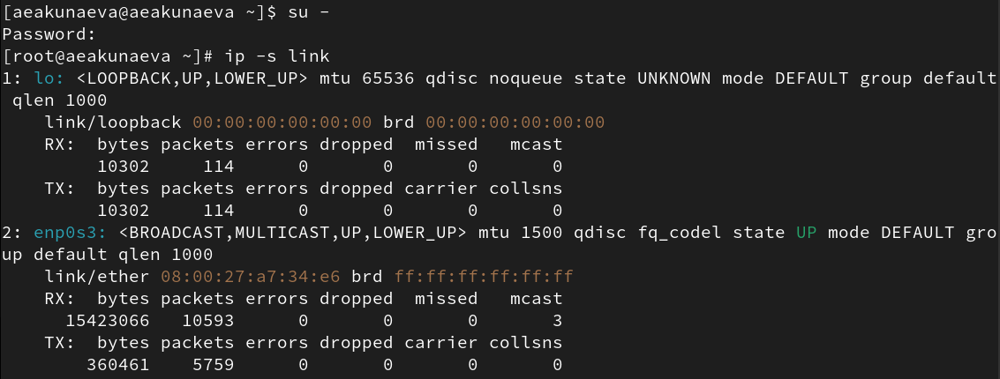
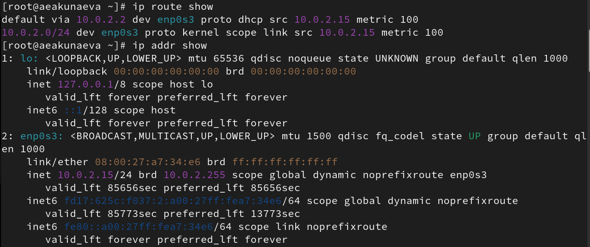
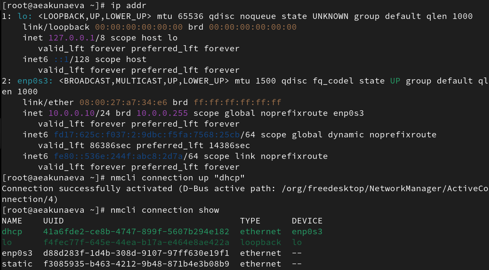
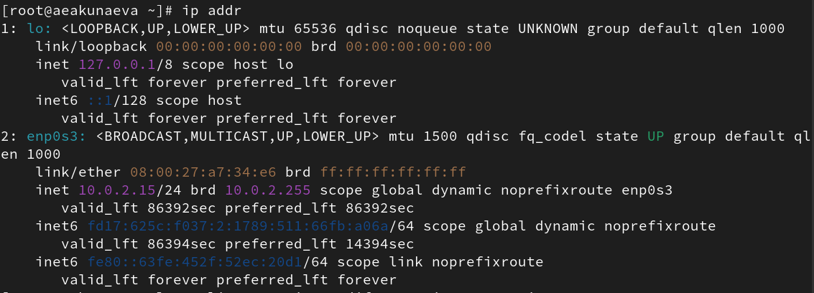
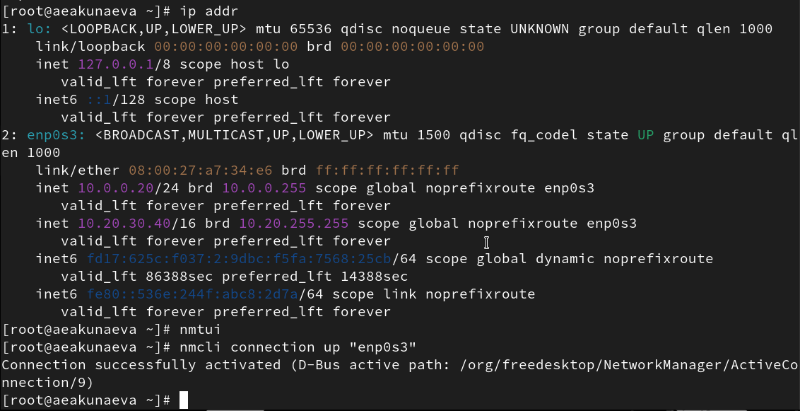

---
## Front matter
lang: ru-RU
title: Лабораторная работа №12
subtitle: Настройки сети в Linux
author:
  - Акунаева Антонина Эрдниевна
institute:
  - Российский университет дружбы народов, Москва, Россия
  
date: 2025-11-22

## i18n babel
babel-lang: russian
babel-otherlangs: english

## Formatting pdf
toc: false
toc-title: Содержание
slide_level: 2
aspectratio: 169
section-titles: true
theme: metropolis
header-includes:
 - \metroset{progressbar=frametitle,sectionpage=progressbar,numbering=fraction}
---

# Информация

## Докладчик

:::::::::::::: {.columns align=center}
::: {.column width="70%"}

  * Акунаева Антонина Эрдниевна
  * студент ФФМиЕН, НПИбд-01-24
  * Российский университет дружбы народов
  * [1032240492@pfur.ru](mailto:1032240492@pfur.ru)
  * <https://github.com/Akuxee>

:::
::: {.column width="30%"}


:::
::::::::::::::

# Цели и задачи

- Получить навыки настройки сетевых параметров системы.

- Продемонстрируйте навыки использования утилиты ip (см. раздел 12.4.1).
- Продемонстрируйте навыки использования утилиты nmcli (см. раздел 12.4.2 и 12.4.3).

# Материалы и методы

- Linux (дистрибутив Rocky 9.6)
- Linux Fedora Sway (Markdown)
- Oracle VirtualBox

# Выполнение лабораторной работы

## Проверка конфигурации сети: Список сетевых подключений ip link

```
ip -s link
```

{#fig:001 width=65%}

## Список текущих маршрутов ip route

```
ip route show
```

{#fig:002 width=65%}

## Список текущих назначений адресов ip addr

```
ip addr show
```

{#fig:003 width=65%}

## Проверка действия и добавление адреса к интерфейсу

```
ping -c 4 8.8.8.8
ip addr add 10.0.0.10/24 dev enp0s3
ip addr show
```

{#fig:004 width=65%}

## Порты ifconfig и UDP, TCP

```
ifconfig
ss -tul
```

{#fig:005 width=65%}

## Управление сетевыми подключениями с помощью nmcl

```
nmcli connection show
nmcli connection add con-name "dhcp" type ethernet ifname enp0s3
nmcli connection add con-name "static" ifname <ifname> autoconnect no type ethernet ip4 10.0.0.10/24 gw4 10.0.0.1 ifname enp0s3
nmcli connection up "static"
```

{#fig:006 width=60%}

## Переключения на новые соединения

```
nmcli connection up "dhcp"
```

{#fig:007 width=65%}

## Проверка переключения ip addr и nmcli con show

```
nmcli connection show
ip addr
```

{#fig:008 width=65%}

## Добавление и изменение DNS-серверов

{#fig:009 width=65%}

## Проверка переподключения и nmtui. nmcli

{#fig:010 width=65%}

## Настройки сети на устройстве nmtui

```
nmtui
```

{#fig:011 width=65%}

## Настройки сети в граф. интерфейсе системы

{#fig:012 width=65%}


# Выводы

Я получила навыки настройки сетевых параметров системы.


