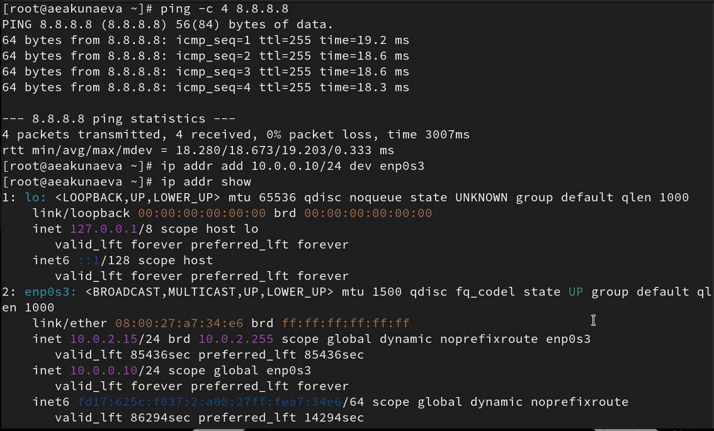
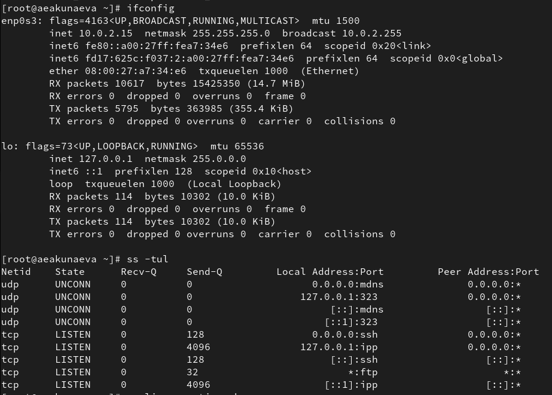
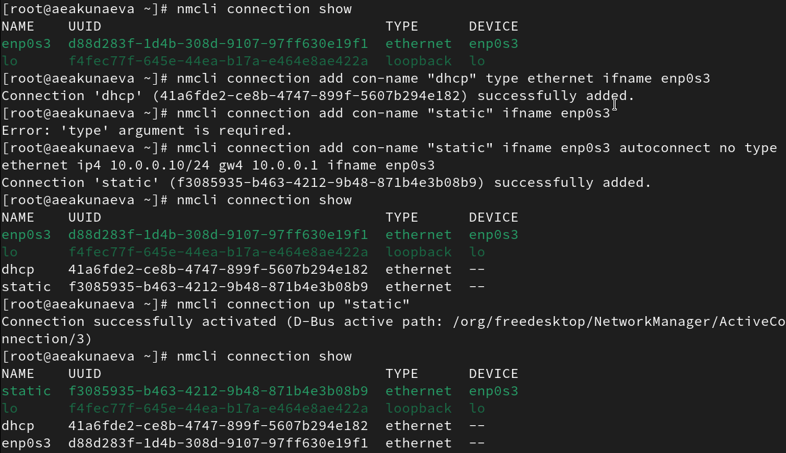
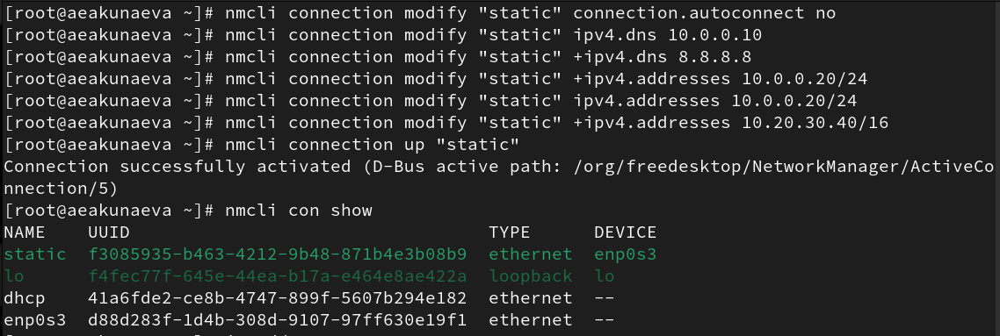
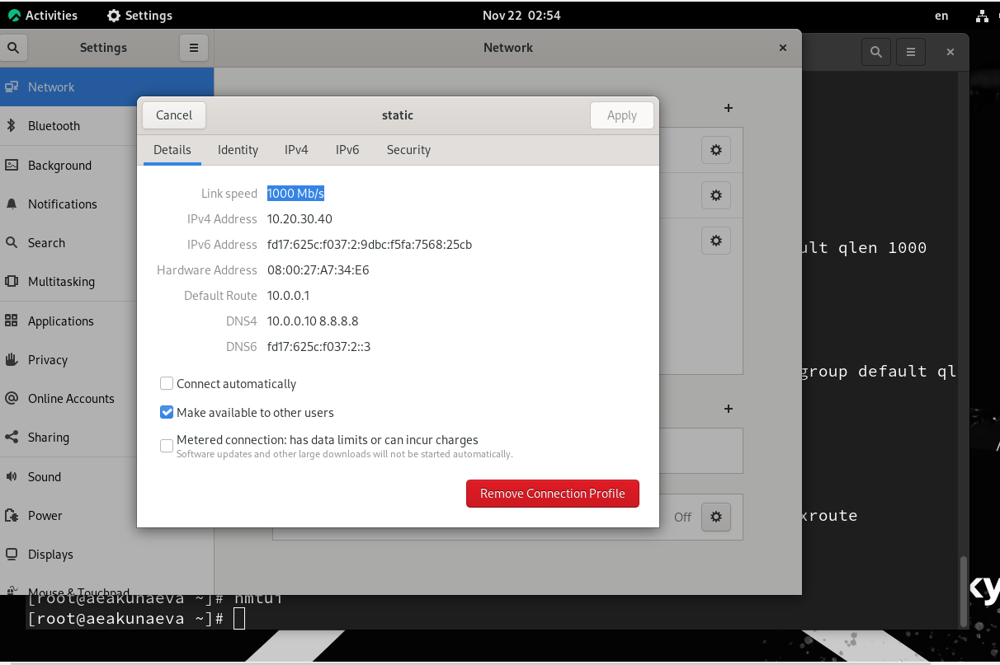
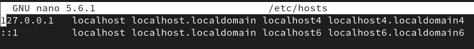
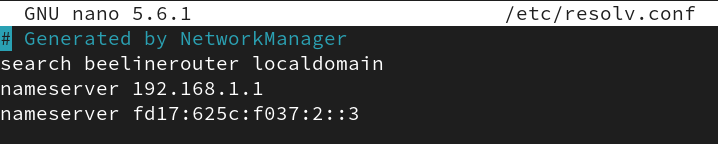
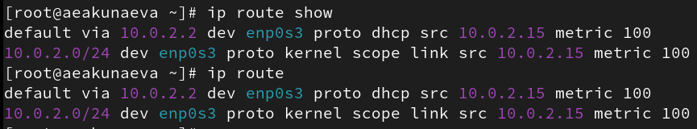
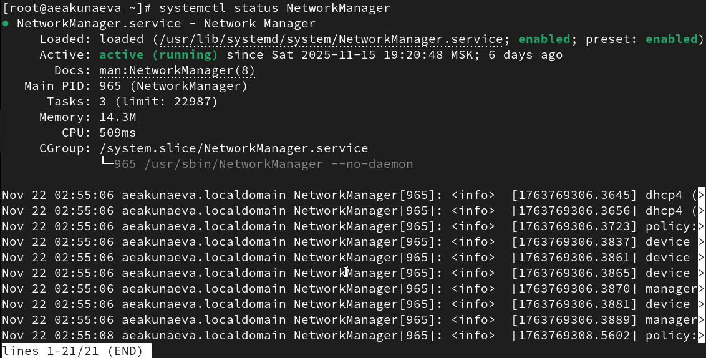
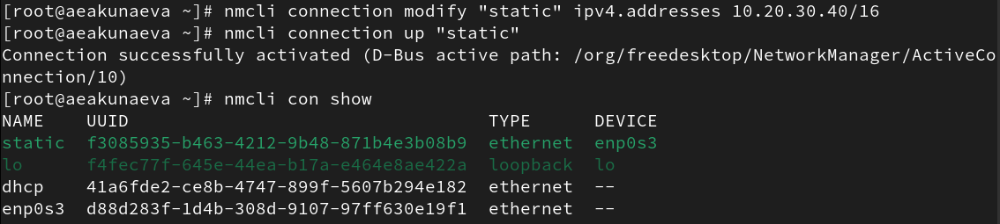

---
## Front matter
title: "Отчёт по лабораторной работе №12"
subtitle: "Настройки сети в Linux"
author: "Акунаева Антонина Эрдниевна"

## Generic otions
lang: ru-RU
toc-title: "Содержание"

## Bibliography
bibliography: bib/cite.bib
csl: pandoc/csl/gost-r-7-0-5-2008-numeric.csl

## Pdf output format
toc: true # Table of contents
toc-depth: 2
lof: true # List of figures
lot: true # List of tables
fontsize: 12pt
linestretch: 1.5
papersize: a4
documentclass: scrreprt
## I18n polyglossia
polyglossia-lang:
  name: russian
  options:
	- spelling=modern
	- babelshorthands=true
polyglossia-otherlangs:
  name: english
## I18n babel
babel-lang: russian
babel-otherlangs: english
## Fonts
mainfont: IBM Plex Serif
romanfont: IBM Plex Serif
sansfont: IBM Plex Sans
monofont: IBM Plex Mono
mathfont: STIX Two Math
mainfontoptions: Ligatures=Common,Ligatures=TeX,Scale=0.94
romanfontoptions: Ligatures=Common,Ligatures=TeX,Scale=0.94
sansfontoptions: Ligatures=Common,Ligatures=TeX,Scale=MatchLowercase,Scale=0.94
monofontoptions: Scale=MatchLowercase,Scale=0.94,FakeStretch=0.9
mathfontoptions:
## Biblatex
biblatex: true
biblio-style: "gost-numeric"
biblatexoptions:
  - parentracker=true
  - backend=biber
  - hyperref=auto
  - language=auto
  - autolang=other*
  - citestyle=gost-numeric
## Pandoc-crossref LaTeX customization
figureTitle: "Рис."
tableTitle: "Таблица"
listingTitle: "Листинг"
lofTitle: "Список иллюстраций"
lotTitle: "Список таблиц"
lolTitle: "Листинги"
## Misc options
indent: true
header-includes:
  - \usepackage{indentfirst}
  - \usepackage{float} # keep figures where there are in the text
  - \floatplacement{figure}{H} # keep figures where there are in the text
---


# Цель работы

Получить навыки настройки сетевых параметров системы. [@TUIS-lab12]

# Задание

1. Продемонстрируйте навыки использования утилиты ip (см. раздел 12.4.1).
2. Продемонстрируйте навыки использования утилиты nmcli (см. раздел 12.4.2 и 12.4.3).

# Выполнение лабораторной работы

**12.4.1. Проверка конфигурации сети**

Получим полномочия администратора при помощи su -. Выведем информацию о текущих сетевых подключениях ([рис. @fig:001]):

```
ip -s link
```

Получим нумерованный список подключений, их названия, общую информацию о них, ipv6-адрес и далее статистику о количестве передаваемых байтов (bytes), отправленных пакетов (packets), ошибках/сообщениях об ошибках (errors), неудачах или потерянных данных (dropped/missed), mcast, collsns.

{#fig:001 width=70%}

Выведем информацию о текущих маршрутах ([рис. @fig:002]):

```
ip route show
```

Получим информацию о двух существующих на устройстве маршрутах enp0s3 с ipv4 10.0.2.2 (dhcp) и 10.0.2.0/24 (kernel) с установленным по умолчанию маршрутом dhcp.

{#fig:002 width=70%}

Выведем информацию о текущих назначениях адресов для сетевых интерфейсов на устройстве ([рис. @fig:003]):

```
ip addr show
```

Получим список из двух существующих адресов lo и enp0s3 с основной информацией о них, имеющимися DNS-серверами в форматах ipv4 или ipv6.

{#fig:003 width=70%}

Проверим подключение к Интернету, отправив четыре пакета на IP-адрес 8.8.8.8 ([рис. @fig:004]):

```
ping -c 4 8.8.8.8
```

Потеряно 0 пакетов, значит, подключение выполнено правильно.

Добавим дополнительный адрес к нашему интерфейсу enp0s3 и проверим успешность добавления:

```
ip addr add 10.0.0.10/24 dev enp0s3
ip addr show
```

Обнаружим у 2. enp0s3 новый адрес inet 10.0.0.10/24.

{#fig:004 width=70%}

Воспользуемся утиилтой ifconfig и сравним её с ip ([рис. @fig:005]):

```
ifconfig
```

Кардинальных визуальных отличий нет: обе утилиты выводят информацию об имеющихся подключениях, их адресах и статистику по отправленным пакетам, полученным сообщениям об ошибках.

Выведем список всех прослушиваемых системой портов UDP и TCP с основной информацией о них:

```
ss -tul
```

{#fig:005 width=70%}

**12.4.2. Управление сетевыми подключениями с помощью nmcl**

Выведем информацию о текущих соединениях при помощи nmcli connection show. Добавим к существующим соединениям enp0s3 и lo новое Ethernet-соединение dhcp к интерфейсу enp0s3 ([рис. @fig:006]):

```
nmcli connection show
nmcli connection add con-name "dhcp" type ethernet ifname enp0s3
```

К нему же добавим также подключение static (со статическим IPv4-адресом и адресом шлюза):

```
nmcli connection add con-name "static" ifname <ifname> autoconnect no type ethernet ip4 10.0.0.10/24 gw4 10.0.0.1 ifname enp0s3
```

ПРоверим их наличие, снова введя:

```
nmcli connection show
```

Теперь существует четыре подключения, в том числе два Ethernet-подключения dhcp и static. Переключимся на статическое соединение:

```
nmcli connection up "static"
```

{#fig:006 width=70%}

Проверим успешность подключения ([рис. @fig:006]-[рис. @fig:007]):

```
nmcli connection show
ip addr
```

Оба выявленных списка отобразят действующее (верхнее) подключение static (10.0.0.10/24). Теперь вернёмся к соединению dhcp:

```
nmcli connectoin up "dhcp"
```

Проверяя снова, убедимся, что ведущим (текущим) подключением стало dhcp (10.0.2.15/24) ([рис. @fig:007]-[рис. @fig:008]):

```
nmcli connection show
ip addr
```

{#fig:007 width=70%}

{#fig:008 width=70%}

**12.4.3. Изменение параметров соединения с помощью nmcli**

Отключим автоподключение статического соединения ([рис. @fig:009]):

```
nmcli connection modify "static" connection.autoconnect no
```

Добавим DNS-сервер в статическое соединение:

```
nmcli connection modify "static" ipv4.dns 10.0.0.10
```

Добавим второй с указанием *+*, в противном случае будет перезаписан предыдущий DNS-сервер:

```
nmcli connection modify "static" +ipv4.dns 8.8.8.8
```

Изменим IP-адрес статического соединения:

```
nmcli connection modify "static" ipv4.addresses 10.0.0.20/24
```

Добавим другой IP-адрес для static:

```
nmcli connection modify "static" +ipv4.dns 10.20.30.40/16
```

Теперь активируем статическое соединение, переключившись на него:

```
nmcli connection up "static"
```

Проверим успешность подключения ([рис. @fig:009]-[рис. @fig:010]):

```
nmcli con show
ip addr
```

Теперь текущим указано соединение static (Ethernet 10.0.0.20/24, 10.20.30.40/16), так что активация прошла успешно.

Переключимся на начальное сетевое соединение enp0s3:

```
nmcli connection up "enp0s3"
```

{#fig:009 width=70%}

{#fig:010 width=70%}

Также, используем команду nmtui, чтобы просмотреть настройки сети на устройстве. СДелаем аналогично в графическом интерфейсе системы и сравним ([рис. @fig:011]-[рис. @fig:012]):

```
nmtui
```

В обоих окнах отображено название подключения, его интерфейс (enp0s3 у static), DNS-сервера, IP-адреса в IPv4/IPv6 и прочая дополнительная информация с разными опциями.

{#fig:011 width=70%}

{#fig:012 width=70%}

# Контрольные вопросы

**1. Какая команда отображает только статус соединения, но не IP-адрес?**

При помощи команды nmcli ([рис. @fig:013]):

```
nmcli connection show
```

{#fig:013 width=70%}

**2. Какая служба управляет сетью в ОС типа RHEL?**

Служба NetworkManager управляет сетью в ОС типа RHEL.

**3. Какой файл содержит имя узла (устройства) в ОС типа RHEL?**

В файле /etc/hosts содержатся имена узлов в ОС типа RHEL ([рис. @fig:014]).

```
/etc/hosts
```

{#fig:014 width=70%}

**4. Какая команда позволяет вам задать имя узла (устройства)?**

Задать имя узла можно при помощи команд hostnamectl ([рис. @fig:015]). Попробуем изменить имя устройства и проверить с hostnamectl:

```
hostnamectl set-hostname [hostname]
```

{#fig:015 width=70%}

**5. Какой конфигурационный файл можно изменить для включения разрешения имён для конкретного IP-адреса?**

Для включения разрешений имён для конкретного IP-адреса можно изменить конфигурационный файл /etc/resolv.conf, содержащий адреса DNS-серверов ([рис. @fig:016]).

```
/etc/resolv.conf
```

{#fig:016 width=70%}

**6. Какая команда показывает текущую конфигурацию маршрутизации?**

Любая из команд ([рис. @fig:017]):

```
ip route show
ip route
```

{#fig:017 width=70%}

**7. Как проверить текущий статус службы NetworkManager?**

При помощи команды ([рис. @fig:018]):

```
systemctl status NetworkManager
```

{#fig:018 width=70%}

**8. Какая команда позволяет вам изменить текущий IP-адрес и шлюз по умолчанию для вашего сетевого соединения?**

Изменить текущий IP-адрес можно при помощи команды nmcli connection modify с указанием изменений, переключиться на другой - при помощи nmcli connection up ([рис. @fig:019]):

```
nmcli connection modify [ifname] ipv4.addresses [addr]
nmcli connection up [ifname]
```

{#fig:019 width=70%}

# Выводы

Я получила навыки настройки сетевых параметров системы.

# Список литературы{.unnumbered}

::: {#refs}
:::
