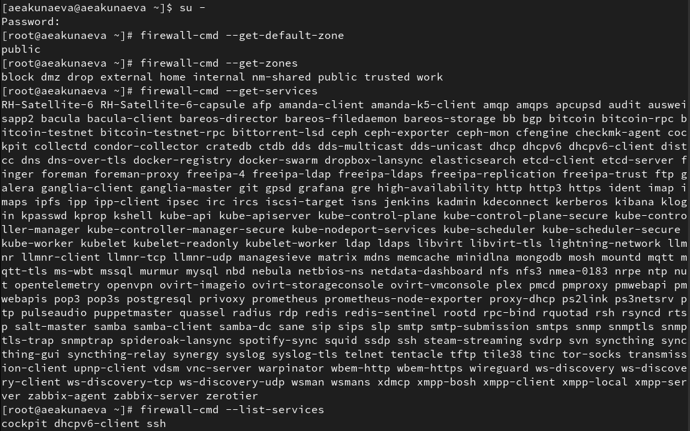
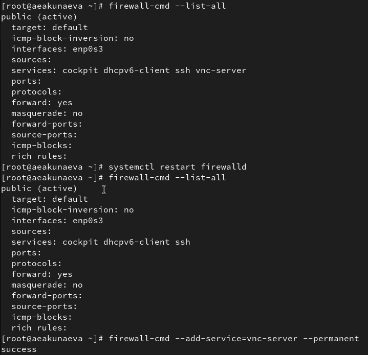
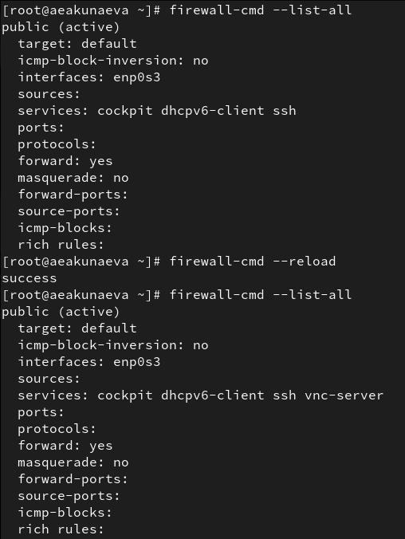
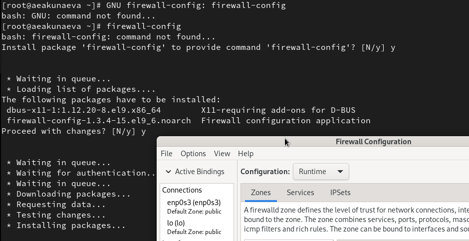
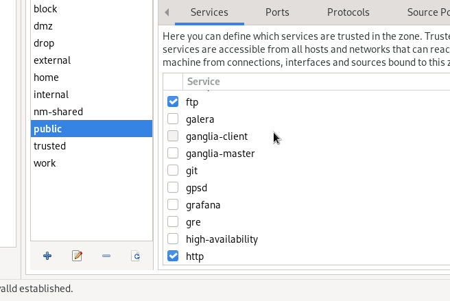
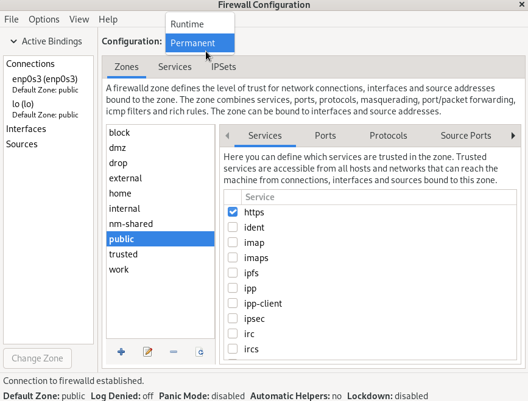
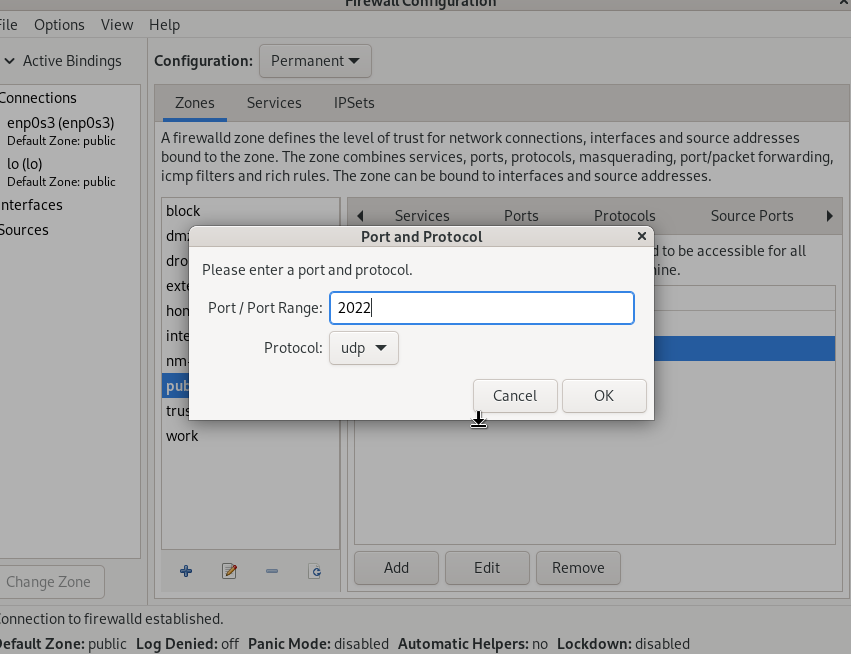
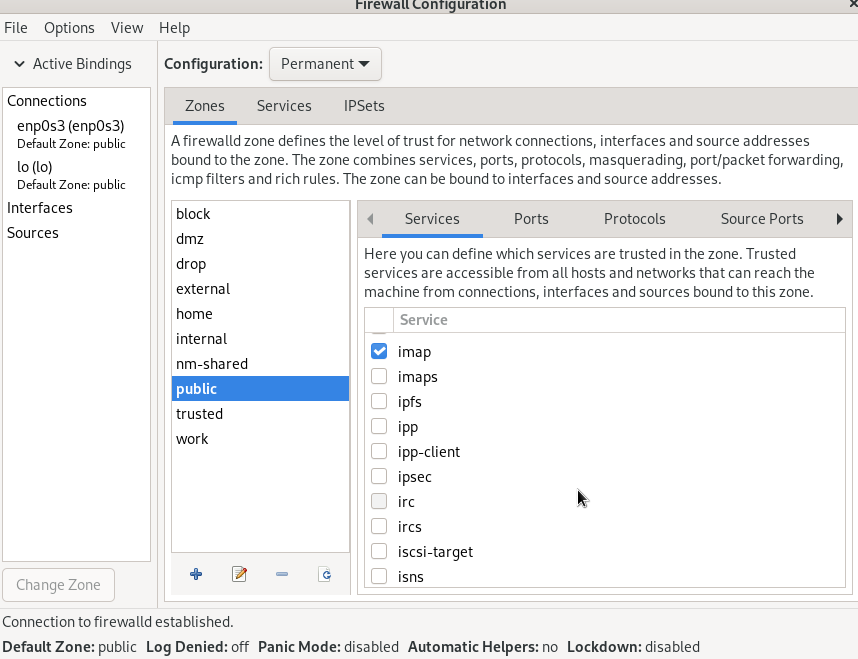
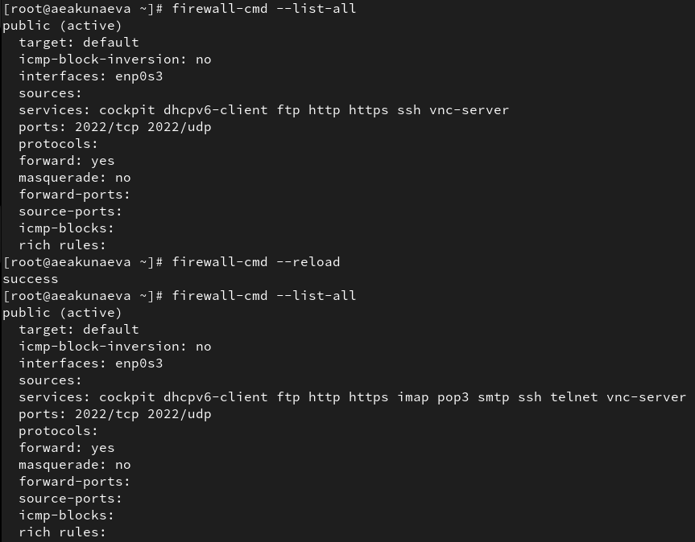

---
## Front matter
lang: ru-RU
title: Лабораторная работа №13
subtitle: Фильтр пакетов
author:
  - Акунаева Антонина Эрдниевна
institute:
  - Российский университет дружбы народов, Москва, Россия
  
date: 2025-11-29

## i18n babel
babel-lang: russian
babel-otherlangs: english

## Formatting pdf
toc: false
toc-title: Содержание
slide_level: 2
aspectratio: 169
section-titles: true
theme: metropolis
header-includes:
 - \metroset{progressbar=frametitle,sectionpage=progressbar,numbering=fraction}
---

# Информация

## Докладчик

:::::::::::::: {.columns align=center}
::: {.column width="70%"}

  * Акунаева Антонина Эрдниевна
  * студент ФФМиЕН, НПИбд-01-24
  * Российский университет дружбы народов
  * [1032240492@pfur.ru](mailto:1032240492@pfur.ru)
  * <https://github.com/Akuxee>

:::
::: {.column width="30%"}


:::
::::::::::::::

# Цели и задачи

- Получить навыки настройки пакетного фильтра в Linux.  

1. Используя firewall-cmd:  
– определить текущую зону по умолчанию;  
– определить доступные для настройки зоны;  
– определить службы, включённые в текущую зону;  
– добавить сервер VNC в конфигурацию брандмауэра.  
2. Используя firewall-config:  
– добавьте службы http и ssh в зону public;  
– добавьте порт 2022 протокола UDP в зону public;  
– добавьте службу ftp.  
3. Выполните задание для самостоятельной работы (раздел 13.5).

# Материалы и методы

- Linux (дистрибутив Rocky 9.6)
- Linux Fedora Sway (Markdown)
- Oracle VirtualBox

# Выполнение лабораторной работы

## Управление брандмауэром с помощью firewall-cmd

```
firewall-cmd --get-default-zone
firewall-cmd --get-zone
firewall-cmd --get-services
firewall-cmd --list-services
```

{#fig:001 width=60%}

## Вывод информании в конфигурации и добавление служб в firewalld

```
firewall-cmd --list-all
firewall-cmd --list-all --zone=public

firewall-cmd --add-service=vnc-server
```

{#fig:002 width=60%}

## Добавление и проверка службы в конфигурации

```
firewall-cmd --add-service=vnc-server --permanent
```

{#fig:003 width=65%}

## Проверка наличия постоянной службы vnc-server

```
firewall-cmd --reload
firewall-cmd --list-all
```

{#fig:004 width=65%}

## Добавление порта в конфигурацию

```
firewall-cmd --add-port=2022/tcp --permanent
```

{#fig:005 width=65%}

## Управление брандмауэром с помощью firewall-config

```
firewall-config
```

{#fig:006 width=65%}

## Добавление служб в firewall-config

{#fig:007 width=70%}

## Выбор настройки конфигурации в firewall-config

{#fig:008 width=70%}

## Добавление порта в firewall-config

{#fig:009 width=70%}

## Проверка изменений в интерфейсе firewall-config

{#fig:010 width=70%}

## Самостоятельная работа

```
firewall-cmd --add-service=telnet --permanent
```

{#fig:011 width=65%}

## Самостоятельная работа

```
firewall-config
```

{#fig:012 width=65%}

## Самостоятельная работа

```
firewall-cmd --reload
firewall-cmd --list-all
```

{#fig:013 width=65%}

# Выводы

Я получила навыки настройки пакетного фильтра в Linux.


