---
## Front matter
title: "Отчёт по лабораторной работе №13"
subtitle: "Фильтр пакетов"
author: "Акунаева Антонина Эрдниевна"

## Generic otions
lang: ru-RU
toc-title: "Содержание"

## Bibliography
bibliography: bib/cite.bib
csl: pandoc/csl/gost-r-7-0-5-2008-numeric.csl

## Pdf output format
toc: true # Table of contents
toc-depth: 2
lof: true # List of figures
lot: true # List of tables
fontsize: 12pt
linestretch: 1.5
papersize: a4
documentclass: scrreprt
## I18n polyglossia
polyglossia-lang:
  name: russian
  options:
	- spelling=modern
	- babelshorthands=true
polyglossia-otherlangs:
  name: english
## I18n babel
babel-lang: russian
babel-otherlangs: english
## Fonts
mainfont: IBM Plex Serif
romanfont: IBM Plex Serif
sansfont: IBM Plex Sans
monofont: IBM Plex Mono
mathfont: STIX Two Math
mainfontoptions: Ligatures=Common,Ligatures=TeX,Scale=0.94
romanfontoptions: Ligatures=Common,Ligatures=TeX,Scale=0.94
sansfontoptions: Ligatures=Common,Ligatures=TeX,Scale=MatchLowercase,Scale=0.94
monofontoptions: Scale=MatchLowercase,Scale=0.94,FakeStretch=0.9
mathfontoptions:
## Biblatex
biblatex: true
biblio-style: "gost-numeric"
biblatexoptions:
  - parentracker=true
  - backend=biber
  - hyperref=auto
  - language=auto
  - autolang=other*
  - citestyle=gost-numeric
## Pandoc-crossref LaTeX customization
figureTitle: "Рис."
tableTitle: "Таблица"
listingTitle: "Листинг"
lofTitle: "Список иллюстраций"
lotTitle: "Список таблиц"
lolTitle: "Листинги"
## Misc options
indent: true
header-includes:
  - \usepackage{indentfirst}
  - \usepackage{float} # keep figures where there are in the text
  - \floatplacement{figure}{H} # keep figures where there are in the text
---


# Цель работы

Получить навыки настройки пакетного фильтра в Linux. [@TUIS-lab13]

# Задание

1. Используя firewall-cmd:  
– определить текущую зону по умолчанию;  
– определить доступные для настройки зоны;  
– определить службы, включённые в текущую зону;  
– добавить сервер VNC в конфигурацию брандмауэра.  
2. Используя firewall-config:  
– добавьте службы http и ssh в зону public;  
– добавьте порт 2022 протокола UDP в зону public;  
– добавьте службу ftp.  
3. Выполните задание для самостоятельной работы (раздел 13.5).

# Выполнение лабораторной работы

**13.4.1. Управление брандмауэром с помощью firewall-cmd**

Зайдём в терминал как root-пользователь и введём пароль. Определим последовательно: текущую зону по умолчанию, доступные зоны, доступные на нашем компьютере службы, доступные службы в текущей зоне ([рис. @fig:001]):

```
su -
```

```
firewall-cmd --get-default-zone
firewall-cmd --get-zone
firewall-cmd --get-services
firewall-cmd --list-services
```

Получим как результат:

1. Текущую и зону по умолчанию одновременно - public, т.к. мы не применяли никаких изменений;
2. Несколько доступных зон, среди которых в том числе public;
3. Все доступные службы;
4. Доступные в текущей зоне (public) службы, их всего три.

{#fig:001 width=70%}

Сравним результат двух команд ([рис. @fig:002]):

```
firewall-cmd --list-all
firewall-cmd --list-all --zone=public
```

Вывод не будет ничем отличаться, т.к. во втором случае мы рассматриваем (указано черз параметр --zone=) именно зону public, а в первом случае - текущую зону, которой по совместительству тоже является public.

Добавим VNC-сервер в конфигурацию брандмауэра и получим положительный ответ на этот запрос:

```
firewall-cmd --add-service=vnc-server
```

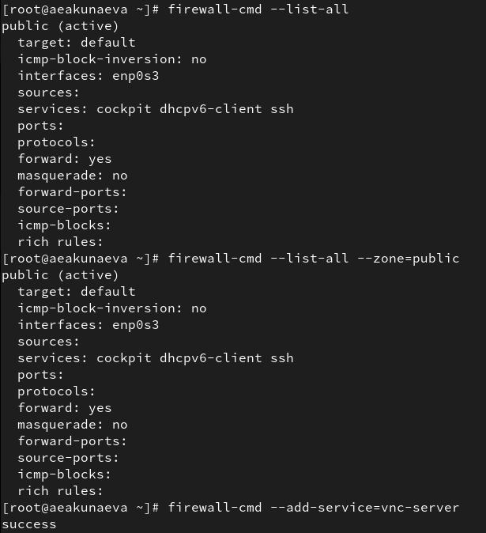{#fig:002 width=70%}

Теперь проверим, появился ли он в конфигурации брандмауэра ([рис. @fig:003]):

```
firewall-cmd --list-all
```

Заметим, что vnc-server появился в службах public. Однако, если мы перезапустим службу firewalld:

```
systemctl restart firewalld
```

ОБнаружим, что при повторной проверке службы vnc-server не будет в списке. Это произошло потому, что служба не была добавлена как постоянная, а потому перезапуске не учитывается во включении. Чтобы это исправить, добавим параметр --permanent, сделав службу постоянной:

```
firewall-cmd --add-service=vnc-server --permanent
```

{#fig:003 width=70%}

Проверим вновь наличие службы в конфигурации: теперь служба vnc-server не будет отображаться в public, т.к. стала постоянной и не добавляется в конфигурацию времени выполнения ([рис. @fig:004]). Однако, если мы перезагрузим конфигурацию firewalld и снова посмотрим, то уже обнаружем примененённые изменения в виде добавившейся службы vnc-server:

```
firewall-cmd --reload
firewall-cmd --list-all
```

{#fig:004 width=70%}

Добавим теперь в конфигурацию брандмауэра порт 2022 и протоколом TCP ([рис. @fig:005]):

```
firewall-cmd --add-port=2022/tcp --permanent
```

Перезагрузим и проверим:

```
firewall-cmd --reload
firewall-cmd --list-all
```

Среди портов зоны public появится порт 2022/tcp.

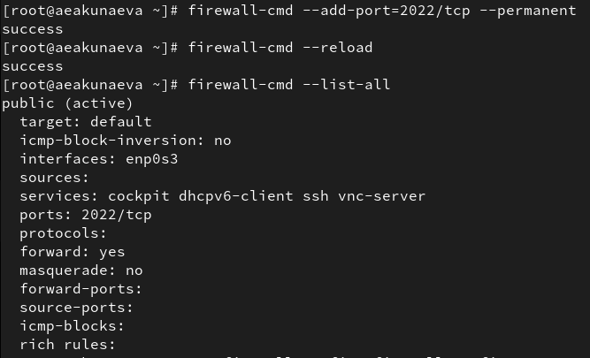{#fig:005 width=70%}

**13.4.2. Управление брандмауэром с помощью firewall-config**

Запустим интерфейс firewall-config, предварительно установив его ([рис. @fig:006]):

```
firewall-config
```

{#fig:006 width=70%}

Сверху в выпадающем окне выберем настрйоку конфигурации *Permanent*, чтобы все добавленные службы и порты были постоянными. Отметим в в зоне public службы http, https, ftp, самостоятельно отыскав их в списке.([рис. @fig:007]-[рис. @fig:008]).

{#fig:007 width=70%}

{#fig:008 width=70%}

Добавим во вкладке Ports новый порт 2022/udp и сохраним ([рис. @fig:009]). Закроем утилиту firewall-config.

{#fig:009 width=70%}

В терминале введём комануд для проверки добавления новых служб и портов. Заметим, что изменения не отобразятся сразу, т.к. необходимо сначала обновить службу. Обновляем и снова проверяем ([рис. @fig:010]):

```
firewall-cmd --list-all
firewall-cmd --reload
firewall-cmd --list-all
```

На этот раз все службы http, https, ftp и порт 2022/udp отобразятся в списке конфигурации зоны public.

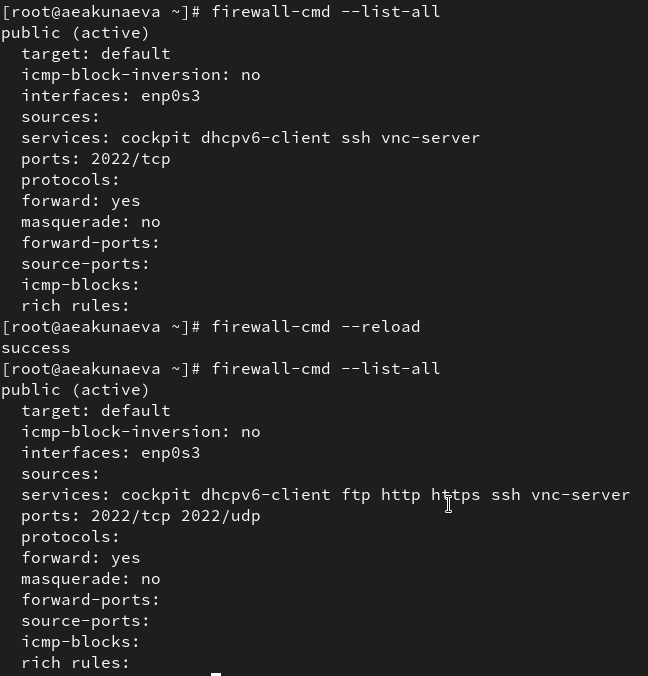{#fig:010 width=70%}

**13.5. Самостоятельная работа**

Для выполнения самостоятельной работы необходимо через терминал добавить службу telnet в конфигурацию брандмауэра ([рис. @fig:011]):

```
firewall-cmd --add-service=telnet --permanent
```

Добавим с параметром --permanent, чтобы сделать службу постоянной. 

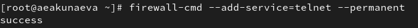{#fig:011 width=70%}

Оставшиеся службы imap, pop3, smtp добавим через графический интерфейс firewall-config ([рис. @fig:012]):

```
firewall-config
```

В зоне public найдём и отметим все необходимые зоны, в настройках конфигурации выберем *Permanent* и закроем интерфейс.

{#fig:012 width=70%}

Проверим теперь наличие активированных служб, перегрузив firewalld и выведя список с информацией для зоны public ([рис. @fig:013]):

```
firewall-cmd --reload
firewall-cmd --list-all
```

{#fig:013 width=70%}

# Контрольные вопросы

**1. Какая служба должна быть запущена перед началом работы с менеджером конфигурации брандмауэра firewall-config?**

Служба динамического управления межсетевым экраном FirewallD (firewalld).

**2. Какая команда позволяет добавить UDP-порт 2355 в конфигурацию брандмауэра в зоне по умолчанию?**

```
firewall-cmd --add-port=2355/udp (--zone=public)
``` ([рис. @fig:014]).

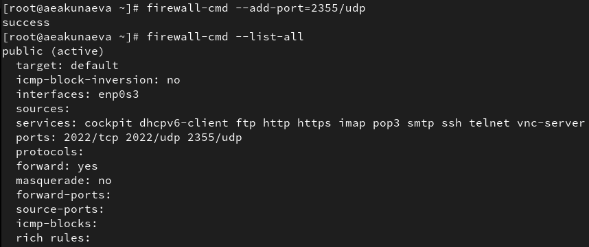{#fig:014 width=70%}

**3. Какая команда позволяет показать всю конфигурацию брандмауэра во всех зонах?**

```
firewall-cmd --list-all-zones
``` ([рис. @fig:015]).

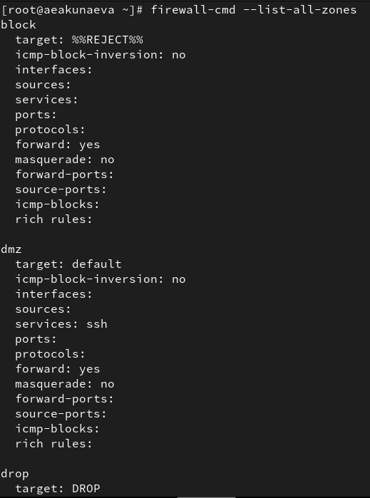{#fig:015 width=70%}

**4. Какая команда позволяет удалить службу vnc-server из текущей конфигурации брандмауэра?**

```
firewall-cmd --remove-service=vnc-server
``` ([рис. @fig:016]).

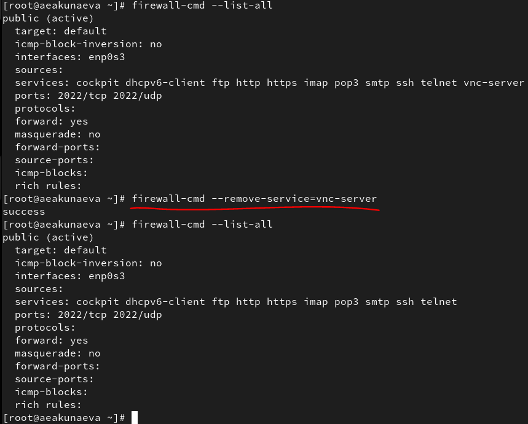{#fig:016 width=70%}

**5. Какая команда firewall-cmd позволяет активировать новую конфигурацию, добавленную опцией --permanent?**

```
firewall-cmd --reload
``` ([рис. @fig:017]).

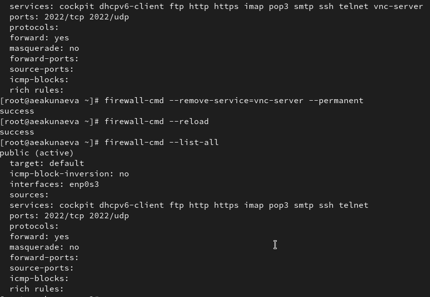{#fig:017 width=70%}

**6. Какой параметр firewall-cmd позволяет проверить, что новая конфигурация была добавлена в текущую зону и теперь активна?**

```
--list-all (firewall-cmd --list-all)
``` ([рис. @fig:018]).

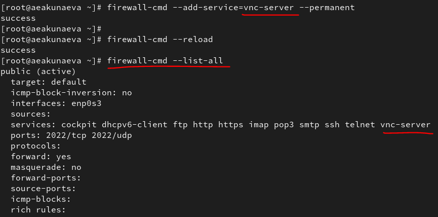{#fig:018 width=70%}

**7. Какая команда позволяет добавить интерфейс eno1 в зону public?**

```
firewall-cmd --add-interface=eno1 --zone=public
``` ([рис. @fig:019]).

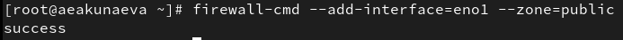{#fig:019 width=70%}

**8. Если добавить новый интерфейс в конфигурацию брандмауэра, пока не указана зона, в какую зону он будет добавлен?**

Если не указать конкретную зону, новый интерфейс будет автоматически добавлен в зону по умолчанию (в частном случае public) ([рис. @fig:020]).

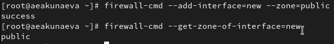{#fig:020 width=70%}

# Выводы

Я получила навыки настройки пакетного фильтра в Linux.

# Список литературы{.unnumbered}

::: {#refs}
:::
